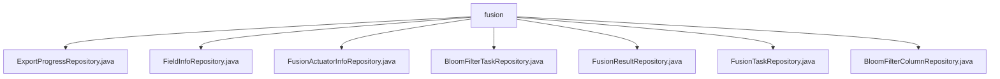

# Basic Information

|      |      |
|------|------|
| Name | fusion |
| Language | .java |
| Code Path | WeFe/board/board-service/src/main/java/com/welab/wefe/board/service/database/repository/fusion |
| Package Name | docs.board.board-service.src.main.java.com.welab.wefe.board.service.database.repository.fusion |
| Brief Description | Multiple Spring Data repository interfaces are defined, all extending BaseRepository, operating on different entity classes with String as the primary key. They include CRUD operations and specific query methods, such as querying the latest record by business ID or deleting records by ID. |

# Description

## Overview  
This module serves as the core persistence layer for data fusion processing, implementing multi-entity CRUD operations based on the Spring Data JPA specification. By inheriting the BaseRepository base class, it uniformly manages seven types of entities, including ExportProgress and FieldInfo, all with String-type primary keys, resembling a standardized data access layer design.  

The interface specification adheres to JPA query syntax, supporting native SQL (e.g., findLastByBusinessId for querying the latest record by business ID) and derived queries, with parameters bound using @Param. Key data structures include seven MySqlModel entities such as ExportProgressMySqlModel, corresponding to data from different business stages.  

External dependencies are limited to the Spring Data JPA framework. Implementation examples are abundant, such as BloomFilterColumnRepository providing deletion operations based on Bloom filter IDs, with @Modifying and @Transactional ensuring transaction safety.  

## Primary Business Scenarios  
The module supports the entire data fusion lifecycle, including task scheduling (FusionTaskRepository), result storage (FusionResultRepository), and intermediate processing (e.g., BloomFilterTaskRepository). It adopts the repository pattern for unified interaction, such as FieldInfoRepository managing field metadata and ActuatorInfoRepository maintaining actuator status.  

A typical application involves pipeline processing: first configuring fields, then triggering Bloom filtering (BloomFilterColumnRepository records column mappings), and finally persisting results. API types cover basic CRUD and custom queries (e.g., sorted queries by business ID), with integration examples including transactional deletion and multi-condition retrieval, akin to a data middle-platform architecture.

### Package Internal Structure View

This flowchart illustrates the hierarchical structure of the fusion repository under the board-service module in the WeFe project. All Java repository interface files are directly subordinate to the fusion directory, comprising 7 distinct Repository implementation classes. These include data access layer components for core functionalities such as export progress, field information, fusion actuator information, and Bloom filter tasks. Together, these Repository classes form the infrastructure layer for database interactions within this module.

# File List

| Name   | Type  | Description |
|-------|------|-------------|
| [ExportProgressRepository.java](ExportProgressRepository.md) | file | This is a Spring Data JPA repository interface designed to query the latest export progress record for a specified business ID. It extends the base repository and includes a native SQL query method that returns a single result sorted by creation time in descending order. |
| [FieldInfoRepository.java](FieldInfoRepository.md) | file | This is a Spring Data JPA repository interface that extends the base repository interface, used for operating on the FieldInfoMySqlModel entity class with a primary key type of String. |
| [FusionActuatorInfoRepository.java](FusionActuatorInfoRepository.md) | file | The FusionActuatorInfoRepository interface extends BaseRepository and is used to operate on FusionActuatorInfoMySqlModel data, with the primary key type being String. |
| [BloomFilterTaskRepository.java](BloomFilterTaskRepository.md) | file | This is a Spring Data JPA repository interface that extends the base repository interface, designed for operating the Bloom filter task data model. |
| [FusionResultRepository.java](FusionResultRepository.md) | file | This is a Spring FusionResult repository interface, which extends the base repository and operates on the FusionResultMySqlModel entity with a primary key type of String. |
| [FusionTaskRepository.java](FusionTaskRepository.md) | file | This is a Spring Data repository interface that extends the base repository class, designed for operating on FusionTaskMySqlModel type data with a primary key of String type. |
| [BloomFilterColumnRepository.java](BloomFilterColumnRepository.md) | file | The interface BloomFilterColumnRepository extends BaseRepository, providing a method to delete data by bloomFilterId, with support for automatic cleanup and transaction handling. |

