# Basic Information

|      |      |
|------|------|
| Name | dto |
| Language | .java |
| Code Path | WeFe/board/board-service/src/main/java/com/welab/wefe/board/service/dto |
| Package Name | docs.board.board-service.src.main.java.com.welab.wefe.board.service.dto |
| Brief Description | The module uniformly manages the lifecycles of multi-type business entities, including data resources, messages, annotations, and task processing. It supports the entire federated learning workflow, encompassing task configuration, member topology management, data fusion, and paginated queries. Adopting a layered design, it relies on multiple frameworks to achieve standardized interfaces and state-driven interactions. |

# Description

## Overview  
This module serves as a comprehensive management platform for federated learning and data governance. Its core responsibilities include full lifecycle management of multi-type business entities (data/messages/annotations/tasks) and task scheduling/configuration management for cross-institution joint modeling, functioning as a hybrid of a workflow engine and a data middleware. The interface specification comprises five systems: 1) Data resource classes inherit `AbstractDataResourceUpdateInputModel`; 2) Message classes follow the `AbstractMessageContent` template; 3) Dual-track processing for annotation classes; 4) Task configurations adopt the JavaBean standard; 5) Pagination handling via `PagingInput`/`Output`. Key data structures exhibit hierarchical characteristics: base classes (`ProjectOutputModel`), process classes (`KernelJob`), member topology (`Member`), annotation coordinates (`Bndbox`), and pagination metadata (`total`/`pageSize`). External dependencies include XStream, JSON libraries, PaddleFL framework, MySQL, and Spring validation framework. For example, the `Env` class switches storage strategies, demonstrating an application similar to the strategy pattern.

## Core Business Scenarios  
The module supports end-to-end federated learning collaboration and data governance, with typical scenarios including: 1) Data resource management (CRUD for images/tables and Bloom filter field initialization); 2) Task orchestration (`KernelJob` dispatch and DAG relationship definition); 3) Member collaboration (role management/status synchronization); 4) Data fusion (Bloom filter deduplication statistics); 5) Paginated queries (`PagingInput` standardization). Interaction modes vary: resource classes implement validation through inheritance (e.g., `BloomFilterAddInputModel`), message classes dynamically assemble content, annotation classes undergo side-specific processing, and task classes are configuration-driven. Functional completeness is reflected in multi-backend switching (`CalculationEngineConfig`), visual monitoring (`useVdl` toggle), and progress tracking (`progressPercentage`). API integration examples include environment prechecks (`Env`), model推送 (`ProviderModelPushResult`), and pagination conversion (`PagingOutput.of`), such as associating task instances via `projectId`, resembling the collaboration model of a multi-tenant SaaS system.

### Package Internal Structure View

```mermaid
graph TD
    dto --> vo
    dto --> kernel
    dto --> entity
    dto --> serving
    dto --> union
    dto --> fusion
    dto --> base
    vo --> data_resource
    vo --> message
    vo --> data_set
    vo --> RoleCounts.java
    vo --> AuditStatusCounts.java
    vo --> FeatureOutput.java
    vo --> JobMemberWithDataSetOutputModel.java
    vo --> OnlineAccountOutput.java
    vo --> AccountInputModel.java
    vo --> JobArbiterInfo.java
    vo --> JobProgressOutput.java
    vo --> ProjectFlowStatisticsResult.java
    vo --> FlowDataSetOutputModel.java
    data_resource --> image_data_set
    data_resource --> DataResourceAddOutputModel.java
    data_resource --> TableDataSetAddInputModel.java
    data_resource --> ImageDataSetAddInputModel.java
    data_resource --> AbstractDataResourceUpdateInputModel.java
    data_resource --> TableDataSetUpdateInputModel.java
    data_resource --> BloomFilterAddInputModel.java
    data_resource --> BloomFilterUpdateInputModel.java
    data_resource --> ImageDataSetUpdateInputModel.java
    image_data_set --> Bndbox.java
    image_data_set --> Size.java
    image_data_set --> Annotation.java
    image_data_set --> Source.java
    image_data_set --> LabelInfo.java
    image_data_set --> Object.java
    message --> AuditApplyDataResourceMessageContent.java
    message --> AuditJoinProjectMessageContent.java
    message --> AbstractMessageContent.java
    message --> ApplyJoinProjectMessageContent.java
    message --> TextMessageContent.java
    message --> AbstractMessageContentWithProject.java
    message --> ApplyDataResourceMessageContent.java
    data_set --> table_data_set
    data_set --> image_data_set
    table_data_set --> LabelDistributionItem.java
    table_data_set --> LabelDistribution.java
    image_data_set --> Bndbox.java
    image_data_set --> Size.java
    image_data_set --> Annotation.java
    image_data_set --> Source.java
    image_data_set --> LabelInfo.java
    image_data_set --> Object.java
    kernel --> deep_learning
    kernel --> machine_learning
    kernel --> Member.java
    deep_learning --> KernelJob.java
    deep_learning --> Env.java
    machine_learning --> StorageConfig.java
    machine_learning --> KernelTask.java
    machine_learning --> CalculationEngineConfig.java
    machine_learning --> KernelJob.java
    machine_learning --> TaskConfig.java
    machine_learning --> JobDataSet.java
    machine_learning --> Project.java
    machine_learning --> Env.java
    entity --> data_resource
    entity --> job
    entity --> modeling_config
    entity --> data_set
    entity --> project
    entity --> component
    entity --> BlacklistOutputModel.java
    entity --> ProjectDataSetInput.java
    entity --> MemberOutputModel.java
    entity --> ProjectMemberAuditOutput.java
    entity --> MessageOutputModel.java
    entity --> OperationLogOutputModel.java
    entity --> MemberFeatureInfoModel.java
    entity --> ProjectMemberInput.java
    entity --> DataIoTaskFeatureInfoOutputModel.java
    entity --> MemberModel.java
    entity --> AccountListAllOutputModel.java
    entity --> AbstractOutputModel.java
    entity --> AccountOutputModel.java
    entity --> MemberChatOutputModel.java
    entity --> PartnerConfigOutputModel.java
    entity --> ChatLastAccountOutputModel.java
    entity --> BloomFilterDataResourceListOutputModel.java
    data_resource --> output
    output --> ImageDataSetOutputModel.java
    output --> TableDataSetOutputModel.java
    output --> DataResourceUploadTaskOutputModel.java
    output --> BloomFilterOutputModel.java
    output --> DataResourceOutputModel.java
    job --> gateway
    job --> RelateDataSetOutputModel.java
    job --> TaskOutputModel.java
    job --> ProjectFlowNodeOutputModel.java
    job --> PreviewJobNodeOutputModel.java
    job --> JobOutputModel.java
    job --> TaskProgressOuputModel.java
    job --> TaskResultOutputModel.java
    job --> TaskOutputView.java
    job --> JobMemberOutputModel.java
    job --> JobListOutputModel.java
    gateway --> ProjectForGatewayDataSetOutputModel.java
    gateway --> ProjectForGatewayMemberOutputModel.java
    modeling_config --> ModelingConfigLogisticRegressionOutputModel.java
    modeling_config --> AbstractModelingConfigOutputModel.java
    modeling_config --> ModelingInfoOutputModel.java
    data_set --> ImageDataSetSampleOutputModel.java
    data_set --> DataSetColumnOutputModel.java
    data_set --> DataSetOutputModel.java
    data_set --> DataSetColumnInputModel.java
    project --> ProjectFlowListOutputModel.java
    project --> ProjectModelingOutputModel.java
    project --> ProjectMemberOutputModel.java
    project --> ProjectFlowDetailOutputModel.java
    project --> data_set
    project --> ProjectQueryOutputModel.java
    project --> ProjectDetailMemberOutputModel.java
    project --> ProjectFlowOutputModel.java
    project --> ProjectOutputModel.java
    project --> ProjectFlowProgressOutputModel.java
    project --> ProjectUsageDetailOutputModel.java
    data_set --> DerivedProjectDataSetOutputModel.java
    data_set --> ProjectDataResourceOutputModel.java
    component --> ComponentOutputModel.java
    serving --> ProviderModelPushResult.java
    union --> UnionDataSetOutput.java
    fusion --> PsiMeta.java
    fusion --> FusionResultExportProgress.java
    fusion --> FusionMemberInfo.java
    fusion --> BloomFilterTaskOutputModel.java
    fusion --> BloomFilterColumnInputModel.java
    fusion --> BloomFilterColumnOutputModel.java
    fusion --> FusionTaskOutput.java
    base --> PagingOutput.java
    base --> PagingInput.java
```

This flowchart illustrates the complete hierarchical structure of the dto directory in the WeFe/board/board-service project, encompassing 7 main subdirectories (vo, kernel, entity, serving, union, fusion, base) and their subordinate files. The vo directory contains data resource and message-related classes, the kernel directory includes machine learning and deep learning configuration classes, the entity directory houses core project entity classes, the serving/union/fusion directories contain specialized functional module classes, and the base directory comprises foundational pagination classes. The entire structure adopts a tree layout to clearly present the hierarchical relationships among up to 158 files.

# File List

| Name   | Type  | Description |
|-------|------|-------------|
| [vo](vo/_module.md) | package | The module uniformly manages CRUD operations for multi-type data resources (images/tables/Bloom filters) using a layered input model design. It supports functions such as data resource review, message content generation, and annotation information management, covering scenarios like tag statistics, format conversion, and status counting. Various types implement differentiated validation through inheritance, relying on XStream and JSON libraries to form a standardized management process. |
| [serving](serving/_module.md) | package | The ProviderModelPushResult class contains member ID, name, and operation status, providing creation and access methods. |
| [base](base/_module.md) | package | PagingOutput encapsulates paginated data, containing total and list attributes, and provides static factory methods. PagingInput handles pagination parameters, including pageIndex and pageSize properties, ensuring pageIndex is non-negative. |
| [fusion](fusion/_module.md) | package | The PsiMeta class encapsulates a list of Base64 strings. FusionResultExportProgress tracks export progress. FusionMemberInfo stores member information. BloomFilterTaskOutputModel records the status of Bloom filter tasks. BloomFilterColumnInputModel validates field inputs. BloomFilterColumnOutputModel describes field outputs. FusionTaskOutput encapsulates fusion task information. |
| [union](union/_module.md) | package | The UnionDataSetOutput class includes attributes such as member ID, creation/update time, number of dimensions, description, labels, whether it contains Y, usage count, name, sample count, ID, and dimension list, along with their corresponding getter/setter methods. |
| [entity](entity/_module.md) | package | This module provides data resource management, task flow orchestration, member collaboration, and status tracking functionalities for federated learning projects. Adopting the Java Bean pattern, it implements standardized interfaces through inheritance and annotations, supporting data lifecycle management and multi-scenario applications. |
| [kernel](kernel/_module.md) | package | The module manages federated learning task configuration and execution, including the KernelJob task structure and Env environment configuration. It supports multi-party collaboration and master-slave interaction, with processes encompassing initialization, resource allocation, and cluster submission. The Member class defines member information and provides factory methods to create member objects for different learning types. |

