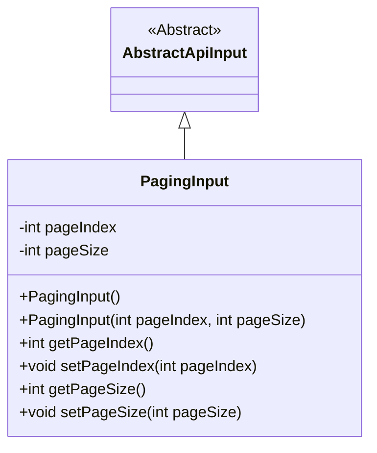
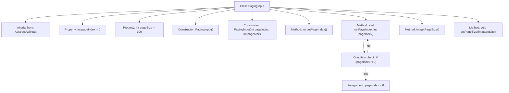

# Basic Information

|      |      |
|------|------|
| Name | PagingInput |
| Language | .java |
| Code Path | WeFe/board/board-service/src/main/java/com/welab/wefe/board/service/dto/base/PagingInput.java |
| Package Name | com.welab.wefe.board.service.dto.base |
| Dependencies | ['com.welab.wefe.common.fieldvalidate.annotation.Check', 'com.welab.wefe.common.web.dto.AbstractApiInput'] |
| Brief Description | Pagination input class, containing page number and page size attributes, with the page number defaulting to 0 and the page size defaulting to 100, providing constructors and getter/setter methods. |

# Description

The PagingInput class inherits from AbstractApiInput and is used for handling pagination input parameters. It includes two attributes: pageIndex represents the page number, with 0 indicating the first page and a default value of 0; pageSize represents the page size, with a default value of 100. It provides a no-argument constructor and a parameterized constructor. The setter method for pageIndex ensures the value is not less than 0. Standard getter and setter methods are provided.

# Class Summary

| Name   | Type  | Description |
|-------|------|-------------|
| PagingInput | class | Pagination input class, containing page number and page size attributes, with the page number defaulting to 0 and the page size defaulting to 100, providing constructors and getter/setter methods. |

## Class PagingInput

|      |      |
|------|------|
| Access Modifier | public |
| Type | class |
| Name | PagingInput |
| Description | Pagination input class, containing page number and page size attributes, with the page number defaulting to 0 and the page size defaulting to 100, providing constructors and getter/setter methods. |

### UML Class Diagram

This code defines a paging input class PagingInput, which inherits from the abstract class AbstractApiInput. PagingInput contains two private fields: pageIndex and pageSize, representing the page number and page size respectively, where pageIndex defaults to 0 (first page) and pageSize defaults to 100. The class provides two constructors and corresponding getter/setter methods, with the setPageIndex method automatically correcting negative values (setting them to 0). This class is primarily used to encapsulate input parameters for paginated queries.

### Internal Method Call Graph

This code defines a class named PagingInput, which inherits from AbstractApiInput and is used to handle pagination input parameters. The class contains two private properties, pageIndex and pageSize, representing the page number and page size respectively, with default values of 0 and 100. It provides two constructors: a no-argument constructor and a parameterized constructor. Additionally, it includes getter and setter methods, where the setPageIndex method incorporates validation logic to ensure the page number is not less than 0. The flowchart clearly illustrates the class inheritance, properties, methods, and the internal logical flow of the methods.

### Field List

| Name  | Type  | Description |
|-------|-------|------|
| pageIndex = 0 | int | Page index, where 0 indicates the first page. |
| pageSize = 100 | int | The default page size is 100. |

### Method List

| Name  | Type  | Description |
|-------|-------|------|
| getPageSize | int | Methods to obtain the current page size, returning an integer value pageSize. |
| getPageIndex | int | Methods to obtain the current page number value, returning the integer variable pageIndex. |
| setPageIndex | void | Set the page number, and if it is less than 0, set it to 0. |
| setPageSize | void | The method to set the number of items displayed per page, with the parameter being pageSize. |

