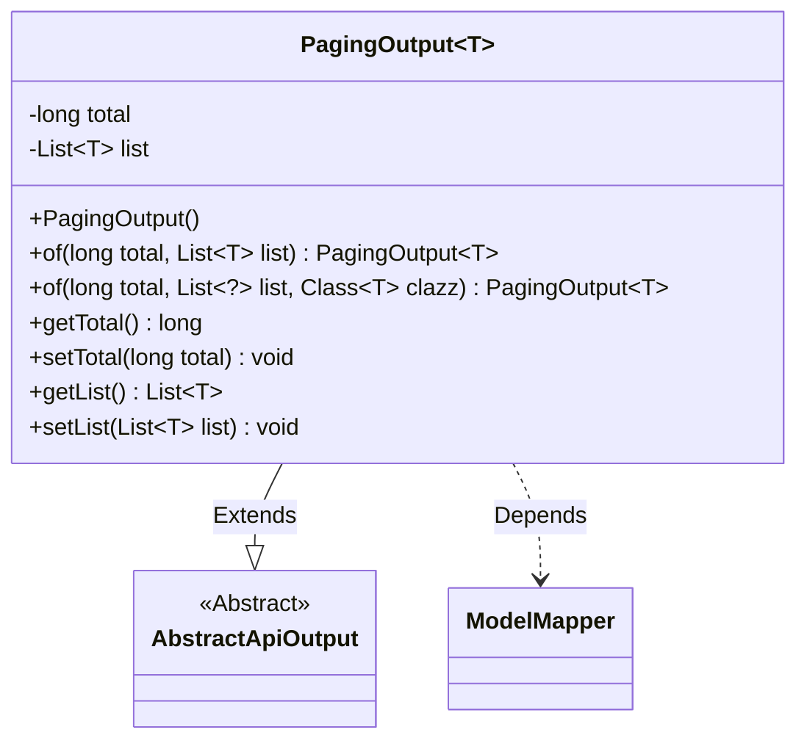
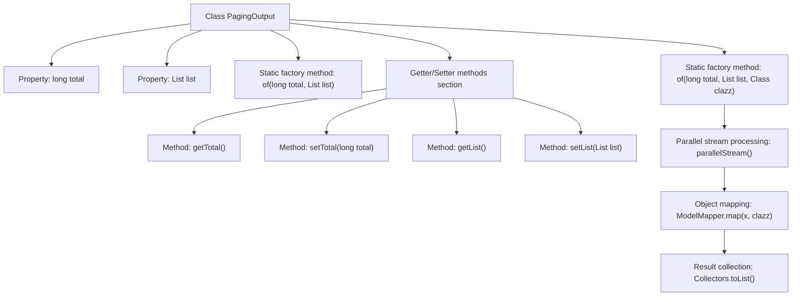

# Basic Information

|      |      |
|------|------|
| Name | PagingOutput |
| Language | .java |
| Code Path | WeFe/board/board-service/src/main/java/com/welab/wefe/board/service/dto/base/PagingOutput.java |
| Package Name | com.welab.wefe.board.service.dto.base |
| Dependencies | ['com.welab.wefe.common.web.dto.AbstractApiOutput', 'com.welab.wefe.common.web.util.ModelMapper', 'java.util.List', 'java.util.stream.Collectors'] |
| Brief Description | The paging output class `PagingOutput<T>` extends `AbstractApiOutput` and includes the total count `total` and a list `list`. It provides two static methods `of` to create instances, supporting direct assignment or automatic DTO mapping. Contains getter/setter methods. |

# Description

PagingOutput is a generic class that inherits from AbstractApiOutput, used to encapsulate paginated data. It contains two main attributes: total represents the total record count, and list stores the current page's data list. It provides two static factory methods: of(long total, List<T> list) directly creates an instance; of(long total, List<?> list, Class<T> clazz) supports automatic mapping of database entities to DTO objects. The class also includes standard getter and setter methods for attribute access and modification.

# Class Summary

| Name   | Type  | Description |
|-------|------|-------------|
| PagingOutput | class | The paging output class PagingOutput includes total count and list data, providing two construction methods: direct assignment and automatic DTO mapping. It supports getter/setter operations. |

## Class PagingOutput

|      |      |
|------|------|
| Access Modifier | public |
| Type | class |
| Name | PagingOutput |
| Description | The paging output class PagingOutput includes total count and list data, providing two construction methods: direct assignment and automatic DTO mapping. It supports getter/setter operations. |

### UML Class Diagram

Class diagram description: PagingOutput<T> is a generic class that inherits from the AbstractApiOutput abstract class, designed to encapsulate paginated query results. It contains two private fields: 'total' representing the total record count, and 'list' storing the current page's data list. Two static factory methods 'of()' are provided for instance creation, one of which supports automatic mapping of database entities to DTOs. The diagram illustrates the inheritance relationship and dependency with ModelMapper, reflecting the core functionality of paginated result encapsulation.

### Internal Method Call Graph

This flowchart illustrates the structure and key method invocation relationships of the PagingOutput generic class. The class contains two core properties (total and list) and two static factory methods, with the second factory method implementing automatic mapping from database entities to DTOs. The process particularly highlights the internal processing logic of the type-converting factory method, including three critical steps: parallel stream processing, object mapping, and result collection. Getter/setter methods are grouped into a dedicated section, demonstrating good code organization. The entire design achieves efficient pagination data processing and type-safe conversion.

### Field List

| Name  | Type  | Description |
|-------|-------|------|
| list | List<T> | Declare a private generic list variable named list with type T. |
| total | long | Private long integer variable total, used to store the total count value. |

### Method List

| Name  | Type  | Description |
|-------|-------|------|
| of | PagingOutput<T> | This is a Java static method designed to create a paginated output object. The method accepts the total record count, a data list, and the target class type. It processes the list data using parallel streams and maps it to the target type, ultimately returning a paginated output object containing the total count and the processed list. |
| getTotal | long | This method returns the value of a long integer variable named total. |
| of | PagingOutput<T> | This is a static factory method used to create a paginated output object. The method accepts the total record count and data list, sets them into the paginated output object, and returns it. |
| setTotal | void | This is a Java method used to set the value of the class member variable `total`. The method accepts a parameter of type `long` and assigns it to the `total` property of the current object. |
| getList | List<T> | Return the list object. |
| setList | void | This is a Java method used to set the List-type member variable `list` of a class. The method accepts a generic List parameter and assigns it to the `list` property of the current object. |

