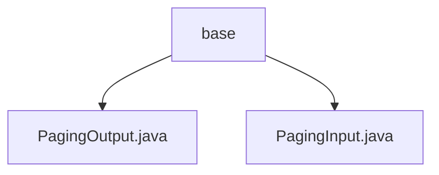

# Basic Information

|      |      |
|------|------|
| Name | base |
| Language | .java |
| Code Path | WeFe/board/board-service/src/main/java/com/welab/wefe/board/service/dto/base |
| Package Name | docs.board.board-service.src.main.java.com.welab.wefe.board.service.dto.base |
| Brief Description | PagingOutput encapsulates paginated data, containing total and list attributes, and provides static factory methods. PagingInput handles pagination parameters, including pageIndex and pageSize properties, ensuring pageIndex is non-negative. |

# Description

## Overview  
The core responsibility of this module is to provide standardized pagination input and output processing capabilities, similar to Spring Data's pagination abstraction. PagingInput encapsulates page number and page size parameters, while PagingOutput wraps the paginated result set and total count. The interface specification uniformly adopts the Getter/Setter pattern, supporting automatic DTO mapping. Key data structures include pagination metadata (total/pageIndex/pageSize) and the data list (List<T>). There are no external dependencies. For example, PagingOutput.of() supports automatic conversion from entities to DTOs.  

## Primary Business Scenarios  
Primarily applied to data pagination query scenarios, forming a standard workflow of "input parameter validation → paginated query → result encapsulation." The interaction model follows the request-response pattern, where input standardizes pagination parameters via PagingInput, and output uniformly packages results via PagingOutput. Typical use cases include backend management system table pagination, such as setting pageSize=20 to retrieve the second page of data. API types include basic CRUD pagination interfaces, with integration examples involving pagination conversion between database entities and DTOs.

### Package Internal Structure View

This flowchart illustrates the DTO base package structure of the board-service module in the WeFe project. The base directory contains two pagination-related data transfer object files: PagingOutput.java handles paginated output data, while PagingInput.java receives pagination input parameters. These two classes collectively form the foundational data structure for the service layer's pagination functionality, demonstrating a concise and clear hierarchical relationship.

# File List

| Name   | Type  | Description |
|-------|------|-------------|
| [PagingOutput.java](PagingOutput.md) | file | The paging output class `PagingOutput<T>` extends `AbstractApiOutput` and includes a total count `total` and a list `list`. It provides two static methods `of` to create instances, supporting direct assignment or automatic DTO mapping. Contains getter/setter methods. |
| [PagingInput.java](PagingInput.md) | file | Pagination input class, containing page number and page size attributes, with the page number defaulting to 0 and the page size defaulting to 100, providing constructors and getter/setter methods. |

