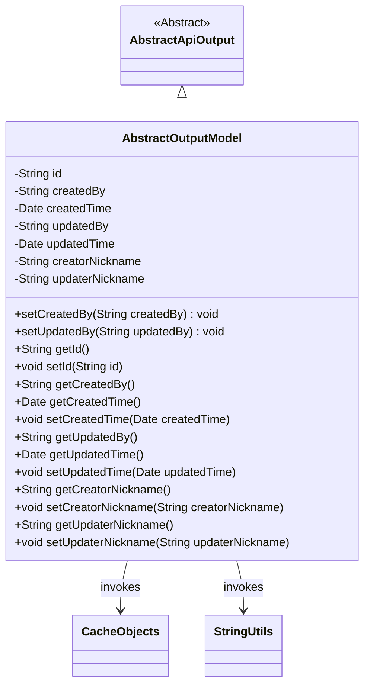

# Basic Information

|      |      |
|------|------|
| Name | AbstractOutputModel |
| Language | .java |
| Code Path | WeFe/board/board-service/src/main/java/com/welab/wefe/board/service/dto/entity/AbstractOutputModel.java |
| Package Name | com.welab.wefe.board.service.dto.entity |
| Dependencies | ['com.welab.wefe.board.service.service.CacheObjects', 'com.welab.wefe.common.fieldvalidate.annotation.Check', 'com.welab.wefe.common.web.dto.AbstractApiOutput', 'org.apache.commons.lang3.StringUtils', 'java.util.Date'] |
| Brief Description | The AbstractOutputModel class includes fields such as ID, creator/updater, and timestamps, with set methods automatically configuring creator and updater nicknames. |

# Description

The `AbstractOutputModel` class inherits from `AbstractApiOutput` and includes basic fields such as `id`, `createdBy`, `createdTime`, `updatedBy`, `updatedTime`, as well as two nickname fields, `creatorNickname` and `updaterNickname`. The nicknames are automatically set via the `setCreatedBy` and `setUpdatedBy` methods, preferentially retrieving nicknames from `CacheObjects` and falling back to member names if empty. Getter and setter methods are provided for all fields to manipulate and access these properties.

# Class Summary

| Name   | Type  | Description |
|-------|------|-------------|
| AbstractOutputModel | class | The AbstractOutputModel class inherits from AbstractApiOutput and includes fields such as ID, creator/updater information and timestamps, automatically setting creator and updater nicknames. |

## Class AbstractOutputModel

|      |      |
|------|------|
| Access Modifier | public |
| Type | class |
| Name | AbstractOutputModel |
| Description | The AbstractOutputModel class inherits from AbstractApiOutput and includes fields such as ID, creator/updater information and timestamps, automatically setting creator and updater nicknames. |

### UML Class Diagram

Class diagram description: AbstractOutputModel inherits from AbstractApiOutput as an abstract output model class containing creation/update information. It includes core fields such as ID, creator/updater and timestamps, and implements automatic nickname population logic through CacheObjects and StringUtils utility classes. The setCreatedBy/setUpdatedBy methods automatically query corresponding nicknames or member names when setting user IDs, demonstrating the interaction between business objects and the caching system.

### Internal Method Call Graph

```mermaid
graph TD
    A["Class AbstractOutputModel"]
    B["Inherits from: AbstractApiOutput"]
    C["Property: @Check String id"]
    D["Property: @Check String createdBy"]
    E["Property: @Check Date createdTime"]
    F["Property: @Check String updatedBy"]
    G["Property: @Check Date updatedTime"]
    H["Property: @Check String creatorNickname"]
    I["Property: @Check String updaterNickname"]
    J["Method: setCreatedBy(String)"]
    K["Method: setUpdatedBy(String)"]
    L["Method: getter/setter group"]

    A --> B
    A --> C
    A --> D
    A --> E
    A --> F
    A --> G
    A --> H
    A --> I
    A --> J
    A --> K
    A --> L

    J --> M["Assign createdBy"]
    J --> N["Call CacheObjects.getNickname"]
    J --> O["Check StringUtils.isBlank"]
    J --> P["Call CacheObjects.getMemberName"]

    K --> Q["Assign updatedBy"]
    K --> R["Call CacheObjects.getNickname"]
    K --> S["Check StringUtils.isBlank"]
    K --> T["Call CacheObjects.getMemberName"]
```

This code demonstrates an AbstractOutputModel class that inherits from AbstractApiOutput, primarily used for managing entity properties with validation annotations. The core logic is reflected in the setCreatedBy and setUpdatedBy methods, which not only set property values but also retrieve nicknames or member names as fallback values through CacheObjects. The flowchart clearly illustrates the complete flow of property declarations, method call chains, and conditional judgments, particularly showcasing the fallback handling mechanism when nicknames are empty.

### Field List

| Name  | Type  | Description |
|-------|-------|------|
| id | String | The field id is marked with the @Check annotation as a globally unique identifier. |
| updaterNickname | String | The field `updaterNickname` is used to store the modifier's nickname and is validated via the `@Check` annotation. |
| updatedBy | String | The private string variable updatedBy is annotated with @Check as "Updated By". |
| creatorNickname | String | Define a private String variable creatorNickname, and validate the creator's nickname using the @Check annotation. |
| createdBy | String | The field `createdBy` is labeled as the inspection item "Creator", with a type of String. |
| createdTime | Date | The field createdTime is marked with the @Check annotation, indicating that the creation time needs to be validated. |
| updatedTime | Date | The field updatedTime is marked with the @Check annotation, with the validation rule being "update time." |

### Method List

| Name  | Type  | Description |
|-------|-------|------|
| setUpdatedBy | void | This method sets the updater information, including the ID and nickname. If the nickname is empty, the member name will be used instead. |
| setId | void | Methods for setting the object ID: Assign the parameter id to the id property of the current object. |
| setCreatorNickname | void | Method to set the creator's nickname, which assigns the input parameter to the class member variable creatorNickname. |
| getUpdaterNickname | String | The method to obtain the updater's nickname, which returns a string-type updaterNickname. |
| setCreatedTime | void | Method to set the object creation time, with the parameter being of Date type. |
| getUpdatedTime | Date | Methods to obtain the update time, returning the updatedTime value. |
| getCreatorNickname | String | Method to obtain the creator's nickname, returns a string-type creatorNickname value. |
| setUpdatedTime | void | A public method to set the update time, with the parameter being of type Date. |
| getUpdatedBy | String | The method returns the updater information. |
| getCreatedTime | Date | Method to get creation time, returns Date type. |
| getId | String | This is a Java method that returns the value of the string-type id field. |
| getCreatedBy | String | The method getCreatedBy returns the value of the string-type variable createdBy. |
| setCreatedBy | void | Set creator information, including ID and nickname. If the nickname is empty, use the member name. |
| setUpdaterNickname | void | The method to set the updater's nickname assigns the passed parameter to the class member variable updaterNickname. |

