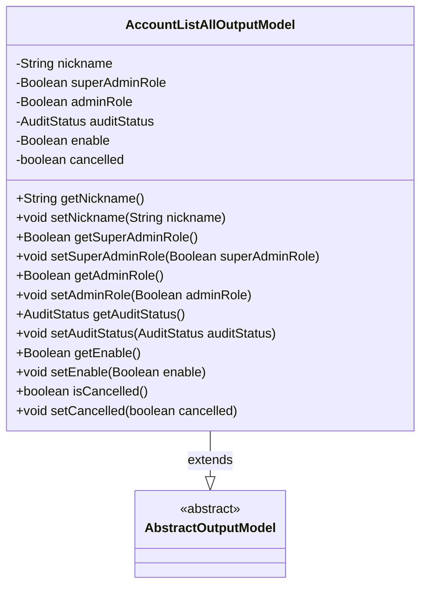

# Basic Information

|      |      |
|------|------|
| Name | AccountListAllOutputModel |
| Language | .java |
| Code Path | WeFe/board/board-service/src/main/java/com/welab/wefe/board/service/dto/entity/AccountListAllOutputModel.java |
| Package Name | com.welab.wefe.board.service.dto.entity |
| Dependencies | ['com.welab.wefe.common.fieldvalidate.annotation.Check', 'com.welab.wefe.common.wefe.enums.AuditStatus'] |
| Brief Description | The AccountListAllOutputModel class includes fields for user nickname, super administrator flag, administrator flag, review status, availability status, and cancellation status, along with their corresponding getter/setter methods. |

# Description

The `AccountListAllOutputModel` class inherits from `AbstractOutputModel` and includes fields for user account information: nickname, super administrator flag (system initializer), administrator flag (with higher privileges), review status, availability status, and deactivation status. Each field has corresponding getter and setter methods to facilitate data access and modification.

# Class Summary

| Name   | Type  | Description |
|-------|------|-------------|
| AccountListAllOutputModel | class | The AccountListAllOutputModel class includes fields for nickname, super administrator flag, administrator flag, review status, available status, and cancellation status, along with their corresponding getter/setter methods. |

## Class AccountListAllOutputModel

|      |      |
|------|------|
| Access Modifier | public |
| Type | class |
| Name | AccountListAllOutputModel |
| Description | The AccountListAllOutputModel class includes fields for nickname, super administrator flag, administrator flag, review status, available status, and cancellation status, along with their corresponding getter/setter methods. |

### UML Class Diagram

This code defines an `AccountListAllOutputModel` class that inherits from the abstract class `AbstractOutputModel`. The class contains multiple private fields representing user nickname, super administrator role, administrator role, audit status, enabled status, and cancellation status, with corresponding getter and setter methods provided for each field. These fields are validated via `@Check` annotations, with some fields including detailed comments explaining their purpose. This class is primarily used to encapsulate the output data model for account list queries.

### Internal Method Call Graph

```mermaid
graph TD
    A["Class AccountListAllOutputModel"]
    B["Inherits from: AbstractOutputModel"]
    C["Property: String nickname @Check('Nickname')"]
    D["Property: Boolean superAdminRole @Check('Is super administrator')"]
    E["Property: Boolean adminRole @Check('Is administrator')"]
    F["Property: AuditStatus auditStatus @Check('Audit status')"]
    G["Property: Boolean enable @Check('Is enabled')"]
    H["Property: boolean cancelled"]
    I["Method: getNickname()/setNickname()"]
    J["Method: getSuperAdminRole()/setSuperAdminRole()"]
    K["Method: getAdminRole()/setAdminRole()"]
    L["Method: getAuditStatus()/setAuditStatus()"]
    M["Method: getEnable()/setEnable()"]
    N["Method: isCancelled()/setCancelled()"]

    A --> B
    A --> C
    A --> D
    A --> E
    A --> F
    A --> G
    A --> H
    A --> I
    A --> J
    A --> K
    A --> L
    A --> M
    A --> N
```

This flowchart illustrates the complete structure of the AccountListAllOutputModel class, including its inheritance relationship, attribute fields (with annotation descriptions), and all getter/setter methods. As an output model, this class contains core fields such as user account nickname, role permission identifiers (super administrator/regular administrator), audit status, activation status, and cancellation status. All attributes follow the standard JavaBean specification for access methods. Notably, multiple properties use @Check annotations for business semantic labeling, reflecting the design intent of model validation.

### Field List

| Name  | Type  | Description |
|-------|-------|------|
| nickname | String | Java Field Annotation: Checking string-type private variables for nicknames. |
| adminRole | Boolean | The private boolean field adminRole is used to check whether the user is an administrator, who possesses additional permissions such as setting member visibility. |
| auditStatus | AuditStatus | The class member variable auditStatus is marked with the @Check annotation as "Audit Status" and has the type AuditStatus. |
| superAdminRole | Boolean | The field `superAdminRole` is used to check whether a user is a super administrator, i.e., the initial creator of the system. |
| enable | Boolean | The private boolean field `enable`, annotated with `@Check(name="是否可用")`, indicates the availability status. |
| cancelled | boolean | The boolean variable `cancelled` indicates the cancellation status. |

### Method List

| Name  | Type  | Description |
|-------|-------|------|
| setNickname | void | The method to set a user nickname assigns the input parameter to the nickname property of the object. |
| getSuperAdminRole | Boolean | Methods to obtain the super administrator role status, returning a boolean value indicating whether it is a super administrator. |
| getNickname | String | The method returns the user's nickname string. |
| setAuditStatus | void | The method to set the audit status assigns the incoming auditStatus to the auditStatus property of the current object. |
| getAuditStatus | AuditStatus | Methods to obtain the audit status, returning the value of the auditStatus variable. |
| setAdminRole | void | Define the method `setAdminRole`, which accepts a boolean parameter `adminRole` to set the `adminRole` property of the object. |
| getAdminRole | Boolean | Methods to obtain administrator role status, returning a boolean value indicating whether it is an administrator. |
| getEnable | Boolean | This is a Java method that returns the boolean value of the enable variable. |
| setEnable | void | This is a Java method used to set the boolean value of the enable property. The method accepts a Boolean parameter and assigns it to the class's member variable enable. |
| isCancelled | boolean | The method returns a boolean value indicating whether it has been canceled. |
| setCancelled | void | The method `setCancelled` is used to set the state of the boolean value `cancelled`. |
| setSuperAdminRole | void | The method to set the super administrator role, with a boolean parameter. |

