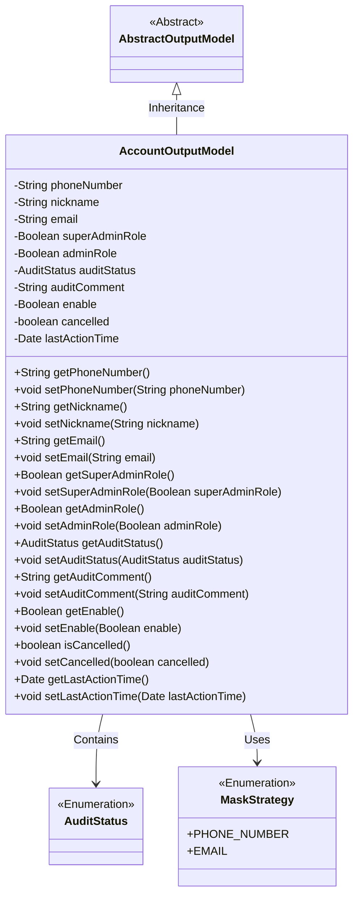

# Basic Information

|      |      |
|------|------|
| Name | AccountOutputModel |
| Language | .java |
| Code Path | WeFe/board/board-service/src/main/java/com/welab/wefe/board/service/dto/entity/AccountOutputModel.java |
| Package Name | com.welab.wefe.board.service.dto.entity |
| Dependencies | ['com.welab.wefe.common.fieldvalidate.annotation.Check', 'com.welab.wefe.common.fieldvalidate.secret.MaskStrategy', 'com.welab.wefe.common.fieldvalidate.secret.Secret', 'com.welab.wefe.common.wefe.enums.AuditStatus', 'java.util.Date'] |
| Brief Description | The AccountOutputModel class contains user account information, such as phone number, nickname, email, administrator role, review status, and last activity time, and provides getter/setter methods. |

# Description

The `AccountOutputModel` class inherits from `AbstractOutputModel` and includes properties related to user accounts. The `phoneNumber` and `email` fields are validated and desensitized using annotations. The `nickname` field represents the user's display name. `superAdminRole` identifies super administrator privileges, while `adminRole` indicates administrator permissions. `auditStatus` and `auditComment` record the review status and comments. `enable` controls account availability, `cancelled` indicates whether the account is deactivated, and `lastActionTime` logs the timestamp of the last activity. All fields are provided with getter and setter methods.

# Class Summary

| Name   | Type  | Description |
|-------|------|-------------|
| AccountOutputModel | class | The AccountOutputModel class contains user account information such as phone number, nickname, email, administrator role, review status, availability, and provides getter/setter methods. |

## Class AccountOutputModel

|      |      |
|------|------|
| Access Modifier | public |
| Type | class |
| Name | AccountOutputModel |
| Description | The AccountOutputModel class contains user account information such as phone number, nickname, email, administrator role, review status, availability, and provides getter/setter methods. |

### UML Class Diagram

This code defines an AccountOutputModel class that inherits from AbstractOutputModel, representing an account output model. The class includes multiple private fields such as phone number, nickname, email, etc., along with corresponding getter and setter methods. The phoneNumber and email fields are annotated with @Secret for desensitization, and @Check for field validation. AuditStatus and MaskStrategy are enumeration types, representing audit status and masking strategies respectively. The class diagram clearly illustrates the inheritance and dependency relationships.

### Internal Method Call Graph

```mermaid
graph TD
    A["Class AccountOutputModel"]
    B["Inherits from: AbstractOutputModel"]
    C["Property: String phoneNumber"]
    D["Property: String nickname"]
    E["Property: String email"]
    F["Property: Boolean superAdminRole"]
    G["Property: Boolean adminRole"]
    H["Property: AuditStatus auditStatus"]
    I["Property: String auditComment"]
    J["Property: Boolean enable"]
    K["Property: boolean cancelled"]
    L["Property: Date lastActionTime"]
    M["Method: getPhoneNumber()"]
    N["Method: setPhoneNumber(String)"]
    O["Method: getNickname()"]
    P["Method: setNickname(String)"]
    Q["Method: getEmail()"]
    R["Method: setEmail(String)"]
    S["Method: getSuperAdminRole()"]
    T["Method: setSuperAdminRole(Boolean)"]
    U["Method: getAdminRole()"]
    V["Method: setAdminRole(Boolean)"]
    W["Method: getAuditStatus()"]
    X["Method: setAuditStatus(AuditStatus)"]
    Y["Method: getAuditComment()"]
    Z["Method: setAuditComment(String)"]
    AA["Method: getEnable()"]
    AB["Method: setEnable(Boolean)"]
    AC["Method: isCancelled()"]
    AD["Method: setCancelled(boolean)"]
    AE["Method: getLastActionTime()"]
    AF["Method: setLastActionTime(Date)"]

    A --> B
    A --> C
    A --> D
    A --> E
    A --> F
    A --> G
    A --> H
    A --> I
    A --> J
    A --> K
    A --> L
    A --> M
    A --> N
    A --> O
    A --> P
    A --> Q
    A --> R
    A --> S
    A --> T
    A --> U
    A --> V
    A --> W
    A --> X
    A --> Y
    A --> Z
    A --> AA
    A --> AB
    A --> AC
    A --> AD
    A --> AE
    A --> AF
```

This code defines an AccountOutputModel class that inherits from AbstractOutputModel, containing user account-related properties and corresponding getter/setter methods. Properties include phone number, nickname, email, administrator role flags, audit status, etc., with some properties using @Check and @Secret annotations for validation and desensitization. The class structure is clear, encapsulating data through standard JavaBean specifications, facilitating the transfer of account information within the system.

### Field List

| Name  | Type  | Description |
|-------|-------|------|
| lastActionTime | Date | The Last Operation Time field records the timestamp of the most recent operation. |
| nickname | String | The code defines a private string variable named nickname, and marks this field with the @Check annotation to indicate it requires "nickname" validation. |
| adminRole | Boolean | The field adminRole is used to check whether a user is an administrator. Administrators have additional permissions, such as setting member visibility. |
| enable | Boolean | Define a private boolean variable `enable`, and mark it with the `@Check` annotation as a "Whether Enabled" check item. |
| cancelled | boolean | The boolean variable `cancelled` indicates the cancellation status. |
| auditComment | String | Entity class field: Review Comments, of type String, used to store remarks related to the review process. |
| email | String | Java Field Annotation: Email validation, using EMAIL masking strategy to protect privacy. |
| superAdminRole | Boolean | Check if it is the super administrator, i.e., the initial creator of the system. |
| auditStatus | AuditStatus | The class private field auditStatus, labeled as audit status check. |
| phoneNumber | String | The code defines a private string variable phoneNumber, which uses the @Check annotation to validate the phone number format and applies the @Secret annotation for desensitization of the phone number, adopting the PHONE_NUMBER masking strategy. |

### Method List

| Name  | Type  | Description |
|-------|-------|------|
| setAdminRole | void | The method to set the administrator role, with the parameter being the boolean value adminRole. |
| getNickname | String | The method returns the user's nickname string. |
| setAuditStatus | void | The method to set the audit status assigns the passed-in `auditStatus` to the `auditStatus` property of the current object. |
| setSuperAdminRole | void | Method to set the super administrator role, with a boolean parameter. |
| setEmail | void | This is a Java method used to set the email property value of an object. The method takes a string parameter email and assigns it to the email field of the current object. |
| setEnable | void | Public method to set the enabled state, with a boolean parameter 'enable', which is assigned to the class member variable enable. |
| getAuditComment | String | The method to obtain audit comments, returns the auditComment string. |
| getAdminRole | Boolean | This is a Java method that returns a boolean adminRole value, used to determine whether a user has administrator privileges. |
| getEmail | String | Public method to obtain the email value. |
| setPhoneNumber | void | The method for setting a phone number assigns the input parameter to the class member variable `phoneNumber`. |
| setAuditComment | void | This is a Java method used to set the value of the auditComment property. The method takes a string parameter auditComment and assigns it to the class's member variable this.auditComment. |
| getAuditStatus | AuditStatus | The method returns the audit status auditStatus. |
| getPhoneNumber | String | Methods to obtain the phone number, returns a string phoneNumber. |
| getSuperAdminRole | Boolean | Methods to obtain the super administrator role status, returning a boolean value indicating whether the permission is possessed. |
| isCancelled | boolean | The method returns a boolean value indicating whether it has been canceled. |
| setCancelled | void | A public method to set the cancellation status, with a boolean parameter `cancelled`, used to update the value of the instance variable `cancelled`. |
| getLastActionTime | Date | The method returns the last operation time. |
| setLastActionTime | void | The method to set the last action time assigns the parameter lastActionTime to the class member variable of the same name. |
| setNickname | void | The method to set the user nickname assigns the input parameter to the member variable nickname. |
| getEnable | Boolean | Public method to obtain the enable boolean value. |

