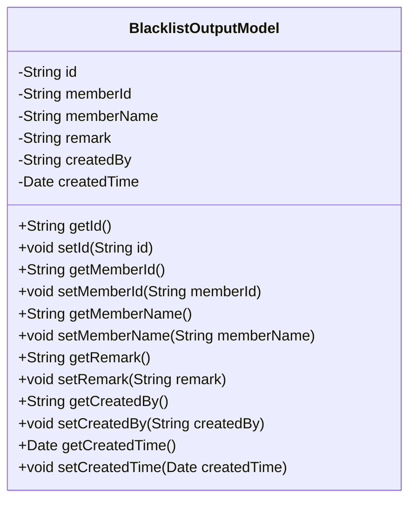

# Basic Information

|      |      |
|------|------|
| Name | BlacklistOutputModel |
| Language | .java |
| Code Path | WeFe/board/board-service/src/main/java/com/welab/wefe/board/service/dto/entity/BlacklistOutputModel.java |
| Package Name | com.welab.wefe.board.service.dto.entity |
| Dependencies | ['com.welab.wefe.common.fieldvalidate.annotation.Check', 'java.util.Date'] |
| Brief Description | The BlacklistOutputModel class includes fields for ID, member ID, name, remarks, creator, and creation time, providing getter and setter methods. |

# Description

The BlacklistOutputModel class defines the blacklist output model, containing fields such as id, memberId (member ID), memberName (member name), remark (remarks), createdBy (creator), and createdTime (creation time). Each field has corresponding getter and setter methods, with some fields annotated using the @Check annotation for validation. This class is used to encapsulate blacklist-related data.

# Class Summary

| Name   | Type  | Description |
|-------|------|-------------|
| BlacklistOutputModel | class | Blacklist output model class, containing fields for ID, member ID, name, remarks, creator, and time, providing getter and setter methods for each attribute. |

## Class BlacklistOutputModel

|      |      |
|------|------|
| Access Modifier | public |
| Type | class |
| Name | BlacklistOutputModel |
| Description | Blacklist output model class, containing fields for ID, member ID, name, remarks, creator, and time, providing getter and setter methods for each attribute. |

### UML Class Diagram

This code defines a class named BlacklistOutputModel, which represents a blacklist output model. The class contains multiple private fields such as id, memberId, memberName, etc., each with corresponding getter and setter methods. These fields are validated through the @Check annotation, indicating that legality checks are required when setting their values. This class is primarily used to encapsulate blacklist-related data, facilitating the transfer and processing of blacklist information within the system.

### Internal Method Call Graph

```mermaid
graph TD
    A["Class BlacklistOutputModel"]
    B["Property: String id"]
    C["Property: @Check String memberId"]
    D["Property: @Check String memberName"]
    E["Property: @Check String remark"]
    F["Property: @Check String createdBy"]
    G["Property: @Check Date createdTime"]
    H["Method: getId()"]
    I["Method: setId(String id)"]
    J["Method: getMemberId()"]
    K["Method: setMemberId(String memberId)"]
    L["Method: getMemberName()"]
    M["Method: setMemberName(String memberName)"]
    N["Method: getRemark()"]
    O["Method: setRemark(String remark)"]
    P["Method: getCreatedBy()"]
    Q["Method: setCreatedBy(String createdBy)"]
    R["Method: getCreatedTime()"]
    S["Method: setCreatedTime(Date createdTime)"]

    A --> B
    A --> C
    A --> D
    A --> E
    A --> F
    A --> G
    A --> H
    A --> I
    A --> J
    A --> K
    A --> L
    A --> M
    A --> N
    A --> O
    A --> P
    A --> Q
    A --> R
    A --> S
```

This flowchart illustrates the complete structure of the BlacklistOutputModel class, containing 6 properties annotated with @Check and their corresponding getter/setter methods. It represents a typical Java Bean class designed for encapsulating blacklist data, where each property is explicitly marked with validation annotations, demonstrating the model's integrity and constraint validation. The class structure is clear with one-to-one correspondence between properties and methods, making it suitable for data transfer and form validation scenarios.

### Field List

| Name  | Type  | Description |
|-------|-------|------|
| memberName | String | The member variable `memberName` is annotated with `@Check` to validate the name. |
| createdBy | String | The code defines a private string variable named createdBy, annotated with @Check and the parameter name set to "Creator". |
| id | String | Private string type variable id. |
| remark | String | The field "remark" is annotated with @Check, which is used for validation. |
| createdTime | Date | The field createdTime is marked with the @Check annotation, indicating that the creation time needs to be validated. |
| memberId | String | Member ID verification field. |

### Method List

| Name  | Type  | Description |
|-------|-------|------|
| setMemberId | void | The method to set the member ID assigns the input parameter to the class's member variable `memberId`. |
| setId | void | Methods for setting object ID, assigning the parameter id to the object's id property. |
| setMemberName | void | The method to set the member name assigns the input parameter to the member variable `memberName`. |
| getMemberId | String | Methods to obtain member ID, returns a string-type memberId. |
| setRemark | void | The method for setting remark information assigns the input string to the `remark` property of the class. |
| getRemark | String | Public method for retrieving remark information, returns the remark content as a string type. |
| getMemberName | String | Methods for obtaining member names, returning the value of the member variable memberName. |
| getId | String | This is a Java method that returns the value of the id field as a string. |
| getCreatedBy | String | The method getCreatedBy returns the value of the string-type variable createdBy. |
| setCreatedBy | void | This is a Java method used to set the creator property of an object. The method accepts a string parameter called createdBy and assigns it to the class member variable this.createdBy. |
| getCreatedTime | Date | Method to get creation time, returns Date type. |
| setCreatedTime | void | The method to set the object creation time assigns the parameter createdTime to the member variable this.createdTime. |

