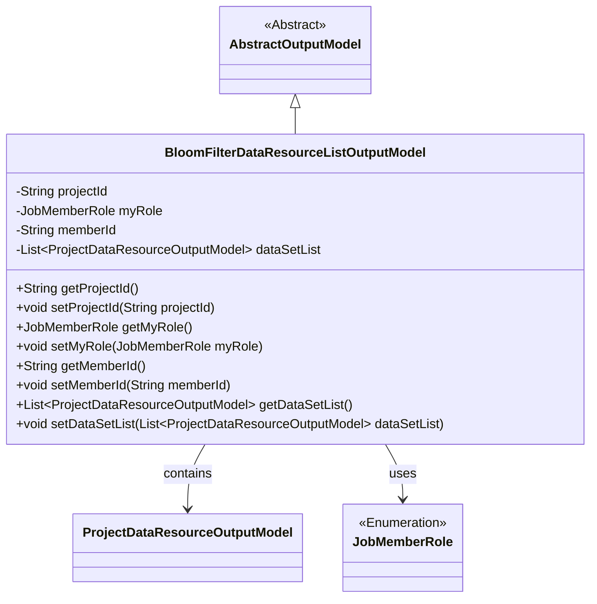

# Basic Information

|      |      |
|------|------|
| Name | BloomFilterDataResourceListOutputModel |
| Language | .java |
| Code Path | WeFe/board/board-service/src/main/java/com/welab/wefe/board/service/dto/entity/BloomFilterDataResourceListOutputModel.java |
| Package Name | com.welab.wefe.board.service.dto.entity |
| Dependencies | ['com.welab.wefe.board.service.dto.entity.project.data_set.ProjectDataResourceOutputModel', 'com.welab.wefe.common.fieldvalidate.annotation.Check', 'com.welab.wefe.common.wefe.enums.JobMemberRole', 'java.util.List'] |
| Brief Description | BloomFilter data resource list output model, including fields for project ID, identity role, member ID, and dataset list. |

# Description

The `BloomFilterDataResourceListOutputModel` class inherits from `AbstractOutputModel` and includes four main attributes: project ID (`projectId`), identity (`myRole`, with enum values `promoter` or `provider`), member ID (`memberId`), and a dataset list (`dataSetList`). Each attribute has corresponding getter and setter methods, with the first three attributes annotated with `@Check` for validation. This class represents the output model for a Bloom filter data resource list.

# Class Summary

| Name   | Type  | Description |
|-------|------|-------------|
| BloomFilterDataResourceListOutputModel | class | The BloomFilterDataResourceListOutputModel class includes fields such as project ID, identity role, member ID, and data resource list, along with their corresponding getter and setter methods. |

## Class BloomFilterDataResourceListOutputModel

|      |      |
|------|------|
| Access Modifier | public |
| Type | class |
| Name | BloomFilterDataResourceListOutputModel |
| Description | The BloomFilterDataResourceListOutputModel class includes fields such as project ID, identity role, member ID, and data resource list, along with their corresponding getter and setter methods. |

### UML Class Diagram

Class Diagram Description: This diagram illustrates that BloomFilterDataResourceListOutputModel inherits from the abstract class AbstractOutputModel, containing private attributes such as project ID, member role, member ID, and dataset list, with access provided through getter/setter methods. The class forms an aggregation relationship with ProjectDataResourceOutputModel and depends on the enumeration type JobMemberRole. The overall structure reflects the design of an output model for data resource lists.

### Internal Method Call Graph

```mermaid
graph TD
    A["Class BloomFilterDataResourceListOutputModel"]
    B["Inherits: AbstractOutputModel"]
    C["Property: String projectId"]
    D["Property: JobMemberRole myRole"]
    E["Property: String memberId"]
    F["Property: List<ProjectDataResourceOutputModel> dataSetList"]
    G["Method: String getProjectId()"]
    H["Method: void setProjectId(String)"]
    I["Method: JobMemberRole getMyRole()"]
    J["Method: void setMyRole(JobMemberRole)"]
    K["Method: String getMemberId()"]
    L["Method: void setMemberId(String)"]
    M["Method: List<ProjectDataResourceOutputModel> getDataSetList()"]
    N["Method: void setDataSetList(List<ProjectDataResourceOutputModel>)"]

    A --> B
    A --> C
    A --> D
    A --> E
    A --> F
    A --> G
    A --> H
    A --> I
    A --> J
    A --> K
    A --> L
    A --> M
    A --> N
```

This code illustrates a class named BloomFilterDataResourceListOutputModel, which inherits from AbstractOutputModel. The class contains four properties: projectId, myRole, memberId, and dataSetList, used to store the project ID, role identity, member ID, and dataset list respectively. Each property has corresponding getter and setter methods for retrieving and updating its value. This class primarily serves as an output model for data resources, with the @Check annotation validating certain properties to ensure data validity and integrity.

### Field List

| Name  | Type  | Description |
|-------|-------|------|
| projectId | String | Define a private String variable projectId, and validate the project ID using the @Check annotation. |
| memberId | String | The code defines a private string variable memberId, annotated with @Check, with the parameter name set to "Our Member ID". |
| dataSetList | List<ProjectDataResourceOutputModel> | List of Private Project Data Resource Output Models. |
| myRole | JobMemberRole | The annotation @Check validates the myRole field, restricting it to our identity enum values promoter or provider. |

### Method List

| Name  | Type  | Description |
|-------|-------|------|
| getMemberId | String | The method to obtain the member ID, which returns a string-type memberId. |
| setProjectId | void | Methods for setting the project ID: Assign the input parameter projectId to the projectId property of the current object. |
| getMyRole | JobMemberRole | Get the role information of the current user, with the return value being of type JobMemberRole. |
| getProjectId | String | Methods to obtain the project ID, returning a string-type variable `projectId`. |
| setMyRole | void | This is a Java method used to set the role property of the current object. The method accepts a parameter of type JobMemberRole named myRole and assigns it to the myRole field of the object. |
| setMemberId | void | Methods for setting member ID, assigning the input parameter to the class member variable memberId. |
| getDataSetList | List<ProjectDataResourceOutputModel> | Methods to obtain the dataset list, returning a list of type ProjectDataResourceOutputModel. |
| setDataSetList | void | Set the dataset list method, assigning the input parameters to the class member variable dataSetList. |

