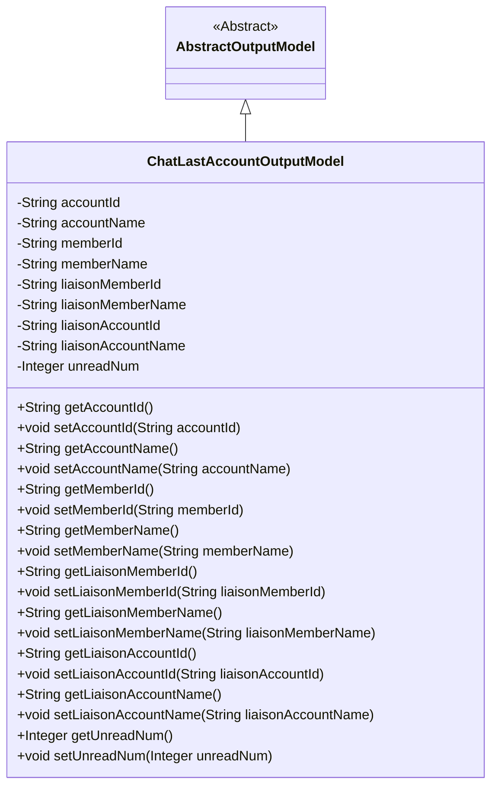

# Basic Information

|      |      |
|------|------|
| Name | ChatLastAccountOutputModel |
| Language | .java |
| Code Path | WeFe/board/board-service/src/main/java/com/welab/wefe/board/service/dto/entity/ChatLastAccountOutputModel.java |
| Package Name | com.welab.wefe.board.service.dto.entity |
| Dependencies | ['com.welab.wefe.common.fieldvalidate.annotation.Check'] |
| Brief Description | The ChatLastAccountOutputModel class contains account, member, and contact information, as well as the count of unread messages. It provides getter and setter methods for each field. |

# Description

The code defines a class named `ChatLastAccountOutputModel`, which inherits from `AbstractOutputModel`. The class includes multiple private fields annotated with `@Check`, such as `accountId`, `accountName`, `memberId`, `memberName`, `liaisonMemberId`, `liaisonMemberName`, `liaisonAccountId`, `liaisonAccountName`, and `unreadNum`, along with corresponding getter and setter methods. These fields are used to store information related to accounts, members, and liaisons, as well as the count of unread messages.

# Class Summary

| Name   | Type  | Description |
|-------|------|-------------|
| ChatLastAccountOutputModel | class | The ChatLastAccountOutputModel class contains account, member, and contact information, including IDs, names, and unread message counts. |

## Class ChatLastAccountOutputModel

|      |      |
|------|------|
| Access Modifier | public |
| Type | class |
| Name | ChatLastAccountOutputModel |
| Description | The ChatLastAccountOutputModel class contains account, member, and contact information, including IDs, names, and unread message counts. |

### UML Class Diagram

This code defines a class named ChatLastAccountOutputModel, which inherits from the abstract class AbstractOutputModel, and is used to store account information related to chat. The class contains multiple private fields, such as account ID, name, member ID, name, as well as liaison-related IDs and names, and the number of unread messages. Each field has corresponding getter and setter methods for retrieving and setting the field values. This class is primarily used to encapsulate the output data model of the last account in a chat system.

### Internal Method Call Graph

```mermaid
graph TD
    A["Class ChatLastAccountOutputModel"]
    B["Inherits from: AbstractOutputModel"]
    C["Property: String accountId"]
    D["Property: String accountName"]
    E["Property: String memberId"]
    F["Property: String memberName"]
    G["Property: String liaisonMemberId"]
    H["Property: String liaisonMemberName"]
    I["Property: String liaisonAccountId"]
    J["Property: String liaisonAccountName"]
    K["Property: Integer unreadNum"]
    L["Method: getAccountId()"]
    M["Method: setAccountId(String)"]
    N["Method: getAccountName()"]
    O["Method: setAccountName(String)"]
    P["Method: getMemberId()"]
    Q["Method: setMemberId(String)"]
    R["Method: getMemberName()"]
    S["Method: setMemberName(String)"]
    T["Method: getLiaisonMemberId()"]
    U["Method: setLiaisonMemberId(String)"]
    V["Method: getLiaisonMemberName()"]
    W["Method: setLiaisonMemberName(String)"]
    X["Method: getLiaisonAccountId()"]
    Y["Method: setLiaisonAccountId(String)"]
    Z["Method: getLiaisonAccountName()"]
    AA["Method: setLiaisonAccountName(String)"]
    AB["Method: getUnreadNum()"]
    AC["Method: setUnreadNum(Integer)"]

    A --> B
    A --> C
    A --> D
    A --> E
    A --> F
    A --> G
    A --> H
    A --> I
    A --> J
    A --> K
    A --> L
    A --> M
    A --> N
    A --> O
    A --> P
    A --> Q
    A --> R
    A --> S
    A --> T
    A --> U
    A --> V
    A --> W
    A --> X
    A --> Y
    A --> Z
    A --> AA
    A --> AB
    A --> AC
```

This flowchart illustrates the structure of the ChatLastAccountOutputModel class, including its inheritance relationship, properties, and methods. The class inherits from AbstractOutputModel and contains multiple String-type properties with corresponding getter/setter methods, primarily used for storing and manipulating chat-related account information. Each property is annotated with @Check, indicating these fields require validation. The class structure is clear, with properties and methods in one-to-one correspondence, facilitating data encapsulation and access control.

### Field List

| Name  | Type  | Description |
|-------|-------|------|
| liaisonAccountName | String | The field liaisonAccountName is used to associate account names and is validated with the @Check annotation. |
| unreadNum = 0 | Integer | Java code snippet: Define a private integer variable unreadNum with an initial value of 0, marked with the @Check annotation and the parameter name as "unread num". |
| memberName | String | Define a member variable memberName, and use the @Check annotation to validate the name. |
| memberId | String | Member ID field, validated using the @Check annotation. |
| liaisonMemberId | String | The field liaisonMemberId is used to validate the liaison member ID, annotated as @Check. |
| accountId | String | The field accountId carries an account ID validation annotation. |
| liaisonMemberName | String | Check the annotation of the liaison officer's name field |
| accountName | String | The code defines a private string variable named accountName and validates its name attribute using the @Check annotation. |
| liaisonAccountId | String | Check the private string field of the contact account ID. |

### Method List

| Name  | Type  | Description |
|-------|-------|------|
| setMemberName | void | Set the value of the member variable memberName. |
| setAccountId | void | Methods for setting the account ID: Assign the parameter accountId to the accountId property of the current object. |
| getLiaisonMemberId | String | Methods to obtain the contact member ID, returns the member ID as a string type. |
| setLiaisonAccountId | void | This is a Java method used to set the liaison account ID. The method takes a string parameter `liaisonAccountId` and assigns it to the member variable of the same name in the current object. |
| getMemberId | String | The method to obtain the member ID, which returns a string-type memberId. |
| setMemberId | void | The method to set the member ID assigns the input parameter to the class's member variable memberId. |
| setAccountName | void | The method to set the account name assigns the parameter `accountName` to the property of the same name in the current object. |
| setLiaisonMemberName | void | The method to set the liaison member name assigns the parameter value to the class member variable `liaisonMemberName`. |
| setLiaisonMemberId | void | The method to set the liaison member ID, with the parameter of string type `liaisonMemberId`, assigns it to the property of the same name in the current object. |
| getUnreadNum | Integer | Methods to retrieve the count of unread messages, returning an integer value representing the number of unread messages. |
| setLiaisonAccountName | void | The method to set the liaison account name assigns the parameter value to the class member variable `liaisonAccountName`. |
| getLiaisonMemberName | String | Methods for obtaining the contact member's name, returning a string-type member name variable. |
| getLiaisonAccountName | String | The method to obtain the liaison account name, which returns a string-type variable `liaisonAccountName`. |
| getAccountName | String | The method to obtain the account name directly returns the value of the accountName variable. |
| getMemberName | String | Methods for obtaining member names, returning the member name as a string. |
| getAccountId | String | This is a Java method that returns the value of the string-type member variable accountId. |
| getLiaisonAccountId | String | Method to obtain the liaison account ID, returns a string-type liaisonAccountId. |
| setUnreadNum | void | Method to set the number of unread messages, with the parameter being of integer type. |

