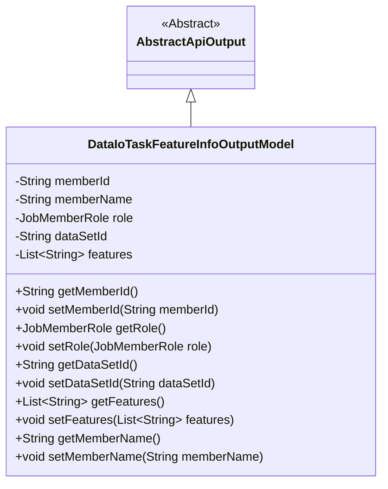

# Basic Information

|      |      |
|------|------|
| Name | DataIoTaskFeatureInfoOutputModel |
| Language | .java |
| Code Path | WeFe/board/board-service/src/main/java/com/welab/wefe/board/service/dto/entity/DataIoTaskFeatureInfoOutputModel.java |
| Package Name | com.welab.wefe.board.service.dto.entity |
| Dependencies | ['com.welab.wefe.common.fieldvalidate.annotation.Check', 'com.welab.wefe.common.web.dto.AbstractApiOutput', 'com.welab.wefe.common.wefe.enums.JobMemberRole', 'java.util.List'] |
| Brief Description | Data IO task feature information output model, including member ID, name, role, dataset ID, and feature column list. |

# Description

The content defines a Java class named `DataIoTaskFeatureInfoOutputModel`, which extends `AbstractApiOutput`. The class contains five private fields: `memberId` (member ID), `memberName` (member name), `role` (role), `dataSetId` (dataset ID), and `features` (a list of selected feature columns for modeling). Each field is annotated with `@Check` and specifies a name. The class also provides corresponding getter and setter methods for each field to access and modify their values.

# Class Summary

| Name   | Type  | Description |
|-------|------|-------------|
| DataIoTaskFeatureInfoOutputModel | class | The DataIoTaskFeatureInfoOutputModel class contains member variables ID, name, role, dataset ID, and feature column list, providing corresponding getter and setter methods. |

## Class DataIoTaskFeatureInfoOutputModel

|      |      |
|------|------|
| Access Modifier | public |
| Type | class |
| Name | DataIoTaskFeatureInfoOutputModel |
| Description | The DataIoTaskFeatureInfoOutputModel class contains member variables ID, name, role, dataset ID, and feature column list, providing corresponding getter and setter methods. |

### UML Class Diagram

This code defines a class named DataIoTaskFeatureInfoOutputModel, which inherits from the abstract class AbstractApiOutput. The class is primarily used to encapsulate the output model for feature information in data I/O tasks, including attributes such as member ID, name, role, dataset ID, and feature columns, along with corresponding getter and setter methods. The @Check annotation marks fields for validation, reflecting the design intent of data verification. The class diagram clearly illustrates the inheritance relationship and class member structure.

### Internal Method Call Graph

```mermaid
graph TD
    A["Class DataIoTaskFeatureInfoOutputModel"]
    B["Inheritance: AbstractApiOutput"]
    C["Attribute: @Check String memberId"]
    D["Attribute: @Check String memberName"]
    E["Attribute: @Check JobMemberRole role"]
    F["Attribute: @Check String dataSetId"]
    G["Attribute: @Check List<String> features"]
    H["Method: getMemberId()"]
    I["Method: setMemberId(String)"]
    J["Method: getRole()"]
    K["Method: setRole(JobMemberRole)"]
    L["Method: getDataSetId()"]
    M["Method: setDataSetId(String)"]
    N["Method: getFeatures()"]
    O["Method: setFeatures(List<String>)"]
    P["Method: getMemberName()"]
    Q["Method: setMemberName(String)"]

    A --> B
    A --> C
    A --> D
    A --> E
    A --> F
    A --> G
    A --> H
    A --> I
    A --> J
    A --> K
    A --> L
    A --> M
    A --> N
    A --> O
    A --> P
    A --> Q
```

This flowchart illustrates the structure of the DataIoTaskFeatureInfoOutputModel class, which inherits from the AbstractApiOutput class. It contains 5 attributes annotated with @Check and corresponding getter/setter methods. Each attribute specifies its type, including primitive type String, custom type JobMemberRole, and collection type List<String>. All methods follow standard naming conventions to implement property access functionality, forming a complete Java Bean structure.

### Field List

| Name  | Type  | Description |
|-------|-------|------|
| memberId | String | Member ID verification field declaration. |
| role | JobMemberRole | The code defines a private field 'role', which is validated using the @Check annotation to ensure its 'name' property equals "Role" and its type is JobMemberRole. |
| dataSetId | String | Define a private String variable dataSetId, and validate the dataset ID using the @Check annotation. |
| features | List<String> | Define a list of private feature columns for selecting modeling features. |
| memberName | String | The code defines a private string variable named memberName and performs name validation using the @Check annotation. |

### Method List

| Name  | Type  | Description |
|-------|-------|------|
| getRole | JobMemberRole | Get the role information of the current object. |
| getMemberName | String | The method returns the string value of the member variable memberName. |
| getFeatures | List<String> | The method returns a list of strings, features. |
| setRole | void | This is a Java method used to set the member role attribute. The method accepts a parameter `role` of type `JobMemberRole` and assigns it to the `role` field of the current object. |
| setMemberId | void | The method to set the member ID assigns the input string to the class's member variable `memberId`. |
| getDataSetId | String | The method to obtain the dataset ID, which returns the dataset ID as a string type. |
| setFeatures | void | Methods for setting object property lists. |
| setDataSetId | void | Methods for setting the dataset ID, assigning the input parameter to the class's dataSetId member variable. |
| getMemberId | String | The method returns a member ID string. |
| setMemberName | void | This is a Java method used to set the value of the member variable memberName. The method accepts a string parameter memberName and assigns it to the member variable of the same name in the current object. |

