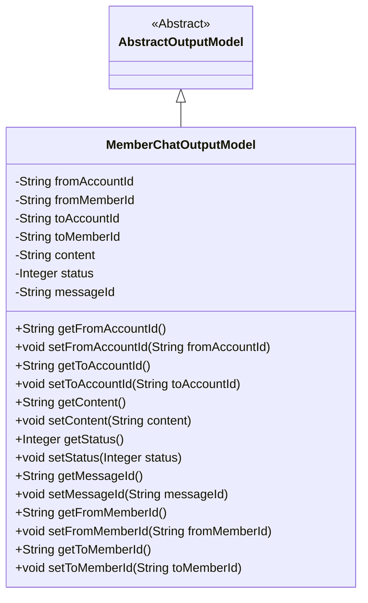

# Basic Information

|      |      |
|------|------|
| Name | MemberChatOutputModel |
| Language | .java |
| Code Path | WeFe/board/board-service/src/main/java/com/welab/wefe/board/service/dto/entity/MemberChatOutputModel.java |
| Package Name | com.welab.wefe.board.service.dto.entity |
| Dependencies | ['com.welab.wefe.common.fieldvalidate.annotation.Check'] |
| Brief Description | Member Chat Output Model Class, including fields such as sender/receiver account ID, member ID, chat content, message status, message ID, and their corresponding getter/setter methods. |

# Description

The MemberChatOutputModel class inherits from AbstractOutputModel and is used to represent member chat output data. It includes fields such as the sender's account ID and member ID, the recipient's account ID and member name, chat content, message status (0 for read, 1 for unread, 2 for successfully sent, 3 for failed to send), and message ID. Each field has corresponding getter and setter methods for retrieving and setting property values.

# Class Summary

| Name   | Type  | Description |
|-------|------|-------------|
| MemberChatOutputModel | class | Member Chat Output Model Class, containing fields such as sender/receiver account ID, member ID, chat content, message status, and message ID, along with corresponding getter/setter methods. |

## Class MemberChatOutputModel

|      |      |
|------|------|
| Access Modifier | public |
| Type | class |
| Name | MemberChatOutputModel |
| Description | Member Chat Output Model Class, containing fields such as sender/receiver account ID, member ID, chat content, message status, and message ID, along with corresponding getter/setter methods. |

### UML Class Diagram

This class diagram illustrates the structure where MemberChatOutputModel inherits from AbstractOutputModel, containing 8 private fields (sender/receiver account IDs, member IDs, message content, status, message ID) along with their corresponding getter/setter methods. The @Check annotation indicates field validation requirements, with the status field using numerical values (0-3) to represent message states. This model primarily encapsulates chat message transmission data, and the inheritance relationship signifies its role as a concrete implementation of the abstract output model.

### Internal Method Call Graph

```mermaid
graph TD
    A["Class MemberChatOutputModel"]
    B["Inherits: AbstractOutputModel"]
    C["Property: String fromAccountId"]
    D["Property: String fromMemberId"]
    E["Property: String toAccountId"]
    F["Property: String toMemberId"]
    G["Property: String content"]
    H["Property: Integer status"]
    I["Property: String messageId"]
    J["Method: getFromAccountId()"]
    K["Method: setFromAccountId(String)"]
    L["Method: getToAccountId()"]
    M["Method: setToAccountId(String)"]
    N["Method: getContent()"]
    O["Method: setContent(String)"]
    P["Method: getStatus()"]
    Q["Method: setStatus(Integer)"]
    R["Method: getMessageId()"]
    S["Method: setMessageId(String)"]
    T["Method: getFromMemberId()"]
    U["Method: setFromMemberId(String)"]
    V["Method: getToMemberId()"]
    W["Method: setToMemberId(String)"]

    A --> B
    A --> C
    A --> D
    A --> E
    A --> F
    A --> G
    A --> H
    A --> I
    A --> J
    A --> K
    A --> L
    A --> M
    A --> N
    A --> O
    A --> P
    A --> Q
    A --> R
    A --> S
    A --> T
    A --> U
    A --> V
    A --> W
```

This flowchart illustrates the complete structure of the MemberChatOutputModel class, including its inheritance relationship and all properties and methods. The class inherits from AbstractOutputModel and contains 8 private properties (such as sender/receiver IDs, message content, and status) along with corresponding 16 getter/setter methods. Each property is annotated with @Check for parameter validation, with the status property explicitly indicating the meaning of status values (0-3 representing different states). The diagram clearly presents the organizational relationships of class members and their access control methods.

### Field List

| Name  | Type  | Description |
|-------|-------|------|
| messageId | String | The private string variable messageId is annotated with @Check and labeled as "Message ID". |
| status | Integer | Status field: 0 read, 1 unread, 2 sent successfully, 3 failed to send. |
| toMemberId | String | The code defines a private string variable named `toMemberId`, with an inspection annotation attached, where the parameter `name` is specified as "Sender member name". |
| fromMemberId | String | Sender member ID field, validated using the @Check annotation. |
| content | String | Chat Content Check Fields |
| fromAccountId | String | Sender account ID string field, validated with @Check annotation. |
| toAccountId | String | Recipient account ID field, validated using the @Check annotation. |

### Method List

| Name  | Type  | Description |
|-------|-------|------|
| getFromMemberId | String | Methods to obtain member ID, returns fromMemberId. |
| getToAccountId | String | Methods to obtain the target account ID, returns the account ID as a string type. |
| setToAccountId | void | The method to set the target account ID assigns the parameter `toAccountId` to the class member variable of the same name. |
| getStatus | Integer | The method getStatus returns an integer status value status. |
| setContent | void | This is a Java method used to set the value of the class's content property. The method takes a string parameter `content` and assigns it to the class's member variable `this.content`. |
| setStatus | void | This is a Java method used to set the state value of an object. The method is named setStatus, which takes an Integer type parameter status and assigns it to the status property of the current object. |
| getContent | String | Methods for obtaining content strings. |
| getMessageId | String | String method to obtain messageId. |
| getFromAccountId | String | This is a Java method that returns the value of the fromAccountId field as a string. |
| getToMemberId | String | Methods to obtain the recipient member ID, returning the string-type value of `toMemberId`. |
| setFromMemberId | void | The method to set the member ID assigns the parameter fromMemberId to the fromMemberId property of the current object. |
| setMessageId | void | Defined a public method setMessageId for setting the value of the messageId property. |
| setFromAccountId | void | Method for setting the source account ID, assigning the parameter value to the class member variable fromAccountId. |
| setToMemberId | void | The method to set the recipient member ID assigns the parameter toMemberId to the class member variable toMemberId. |

