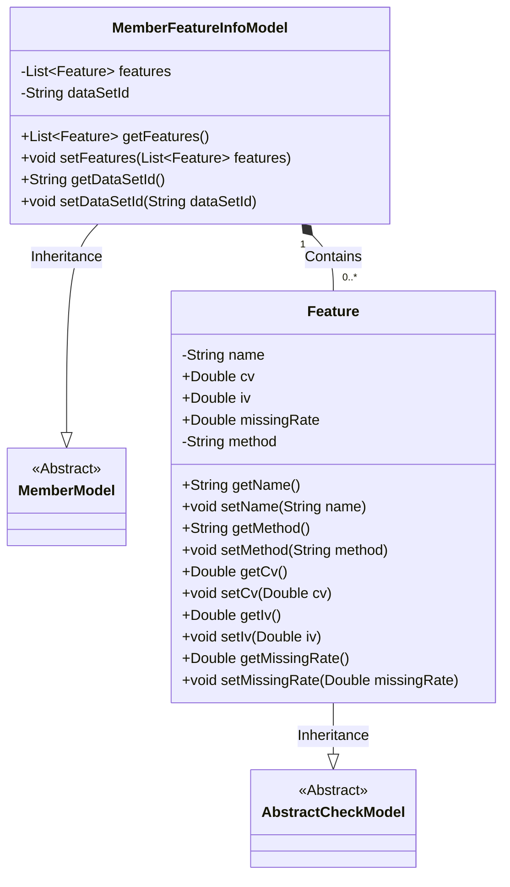
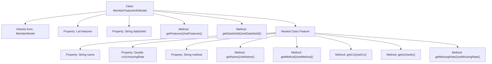

# Basic Information

|      |      |
|------|------|
| Name | MemberFeatureInfoModel |
| Language | .java |
| Code Path | WeFe/board/board-service/src/main/java/com/welab/wefe/board/service/dto/entity/MemberFeatureInfoModel.java |
| Package Name | com.welab.wefe.board.service.dto.entity |
| Dependencies | ['com.welab.wefe.common.fieldvalidate.AbstractCheckModel', 'com.welab.wefe.common.fieldvalidate.annotation.Check', 'java.util.ArrayList', 'java.util.List'] |
| Brief Description | The MemberFeatureInfoModel inherits from MemberModel and includes a mandatory feature list `features` and a dataset ID `dataSetId`. The Feature class has attributes such as feature name `name`, `cv`, `iv`, missing rate `missingRate`, and method `method`. |

# Description

The MemberFeatureInfoModel extends MemberModel and includes the mandatory feature column `features` and dataset ID `dataSetId`. The inner class `Feature` extends AbstractCheckModel and contains the feature name `name`, method `method`, and statistical metrics `cv`, `iv`, and `missingRate`. All fields are provided with getter and setter methods.

# Class Summary

| Name   | Type  | Description |
|-------|------|-------------|
| MemberFeatureInfoModel | class | The MemberFeatureInfoModel inherits from MemberModel and includes the mandatory feature list features and dataset ID dataSetId. The Feature class consists of the feature name name, method method, and statistical metrics cv, iv, missingRate. |

## Class MemberFeatureInfoModel

|      |      |
|------|------|
| Access Modifier | public |
| Type | class |
| Name | MemberFeatureInfoModel |
| Description | The MemberFeatureInfoModel inherits from MemberModel and includes the mandatory feature list features and dataset ID dataSetId. The Feature class consists of the feature name name, method method, and statistical metrics cv, iv, missingRate. |

### UML Class Diagram

This code demonstrates an inheritance hierarchy where MemberFeatureInfoModel inherits from the abstract class MemberModel and contains multiple Feature objects. Feature is an inner class of MemberFeatureInfoModel, inheriting from AbstractCheckModel, and stores feature analysis data (such as cv/iv/missingRate, etc.). MemberFeatureInfoModel manages the feature list through the features collection while maintaining the dataSetId field. The @Check annotation is used for field validation, reflecting data verification functionality. The overall structure clearly expresses the inheritance and composition relationships between the models.

### Internal Method Call Graph

This code defines a MemberFeatureInfoModel class that inherits from MemberModel, containing a feature list and dataset ID property along with corresponding getter/setter methods. It internally nests a Feature class for storing feature names, statistical metrics (CV/IV/missing rate), and calculation methods, also providing complete property access methods. The flowchart clearly illustrates the class inheritance relationship, property structure, and method invocation hierarchy.

### Field List

| Name  | Type  | Description |
|-------|-------|------|
| features = new ArrayList<>() | List<Feature> | The code defines a private list `features`, initialized as an empty ArrayList, marked with the `@Check` annotation as a required field with the name "Feature Columns". |
| dataSetId | String | The private string-type variable dataSetId is used to store the dataset ID. |

### Method List

| Name  | Type  | Description |
|-------|-------|------|
| getFeatures | List<Feature> | Methods to obtain the feature list, directly returning the member variable features. |
| setFeatures | void | This is a Java method used to set the features property of an object, accepting a list of Feature type as a parameter. |
| getDataSetId | String | Methods to obtain the dataset ID, returning a string-type dataset ID. |
| setDataSetId | void | This is a Java method used to set the value of the class's dataSetId property. The method takes a string parameter dataSetId and assigns it to the class's member variable of the same name. |

