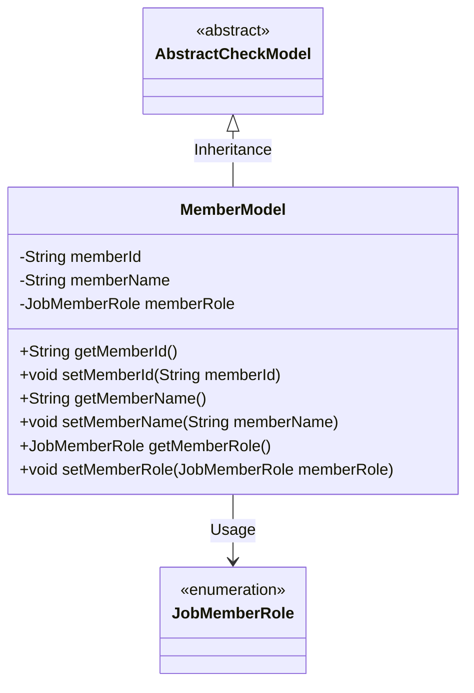
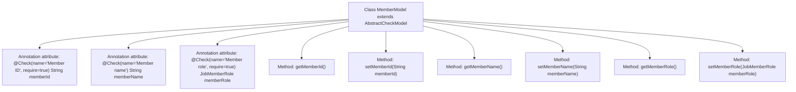

# Basic Information

|      |      |
|------|------|
| Name | MemberModel |
| Language | .java |
| Code Path | WeFe/board/board-service/src/main/java/com/welab/wefe/board/service/dto/entity/MemberModel.java |
| Package Name | com.welab.wefe.board.service.dto.entity |
| Dependencies | ['com.welab.wefe.common.fieldvalidate.AbstractCheckModel', 'com.welab.wefe.common.fieldvalidate.annotation.Check', 'com.welab.wefe.common.wefe.enums.JobMemberRole'] |
| Brief Description | The MemberModel class inherits from AbstractCheckModel, containing a required member ID field, an optional member name field, and a required member role field, with getter and setter methods provided for each field. |

# Description

The content defines a class named MemberModel, which inherits from AbstractCheckModel. The class contains three member variables: memberId (required), memberName, and memberRole (required), each annotated with validation rules and necessity markers. Each variable has corresponding getter and setter methods for retrieving and setting its value. The type of memberRole is JobMemberRole. The overall structure is designed to manage member information while ensuring validation of mandatory fields.

# Class Summary

| Name   | Type  | Description |
|-------|------|-------------|
| MemberModel | class | The MemberModel class inherits from AbstractCheckModel and includes required member ID, optional member name, and required member role fields, providing getter/setter methods. |

## Class MemberModel

|      |      |
|------|------|
| Access Modifier | public |
| Type | class |
| Name | MemberModel |
| Description | The MemberModel class inherits from AbstractCheckModel and includes required member ID, optional member name, and required member role fields, providing getter/setter methods. |

### UML Class Diagram

This code demonstrates a member model class MemberModel, which inherits from the abstract class AbstractCheckModel and contains three main attributes: memberId, memberName, and memberRole. Among them, memberId and memberRole are marked as required fields through the @Check annotation. The class provides standard getter and setter methods and has an association relationship with the enumeration type JobMemberRole. The overall structure reflects the Java Bean design pattern while implementing simple validation functionality through annotations.

### Internal Method Call Graph

This code demonstrates a MemberModel class that inherits from AbstractCheckModel, containing three attributes with validation annotations (memberId, memberName, memberRole) along with their corresponding getter and setter methods. The flowchart clearly presents the class inheritance relationship, attribute annotation configurations, and method invocation structure. Each attribute is marked with @Check annotation specifying validation rules, where the require parameter indicates mandatory fields. This design primarily implements a member data model with validation capabilities, suitable for business scenarios requiring field-level verification.

### Field List

| Name  | Type  | Description |
|-------|-------|------|
| memberRole | JobMemberRole | Check member roles, required field, type is JobMemberRole. |
| memberName | String | Define a private String member variable memberName, and use the @Check annotation to validate the member name. |
| memberId | String | Member ID field, mandatory validation. |

### Method List

| Name  | Type  | Description |
|-------|-------|------|
| getMemberName | String | Methods to obtain the member name, returning the value of the member variable `memberName`. |
| getMemberRole | JobMemberRole | Method to obtain member roles, returns a member role object. |
| setMemberName | void | The method to set the member variable `memberName`. |
| setMemberId | void | Methods for setting member IDs, assigning input parameters to the member variables of the class. |
| getMemberId | String | Methods to obtain member ID, returns member ID string. |
| setMemberRole | void | The method `setMemberRole` is used to set the member role, with the parameter of type `JobMemberRole`, which is assigned to the `memberRole` property of the current object. |

