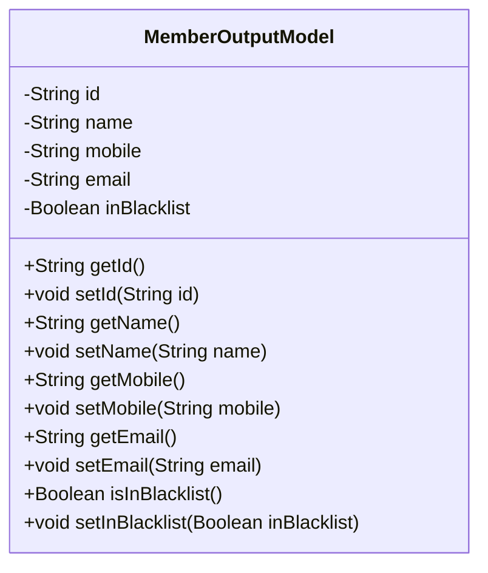

# Basic Information

|      |      |
|------|------|
| Name | MemberOutputModel |
| Language | .java |
| Code Path | WeFe/board/board-service/src/main/java/com/welab/wefe/board/service/dto/entity/MemberOutputModel.java |
| Package Name | com.welab.wefe.board.service.dto.entity |
| Dependencies | [] |
| Brief Description | Member output model class, containing fields for ID, name, mobile phone, email, and blacklist status along with corresponding getter/setter methods. |

# Description

The MemberOutputModel is a Java class designed to represent a member output model. This class includes five private attributes: id (member ID), name (member name), mobile (phone number), email (email address), and inBlacklist (whether the member is on the blacklist, defaulting to false). Each attribute has corresponding getter and setter methods for retrieving and setting the attribute values. This class is primarily used to encapsulate member information, facilitating the transfer and processing of member data within the system.

# Class Summary

| Name   | Type  | Description |
|-------|------|-------------|
| MemberOutputModel | class | The MemberOutputModel class includes fields for member ID, name, mobile number, email, and blacklist status, providing getter and setter methods for each attribute. |

## Class MemberOutputModel

|      |      |
|------|------|
| Access Modifier | public |
| Type | class |
| Name | MemberOutputModel |
| Description | The MemberOutputModel class includes fields for member ID, name, mobile number, email, and blacklist status, providing getter and setter methods for each attribute. |

### UML Class Diagram

This code defines a class named MemberOutputModel, which represents a member output model. The class contains five private attributes: id, name, mobile, email, and inBlacklist, representing the member's unique identifier, name, phone number, email address, and whether they are on the blacklist, respectively. Each attribute has corresponding getter and setter methods for retrieving and setting the attribute values. This class is primarily used to encapsulate member information, facilitating the transfer and processing of member data within the system.

### Internal Method Call Graph

```mermaid
graph TD
    A["Class MemberOutputModel"]
    B["Attribute: String id"]
    C["Attribute: String name"]
    D["Attribute: String mobile"]
    E["Attribute: String email"]
    F["Attribute: Boolean inBlacklist = false"]
    G["Method: String getId()"]
    H["Method: void setId(String id)"]
    I["Method: String getName()"]
    J["Method: void setName(String name)"]
    K["Method: String getMobile()"]
    L["Method: void setMobile(String mobile)"]
    M["Method: String getEmail()"]
    N["Method: void setEmail(String email)"]
    O["Method: Boolean isInBlacklist()"]
    P["Method: void setInBlacklist(Boolean inBlacklist)"]

    A --> B
    A --> C
    A --> D
    A --> E
    A --> F
    A --> G
    A --> H
    A --> I
    A --> J
    A --> K
    A --> L
    A --> M
    A --> N
    A --> O
    A --> P
```

This code defines a Java class named MemberOutputModel, representing a member output model. The class contains five private attributes: id, name, mobile, email, and inBlacklist (defaulting to false). Each attribute has corresponding getter and setter methods for retrieving and updating values. The isInBlacklist method checks whether a member is on the blacklist. This class primarily encapsulates member information for streamlined data transfer and processing within the system.

### Field List

| Name  | Type  | Description |
|-------|-------|------|
| id | String | Private string type variable id. |
| name | String | Private string variable name. |
| mobile | String | Define a private string variable named mobile. |
| email | String | private String email |
| inBlacklist = false | Boolean | The boolean variable inBlacklist has an initial value of false, indicating that it is not on the blacklist by default. |

### Method List

| Name  | Type  | Description |
|-------|-------|------|
| setEmail | void | This is a Java method used to set the email property of an object. The method takes a string parameter email and assigns it to the email field of the current object. |
| getId | String | The method getId returns the id of type string. |
| setId | void | Methods for setting the object ID: Assign the parameter id to the id property of the object. |
| setMobile | void | The method to set the mobile number assigns the parameter `mobile` to the `mobile` property of the current object. |
| setName | void | Methods for setting the object name, assigning the input parameter to the member variable name. |
| getName | String | Methods to obtain the name, returning the string-type name variable. |
| getMobile | String | This is a Java method that returns the value of the string-type mobile variable. |
| isInBlacklist | Boolean | This is a Java method that returns a boolean value indicating whether an object is in the blacklist. The method is named `isInBlacklist` and returns the value of the member variable `inBlacklist`. |
| getEmail | String | Methods to obtain the string value of an email. |
| setInBlacklist | void | Method for setting the blacklist status, with a boolean parameter. |

