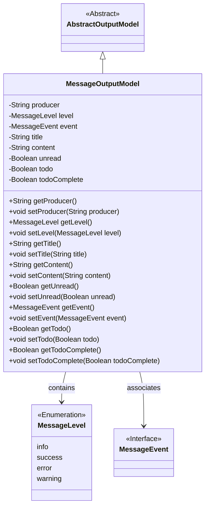

# Basic Information

|      |      |
|------|------|
| Name | MessageOutputModel |
| Language | .java |
| Code Path | WeFe/board/board-service/src/main/java/com/welab/wefe/board/service/dto/entity/MessageOutputModel.java |
| Package Name | com.welab.wefe.board.service.dto.entity |
| Dependencies | ['com.welab.wefe.common.fieldvalidate.annotation.Check', 'com.welab.wefe.common.wefe.enums.MessageEvent', 'com.welab.wefe.common.wefe.enums.MessageLevel'] |
| Brief Description | Message output model class, containing attributes such as producer, level, event, title, content, unread status, to-do item, and completion status, along with corresponding getter/setter methods. |

# Description

The `MessageOutputModel` class inherits from `AbstractOutputModel` and is used to define the message output model. It includes the following attributes: `producer` represents the message producer, with enumerated values being `board` or `gateway`; `level` represents the message level, with enumerated values being `info`, `success`, `error`, or `warning`; `event` represents the event associated with the message; `title` and `content` represent the message title and content, respectively; `unread` indicates whether the message is unread; `todo` indicates whether it is a to-do item; and `todoComplete` indicates whether the to-do item is completed. Each attribute has corresponding getter and setter methods.

# Class Summary

| Name   | Type  | Description |
|-------|------|-------------|
| MessageOutputModel | class | The MessageOutputModel class inherits from AbstractOutputModel and includes attributes such as message producer, level, event, title, content, unread status, to-do marker, and completion status, along with their corresponding getter/setter methods. |

## Class MessageOutputModel

|      |      |
|------|------|
| Access Modifier | public |
| Type | class |
| Name | MessageOutputModel |
| Description | The MessageOutputModel class inherits from AbstractOutputModel and includes attributes such as message producer, level, event, title, content, unread status, to-do marker, and completion status, along with their corresponding getter/setter methods. |

### UML Class Diagram

This class diagram illustrates the structure of a message output model. The MessageOutputModel inherits from the abstract class AbstractOutputModel, containing private fields such as producer, message level, event, title, content, and their corresponding getter/setter methods. Here, MessageLevel is an enumeration type, and MessageEvent is an interface type. The diagram clearly reflects inheritance relationships between entities and attribute associations, making it suitable for domain modeling in message notification systems.

### Internal Method Call Graph

```mermaid
graph TD
    A["Class MessageOutputModel"]
    B["Inherits: AbstractOutputModel"]
    C["Property: String producer"]
    D["Property: MessageLevel level"]
    E["Property: MessageEvent event"]
    F["Property: String title"]
    G["Property: String content"]
    H["Property: Boolean unread"]
    I["Property: Boolean todo"]
    J["Property: Boolean todoComplete"]
    K["Method: getProducer()"]
    L["Method: setProducer(String)"]
    M["Method: getLevel()"]
    N["Method: setLevel(MessageLevel)"]
    O["Method: getTitle()"]
    P["Method: setTitle(String)"]
    Q["Method: getContent()"]
    R["Method: setContent(String)"]
    S["Method: getUnread()"]
    T["Method: setUnread(Boolean)"]
    U["Method: getEvent()"]
    V["Method: setEvent(MessageEvent)"]
    W["Method: getTodo()"]
    X["Method: setTodo(Boolean)"]
    Y["Method: getTodoComplete()"]
    Z["Method: setTodoComplete(Boolean)"]

    A --> B
    A --> C
    A --> D
    A --> E
    A --> F
    A --> G
    A --> H
    A --> I
    A --> J
    A --> K
    A --> L
    A --> M
    A --> N
    A --> O
    A --> P
    A --> Q
    A --> R
    A --> S
    A --> T
    A --> U
    A --> V
    A --> W
    A --> X
    A --> Y
    A --> Z
```

This flowchart illustrates the complete structure of the MessageOutputModel class, including its inheritance relationships and all properties/methods. The class inherits from AbstractOutputModel and contains 9 properties with validation annotations along with corresponding getter/setter methods. The properties cover core fields such as message producer, level, event, title, and content, while also managing unread status and to-do status via Boolean fields. Each property has strict data validation requirements, such as producer and level being restricted to enumerated values.

### Field List

| Name  | Type  | Description |
|-------|-------|------|
| event | MessageEvent | The event field associated with the message is marked with the @Check annotation. |
| unread | Boolean | Class member variable `unread`, boolean type, marked as an unchecked item. |
| producer | String | Message producer field, enumeration type (board/gateway), used to identify the source. |
| content | String | Define a private string variable named content, and mark its name attribute as "Content" using the @Check annotation. |
| todoComplete | Boolean | The field `todoComplete` marks the completion status of a to-do item, validated using the `@Check` annotation to verify whether it is completed. |
| todo | Boolean | The private boolean field 'todo' is marked with the @Check annotation as a to-do checklist item. |
| level | MessageLevel | Message level enumeration field, optional values are info/success/error/warning. |
| title | String | The code defines a private string variable named title, annotated with the check annotation `@Check(name = "title")`. |

### Method List

| Name  | Type  | Description |
|-------|-------|------|
| getProducer | String | The method to obtain the producer name returns a string-type producer value. |
| setUnread | void | Methods for setting the unread status, with a boolean parameter `unread` used to update the `unread` property of the current object. |
| getLevel | MessageLevel | Methods for obtaining the message level, returns the value of the level attribute. |
| setTitle | void | Methods for setting object titles, assigning the passed string to the object's title property. |
| setProducer | void | This is a Java method used to set the producer property value of a class. The method takes a string parameter named producer and assigns it to the producer member variable of the current object. |
| getContent | String | This is a Java method that returns the value of the string-type variable `content`. |
| getEvent | MessageEvent | Methods to obtain the event object, returning the MessageEvent type. |
| setLevel | void | The method to set the message level assigns the input parameter level to the level property of the current object. |
| setContent | void | This is a Java method used to set the value of the class member variable `content`. The method takes a string parameter `content` and assigns it to the `content` property of the current object. |
| setEvent | void | Set the event method to assign the incoming MessageEvent to the event property of the current object. |
| getUnread | Boolean | Method to obtain the boolean value of unread status. |
| getTitle | String | Methods to obtain the title, returning the value of the title variable as a string type. |
| getTodo | Boolean | This is a Java method that returns the boolean value of the todo variable. |
| setTodo | void | Methods for setting the to-do status by assigning a boolean value to the class variable `todo`. |
| getTodoComplete | Boolean | Method to obtain the boolean value of the to-do item completion status. |
| setTodoComplete | void | Methods for setting the completion status of a to-do item, with a boolean parameter. |

