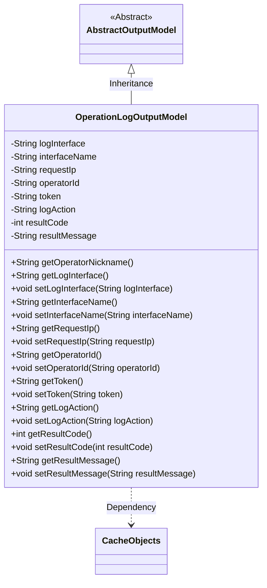

# Basic Information

|      |      |
|------|------|
| Name | OperationLogOutputModel |
| Language | .java |
| Code Path | WeFe/board/board-service/src/main/java/com/welab/wefe/board/service/dto/entity/OperationLogOutputModel.java |
| Package Name | com.welab.wefe.board.service.dto.entity |
| Dependencies | ['com.welab.wefe.board.service.service.CacheObjects', 'com.welab.wefe.common.fieldvalidate.annotation.Check'] |
| Brief Description | The OperationLogOutputModel class inherits from AbstractOutputModel and includes fields such as log interface, name, IP, operator ID, token, action, result code, and message, providing getter and setter methods. |

# Description

The OperationLogOutputModel class inherits from AbstractOutputModel and contains multiple fields annotated with @Check: logInterface (request interface), interfaceName (interface name), requestIp (request IP), operatorId (operator ID), token (request token), logAction (operation action), resultCode (result code), and resultMessage (result message). It provides getter and setter methods for each field, as well as a getOperatorNickname method to retrieve the operator's nickname based on the operatorId.

# Class Summary

| Name   | Type  | Description |
|-------|------|-------------|
| OperationLogOutputModel | class | The OperationLogOutputModel class inherits from AbstractOutputModel and includes fields such as log interface, name, IP, operator ID, token, action, result code, and message, providing getter and setter methods for each field. |

## Class OperationLogOutputModel

|      |      |
|------|------|
| Access Modifier | public |
| Type | class |
| Name | OperationLogOutputModel |
| Description | The OperationLogOutputModel class inherits from AbstractOutputModel and includes fields such as log interface, name, IP, operator ID, token, action, result code, and message, providing getter and setter methods for each field. |

### UML Class Diagram

Class Diagram Description: OperationLogOutputModel inherits from the abstract class AbstractOutputModel, containing multiple private fields for recording operation log information such as request interface, IP, operator ID, etc. Each field has corresponding getter and setter methods. This class retrieves operator nicknames through CacheObjects, reflecting a dependency on cached objects. All fields are annotated with @Check, indicating validation requirements.

### Internal Method Call Graph

```mermaid
graph TD
    A["Class OperationLogOutputModel"]
    B["Inherits: AbstractOutputModel"]
    C["Annotated Property: @Check String logInterface"]
    D["Annotated Property: @Check String interfaceName"]
    E["Annotated Property: @Check String requestIp"]
    F["Annotated Property: @Check String operatorId"]
    G["Annotated Property: @Check String token"]
    H["Annotated Property: @Check String logAction"]
    I["Annotated Property: @Check int resultCode"]
    J["Annotated Property: @Check String resultMessage"]
    K["Method: getOperatorNickname()"]
    L["Methods: getter/setter pairs x8"]

    A --> B
    A --> C
    A --> D
    A --> E
    A --> F
    A --> G
    A --> H
    A --> I
    A --> J
    A --> K
    A --> L
```

This flowchart illustrates the complete structure of the OperationLogOutputModel class, which inherits from AbstractOutputModel and contains 8 properties annotated with @Check and 9 methods. The getOperatorNickname() method retrieves the nickname from CacheObjects using operatorId, while the remaining 8 methods are standard property getter/setter pairs. All properties are marked with @Check annotation, indicating this is a data model class designed for logging and parameter validation, primarily used to record key information such as interface requests, operational behaviors, and results.

### Field List

| Name  | Type  | Description |
|-------|-------|------|
| operatorId | String | The field operatorId is validated with the @Check annotation to verify the operator ID. |
| resultMessage | String | The class member variable `resultMessage` is used to store the request result and is annotated with `@Check`. |
| interfaceName | String | Define the interface name check field to identify the requested interface name. |
| logAction | String | Log operation behavior field, used to record the operation type. |
| logInterface | String | A private string variable named `logInterface` is defined to mark the request interface. |
| token | String | The code defines a private string variable named token and adds an inspection annotation labeled "Request Token". |
| resultCode | int | The private integer variable `resultCode` is used to store the request result code, marked with the `@Check` annotation. |
| requestIp | String | Define a private string variable requestIp, marked with the @Check annotation as a validation item for "Request IP". |

### Method List

| Name  | Type  | Description |
|-------|-------|------|
| setLogInterface | void | This is a Java method used to set the string value of the log interface. The method is named setLogInterface, which takes a String parameter logInterface and assigns it to the property of the same name in the current object. |
| getToken | String | Methods for obtaining the string value of a token. |
| getInterfaceName | String | Methods to obtain the interface name, returns the interfaceName of string type. |
| getOperatorNickname | String | Methods to retrieve operator nicknames, query and return the nickname from the cache using operatorId. |
| setLogAction | void | Define the method setLogAction to set the value of the logAction property. |
| getResultCode | int | Methods for obtaining return result codes. |
| setResultCode | void | The method to set the result code assigns the passed integer value to the `resultCode` member variable of the class. |
| getResultMessage | String | Methods to obtain the result message, returns a string-type resultMessage. |
| setResultMessage | void | This is a Java method used to set the value of the class's resultMessage property. The method takes a string parameter and assigns it to the member variable resultMessage of the class. |
| setToken | void | Methods for setting the token string value. |
| setRequestIp | void | This is a Java method used to set the request IP address, which assigns the incoming requestIp parameter to the class's member variable requestIp. |
| getRequestIp | String | Methods to obtain the request IP, returning the value of the requestIp variable. |
| setOperatorId | void | The method to set the operator ID assigns the parameter `operatorId` to the `operatorId` property of the current object. |
| getLogInterface | String | The method returns the logInterface string. |
| getOperatorId | String | Methods to obtain the operator ID, returning the operatorId string. |
| setInterfaceName | void | The method to set the interface name assigns the parameter value to the class member variable `interfaceName`. |
| getLogAction | String | Methods for obtaining log actions, returning a string type logAction. |

