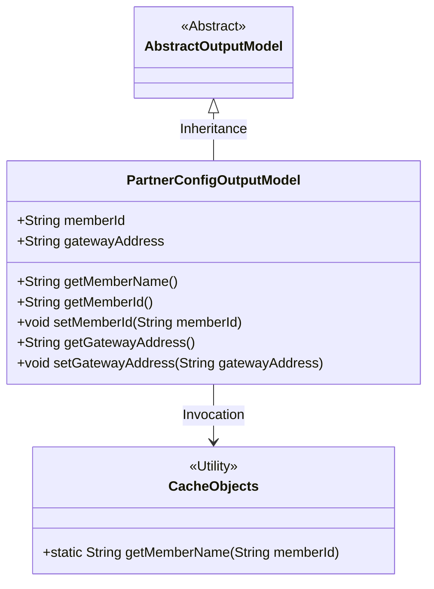
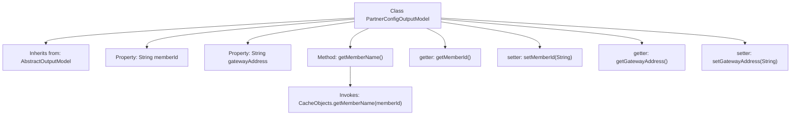

# Basic Information

|      |      |
|------|------|
| Name | PartnerConfigOutputModel |
| Language | .java |
| Code Path | WeFe/board/board-service/src/main/java/com/welab/wefe/board/service/dto/entity/PartnerConfigOutputModel.java |
| Package Name | com.welab.wefe.board.service.dto.entity |
| Dependencies | ['com.welab.wefe.board.service.service.CacheObjects'] |
| Brief Description | The PartnerConfigOutputModel class extends AbstractOutputModel, containing memberId and gatewayAddress fields along with their getter/setter methods, and provides a getMemberName method to retrieve member names via CacheObjects. |

# Description

The `PartnerConfigOutputModel` class inherits from `AbstractOutputModel` and includes two member variables: `memberId` and `gatewayAddress`. This class provides a method `getMemberName` to retrieve the member name, implemented via `CacheObjects.getMemberName`. It also contains getter and setter methods for `memberId` and `gatewayAddress`, enabling access and modification of these variables.

# Class Summary

| Name   | Type  | Description |
|-------|------|-------------|
| PartnerConfigOutputModel | class | The PartnerConfigOutputModel class extends AbstractOutputModel, containing memberId and gatewayAddress fields along with their getter/setter methods, and provides a method to retrieve memberName by memberId. |

## Class PartnerConfigOutputModel

|      |      |
|------|------|
| Access Modifier | public |
| Type | class |
| Name | PartnerConfigOutputModel |
| Description | The PartnerConfigOutputModel class extends AbstractOutputModel, containing memberId and gatewayAddress fields along with their getter/setter methods, and provides a method to retrieve memberName by memberId. |

### UML Class Diagram

This class diagram illustrates that PartnerConfigOutputModel inherits from the abstract class AbstractOutputModel, containing two public fields (memberId and gatewayAddress) along with corresponding getter/setter methods. The getMemberName() method relies on the static method of the CacheObjects utility class. This design achieves encapsulation of configuration data and cache query functionality, demonstrating a simple DTO (Data Transfer Object) pattern collaborating with utility classes.

### Internal Method Call Graph

This code illustrates the PartnerConfigOutputModel class, which inherits from AbstractOutputModel and contains two member variables: memberId and gatewayAddress. The class defines a getMemberName() method to retrieve member names, implemented by invoking the static method getMemberName() from CacheObjects. Additionally, standard getter and setter methods are provided for accessing and modifying the member variables. The flowchart clearly demonstrates the class inheritance, property structure, and method invocation chain.

### Field List

| Name  | Type  | Description |
|-------|-------|------|
| memberId | String | Define a public string type member variable memberId. |
| gatewayAddress | String | Declare a public string variable gatewayAddress. |

### Method List

| Name  | Type  | Description |
|-------|-------|------|
| getMemberId | String | Methods to obtain member ID, returns a string-type memberId. |
| getMemberName | String | Method to retrieve member name: Returns the name from cache based on member ID. |
| setMemberId | void | The method to set the member ID assigns the input parameter to the class's member variable memberId. |
| getGatewayAddress | String | This is a Java method that returns the gateway address variable `gatewayAddress` of type String. |
| setGatewayAddress | void | The method to set the gateway address assigns the input parameter `gatewayAddress` to the class member variable of the same name. |

