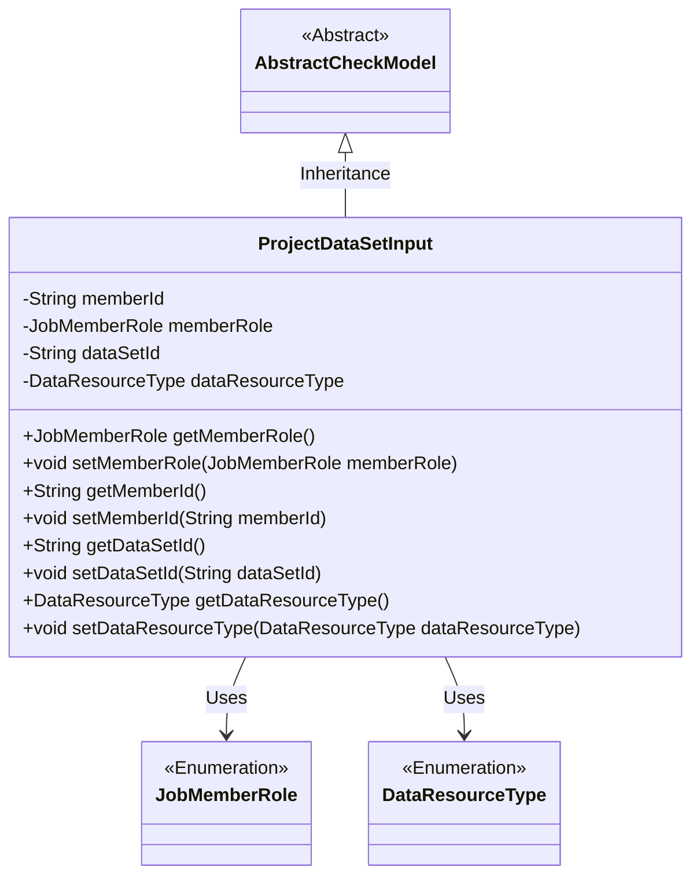

# Basic Information

|      |      |
|------|------|
| Name | ProjectDataSetInput |
| Language | .java |
| Code Path | WeFe/board/board-service/src/main/java/com/welab/wefe/board/service/dto/entity/ProjectDataSetInput.java |
| Package Name | com.welab.wefe.board.service.dto.entity |
| Dependencies | ['com.welab.wefe.common.fieldvalidate.AbstractCheckModel', 'com.welab.wefe.common.fieldvalidate.annotation.Check', 'com.welab.wefe.common.wefe.enums.DataResourceType', 'com.welab.wefe.common.wefe.enums.JobMemberRole'] |
| Brief Description | The ProjectDataSetInput class inherits from AbstractCheckModel and includes member fields such as ID, role, dataset ID, and type, all of which require non-null validation. It also provides getter/setter methods. |

# Description

The ProjectDataSetInput class inherits from AbstractCheckModel and includes four key fields: memberId (required, representing the member ID), memberRole (required, describing the member role to distinguish between oneself and one's federation scenario), dataSetId (required, representing the dataset ID), and dataResourceType (required, representing the dataset type). Each field is validated using the @Check annotation and is equipped with corresponding getter and setter methods.

# Class Summary

| Name   | Type  | Description |
|-------|------|-------------|
| ProjectDataSetInput | class | The ProjectDataSetInput class includes member ID, role, dataset ID, and type fields, all of which are mandatory and used for data validation by project collaborators. |

## Class ProjectDataSetInput

|      |      |
|------|------|
| Access Modifier | public |
| Type | class |
| Name | ProjectDataSetInput |
| Description | The ProjectDataSetInput class includes member ID, role, dataset ID, and type fields, all of which are mandatory and used for data validation by project collaborators. |

### UML Class Diagram

This class diagram illustrates that the ProjectDataSetInput class inherits from the AbstractCheckModel abstract class and contains four private fields (memberId, memberRole, dataSetId, dataResourceType) along with their corresponding getter/setter methods. The memberRole and dataResourceType fields are associated with the JobMemberRole and DataResourceType enumeration types respectively. The class implements field validation functionality through annotations to handle various constraint conditions during project dataset input, including mandatory field checks and business logic validation.

### Internal Method Call Graph

```mermaid
graph TD
    A["Class ProjectDataSetInput"]
    B["Inherits from: AbstractCheckModel"]
    C["Annotation attribute: @Check memberId"]
    D["Annotation attribute: @Check memberRole"]
    E["Annotation attribute: @Check dataSetId"]
    F["Annotation attribute: @Check dataResourceType"]
    G["Method: getMemberRole()"]
    H["Method: setMemberRole(JobMemberRole)"]
    I["Method: getMemberId()"]
    J["Method: setMemberId(String)"]
    K["Method: getDataSetId()"]
    L["Method: setDataSetId(String)"]
    M["Method: getDataResourceType()"]
    N["Method: setDataResourceType(DataResourceType)"]

    A --> B
    A --> C
    A --> D
    A --> E
    A --> F
    A --> G
    A --> H
    A --> I
    A --> J
    A --> K
    A --> L
    A --> M
    A --> N
```

This code defines a class named ProjectDataSetInput, which inherits from AbstractCheckModel. The class contains four attributes annotated with @Check: memberId, memberRole, dataSetId, and dataResourceType, representing member ID, member role, dataset ID, and dataset type respectively. Each attribute has corresponding getter and setter methods for retrieving and setting attribute values. This class is primarily used for dataset input validation and encapsulation, implementing mandatory field validation functionality through annotations.

### Field List

| Name  | Type  | Description |
|-------|-------|------|
| memberId | String | Member ID field validation: Required field, prompt "Please select a project partner" when left blank. |
| dataSetId | String | The field dataSetId must be non-empty and is marked as a required dataset ID. |
| dataResourceType | DataResourceType | The code defines a private variable dataResourceType with a mandatory annotation, specifying dataset type validation. |
| memberRole | JobMemberRole | The member role field is used to distinguish between oneself and one's federation, and is mandatory. |

### Method List

| Name  | Type  | Description |
|-------|-------|------|
| getMemberId | String | Methods to obtain the member ID, returns a string-type memberId. |
| getDataSetId | String | The method to obtain the dataset ID, which returns the dataset ID as a string type. |
| getMemberRole | JobMemberRole | The method getMemberRole returns the member role object memberRole. |
| setMemberRole | void | This method is used to set the member role, assigning the passed memberRole parameter to the memberRole property of the current object. |
| setMemberId | void | The method to set the member ID assigns the parameter memberId to the memberId property of the current object. |
| setDataSetId | void | The method to set the dataset ID assigns the parameter value to the class member variable `dataSetId`. |
| getDataResourceType | DataResourceType | Methods for obtaining data resource types, returns a dataResourceType object. |
| setDataResourceType | void | The method for setting the data resource type takes a parameter of type DataResourceType and assigns it to the member variable dataResourceType. |

