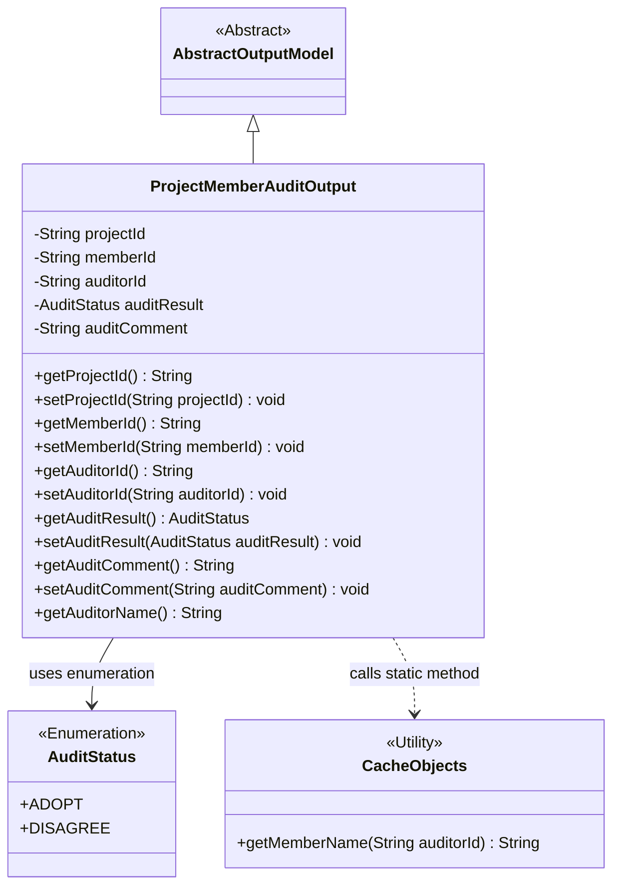
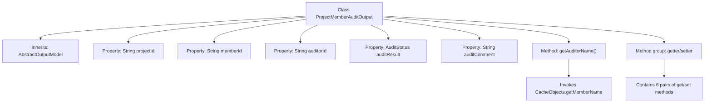

# Basic Information

|      |      |
|------|------|
| Name | ProjectMemberAuditOutput |
| Language | .java |
| Code Path | WeFe/board/board-service/src/main/java/com/welab/wefe/board/service/dto/entity/ProjectMemberAuditOutput.java |
| Package Name | com.welab.wefe.board.service.dto.entity |
| Dependencies | ['com.welab.wefe.board.service.service.CacheObjects', 'com.welab.wefe.common.fieldvalidate.annotation.Check', 'com.welab.wefe.common.wefe.enums.AuditStatus'] |
| Brief Description | The ProjectMemberAuditOutput class is used for project member audits, containing fields such as project ID, member ID, reviewer ID, audit result (adopt/disagree), and audit comments, with getter/setter methods provided. |

# Description

The ProjectMemberAuditOutput class extends AbstractOutputModel and includes fields for project ID, member ID, reviewer ID, audit result (enum values adopt/disagree), and audit comments. It provides getter/setter methods for each field, with the reviewer name obtained via the CacheObjects.getMemberName method. All fields are annotated with @Check to specify their names.

# Class Summary

| Name   | Type  | Description |
|-------|------|-------------|
| ProjectMemberAuditOutput | class | Project member review output class, including fields such as project ID, member ID, reviewer ID, review result, and comments, along with corresponding getter/setter methods. |

## Class ProjectMemberAuditOutput

|      |      |
|------|------|
| Access Modifier | public |
| Type | class |
| Name | ProjectMemberAuditOutput |
| Description | Project member review output class, including fields such as project ID, member ID, reviewer ID, review result, and comments, along with corresponding getter/setter methods. |

### UML Class Diagram

This class diagram illustrates the structure of the project member audit output model. ProjectMemberAuditOutput inherits from the abstract class AbstractOutputModel, containing core fields such as project ID, member ID, and auditor ID. It uses the AuditStatus enumeration to represent audit results and retrieves auditor names through the CacheObjects utility class. The class manages field access via getter/setter methods, demonstrating the standard JavaBean design pattern, making it suitable for encapsulating and transmitting project member audit results.

### Internal Method Call Graph

This code defines a project member audit output class ProjectMemberAuditOutput, which inherits from AbstractOutputModel. The class contains five core properties: project ID, member ID, auditor ID, audit result enumeration, and audit comments, each with corresponding getter/setter methods. Notably, the getAuditorName() method retrieves the auditor's name by calling CacheObjects.getMemberName(). All properties are annotated with @Check for validation, reflecting the design intent of data verification. This class is primarily used to encapsulate output data models related to project member audits.

### Field List

| Name  | Type  | Description |
|-------|-------|------|
| auditComment | String | The private string variable `auditComment` is used to store audit comments, annotated with `@Check`. |
| auditResult | AuditStatus | Review result field, with enumerated values of adopt (approved) or disagree (rejected). |
| memberId | String | Member ID field, validated using the @Check annotation. |
| auditorId | String | The code defines a private string variable named auditorId, annotated with @Check to label it as "Reviewer". |
| projectId | String | The field projectId is labeled as the primary key of the associated project, used to identify the project ID. |

### Method List

| Name  | Type  | Description |
|-------|-------|------|
| setMemberId | void | Methods for setting member ID: Assign the passed string parameter to the class's member variable memberId. |
| getAuditorId | String | Methods to obtain auditorId, returns a string type auditorId. |
| getAuditorName | String | Methods to obtain the auditor's name: query the member name from the cache using auditorId and return it. |
| setAuditorId | void | The method to set the auditor ID assigns the parameter auditorId to the auditorId property of the current object. |
| getProjectId | String | Methods to obtain the project ID, returning a string-type variable projectId. |
| setAuditResult | void | The method to set the audit result, with the parameter of type AuditStatus, assigns the value to the member variable auditResult. |
| setProjectId | void | Methods for setting the project ID: Assign the input parameter projectId to the projectId property of the current object. |
| getMemberId | String | The method getMemberId returns the member ID string memberId. |
| getAuditComment | String | Method to obtain the audit comment, returns the auditComment string. |
| setAuditComment | void | This is a Java method used to set the value of the auditComment property. The method takes a string parameter auditComment and assigns it to the class member variable this.auditComment. |
| getAuditResult | AuditStatus | Methods to obtain the audit result, returning the auditResult status. |

