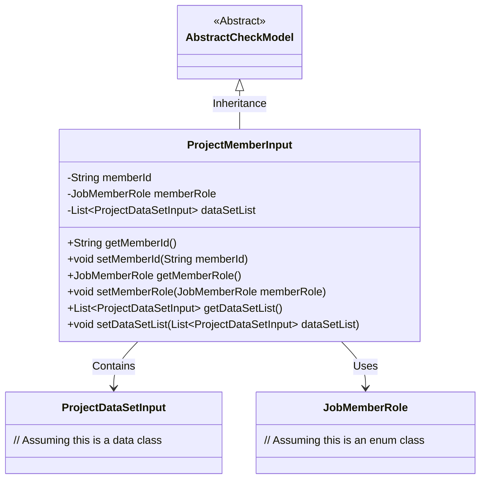
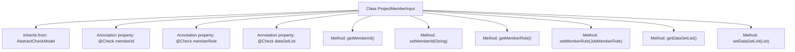

# Basic Information

|      |      |
|------|------|
| Name | ProjectMemberInput |
| Language | .java |
| Code Path | WeFe/board/board-service/src/main/java/com/welab/wefe/board/service/dto/entity/ProjectMemberInput.java |
| Package Name | com.welab.wefe.board.service.dto.entity |
| Dependencies | ['com.welab.wefe.common.fieldvalidate.AbstractCheckModel', 'com.welab.wefe.common.fieldvalidate.annotation.Check', 'com.welab.wefe.common.wefe.enums.JobMemberRole', 'java.util.List'] |
| Brief Description | The ProjectMemberInput class includes fields for member ID, role, and dataset list, providing getter/setter methods, with member ID being a required field. |

# Description

The `ProjectMemberInput` class inherits from `AbstractCheckModel` and includes three main fields: `memberId` (required, with validation prompt "Please select a project collaborator" when empty), `memberRole` (not displayed on the interface), and `dataSetList` (a list of datasets). Each field has corresponding getter and setter methods for retrieving and setting property values. This class is used to handle project member input data, including member ID, role, and associated dataset information.

# Class Summary

| Name   | Type  | Description |
|-------|------|-------------|
| ProjectMemberInput | class | The ProjectMemberInput class includes fields for member ID (required), member role, and dataset list, providing getter/setter methods. |

## Class ProjectMemberInput

|      |      |
|------|------|
| Access Modifier | public |
| Type | class |
| Name | ProjectMemberInput |
| Description | The ProjectMemberInput class includes fields for member ID (required), member role, and dataset list, providing getter/setter methods. |

### UML Class Diagram

This class diagram illustrates that the ProjectMemberInput class inherits from the AbstractCheckModel base class and contains three main private fields: memberId (String type), memberRole (JobMemberRole type), and dataSetList (List of ProjectDataSetInput type). The class exposes access to these fields through getter/setter methods, with the memberId field marked as mandatory via the @Check annotation. ProjectMemberInput has association relationships with ProjectDataSetInput and JobMemberRole, representing the project dataset list and member role enumeration respectively. The overall structure reflects the domain model for form data validation and project member information management.

### Internal Method Call Graph

This flowchart illustrates the structure of the ProjectMemberInput class, which inherits from the AbstractCheckModel class. It contains three properties annotated with @Check and their corresponding getter/setter methods. The memberId property has a non-null validation requirement, the memberRole property is configured to be non-displayed, and the dataSetList property is used to store a list of datasets. All methods are implemented according to the standard JavaBean specification for accessing and modifying these property values.

### Field List

| Name  | Type  | Description |
|-------|-------|------|
| dataSetList | List<ProjectDataSetInput> | The dataset list field, a private list of type ProjectDataSetInput, is marked with the @Check annotation. |
| memberRole | JobMemberRole | Member role check annotation, not displayed, private member role variable. |
| memberId | String | Java Field Annotation: Member ID is required, with a prompt "Please select a project partner" if left empty. |

### Method List

| Name  | Type  | Description |
|-------|-------|------|
| setMemberId | void | The method to set the member ID assigns the input string to the class's member variable `memberId`. |
| getMemberId | String | Methods to obtain the member ID, which returns a string-type memberId. |
| setDataSetList | void | This is a Java method used to set the dataset list property, which accepts a List parameter of type ProjectDataSetInput. |
| getDataSetList | List<ProjectDataSetInput> | The method returns a list of data sets, dataSetList. |
| getMemberRole | JobMemberRole | The method getMemberRole returns the member role memberRole. |
| setMemberRole | void | Method for setting member roles, which assigns the passed member roles to the member role property of the current object. |

