# Basic Information

|      |      |
|------|------|
| Name | entity |
| Language | .java |
| Code Path | WeFe/board/board-service/src/main/java/com/welab/wefe/board/service/dto/entity |
| Package Name | docs.board.board-service.src.main.java.com.welab.wefe.board.service.dto.entity |
| Brief Description | This module provides data resource management, task flow orchestration, member collaboration, and status tracking functionalities for federated learning projects. Adopting the Java Bean pattern, it implements standardized interfaces through inheritance and annotations, supporting data lifecycle management and multi-scenario applications. |

# Description

## Overview  
The core responsibility of this module is to establish a federated learning lifecycle management system, resembling a hybrid model of a workflow engine and a data platform, which uniformly manages project collaboration, task orchestration, data resources, and member interactions. The interface specification adopts the Java Bean pattern, leveraging field reuse through inheritance of `AbstractOutputModel`, combined with `@Check` annotation validation and JSON serialization control. Key data structures include a four-layer model system: base classes (e.g., `ProjectOutputModel`), process classes (e.g., `JobOutputModel`), member classes (e.g., `MemberOutputModel`), and derived classes (e.g., `BloomFilterDataResourceListOutputModel`). External dependencies primarily include the Spring validation framework and ModelMapper, such as converting MySQL models to output models via ModelMapper.

## Key Business Scenarios  
The module supports end-to-end federated learning collaboration, with typical scenarios including: 1) Project Dashboard (aggregating workflow status and dataset statistics); 2) Task Orchestration (e.g., `ProjectFlowNodeOutputModel` defining DAG relationships); 3) Data Governance (e.g., `DataSetOutputModel` analyzing feature distributions). The interaction model resembles a multi-tenant SaaS system, transmitting state changes through standardized models, such as `BlacklistOutputModel` synchronizing member status. APIs cover resource queries (`getStorageNamespace`), parameter configuration (e.g., logistic regression learning rate), and progress tracking (`progressPercentage`). Integration examples include gateway-pushed task topologies and real-time dashboard synchronization.

### Package Internal Structure View

```mermaid
graph TD
    entity --> data_resource
    entity --> job
    entity --> modeling_config
    entity --> data_set
    entity --> project
    entity --> component
    entity --> BlacklistOutputModel.java
    entity --> ProjectDataSetInput.java
    entity --> MemberOutputModel.java
    entity --> ProjectMemberAuditOutput.java
    entity --> MessageOutputModel.java
    entity --> OperationLogOutputModel.java
    entity --> MemberFeatureInfoModel.java
    entity --> ProjectMemberInput.java
    entity --> DataIoTaskFeatureInfoOutputModel.java
    entity --> MemberModel.java
    entity --> AccountListAllOutputModel.java
    entity --> AbstractOutputModel.java
    entity --> AccountOutputModel.java
    entity --> MemberChatOutputModel.java
    entity --> PartnerConfigOutputModel.java
    entity --> ChatLastAccountOutputModel.java
    entity --> BloomFilterDataResourceListOutputModel.java
    data_resource --> output
    output --> ImageDataSetOutputModel.java
    output --> TableDataSetOutputModel.java
    output --> DataResourceUploadTaskOutputModel.java
    output --> BloomFilterOutputModel.java
    output --> DataResourceOutputModel.java
    job --> gateway
    job --> RelateDataSetOutputModel.java
    job --> TaskOutputModel.java
    job --> ProjectFlowNodeOutputModel.java
    job --> PreviewJobNodeOutputModel.java
    job --> JobOutputModel.java
    job --> TaskProgressOuputModel.java
    job --> TaskResultOutputModel.java
    job --> TaskOutputView.java
    job --> JobMemberOutputModel.java
    job --> JobListOutputModel.java
    gateway --> ProjectForGatewayDataSetOutputModel.java
    gateway --> ProjectForGatewayMemberOutputModel.java
    modeling_config --> ModelingConfigLogisticRegressionOutputModel.java
    modeling_config --> AbstractModelingConfigOutputModel.java
    modeling_config --> ModelingInfoOutputModel.java
    data_set --> ImageDataSetSampleOutputModel.java
    data_set --> DataSetColumnOutputModel.java
    data_set --> DataSetOutputModel.java
    data_set --> DataSetColumnInputModel.java
    project --> ProjectFlowListOutputModel.java
    project --> ProjectModelingOutputModel.java
    project --> ProjectMemberOutputModel.java
    project --> ProjectFlowDetailOutputModel.java
    project --> data_set
    project --> ProjectQueryOutputModel.java
    project --> ProjectDetailMemberOutputModel.java
    project --> ProjectFlowOutputModel.java
    project --> ProjectOutputModel.java
    project --> ProjectFlowProgressOutputModel.java
    project --> ProjectUsageDetailOutputModel.java
    data_set --> DerivedProjectDataSetOutputModel.java
    data_set --> ProjectDataResourceOutputModel.java
    component --> ComponentOutputModel.java
```

This flowchart illustrates the hierarchical structure of DTO entity classes in the board-service module of the WeFe project. The root node is "entity," which branches into major submodules such as data_resource, job, and modeling_config. Each submodule contains specific output model classes, such as various resource output models under data_resource/output, and the job module includes task and project flow-related models. The overall structure clearly demonstrates data flow and inter-module relationships, comprising over 50 nodes that comprehensively cover the data transfer object definitions in the project.

# File List

| Name   | Type  | Description |
|-------|------|-------------|
| [BlacklistOutputModel.java](BlacklistOutputModel.md) | file | The BlacklistOutputModel class includes fields for ID, member ID, name, remarks, creator, and creation time, providing getter and setter methods. |
| [ProjectDataSetInput.java](ProjectDataSetInput.md) | file | The ProjectDataSetInput class inherits from AbstractCheckModel and includes member fields such as ID, role, dataset ID, and type, all of which require non-null validation. It also provides getter/setter methods. |
| [MemberOutputModel.java](MemberOutputModel.md) | file | Member output model class, including fields for ID, name, phone, email, and blacklist status, along with corresponding getter/setter methods. |
| [ProjectMemberAuditOutput.java](ProjectMemberAuditOutput.md) | file | The ProjectMemberAuditOutput class is used for project member audits, containing fields such as project ID, member ID, reviewer ID, audit result (adopt/disagree), and audit comments, and provides getter/setter methods. |
| [MessageOutputModel.java](MessageOutputModel.md) | file | Message output model class, containing attributes such as producer, level, event, title, content, unread status, to-do item, and completion status, along with corresponding getter/setter methods. |
| [OperationLogOutputModel.java](OperationLogOutputModel.md) | file | The OperationLogOutputModel class inherits from AbstractOutputModel and includes fields such as log interface, name, IP, operator ID, token, action, result code, and message, providing getter and setter methods. |
| [MemberFeatureInfoModel.java](MemberFeatureInfoModel.md) | file | The MemberFeatureInfoModel inherits from MemberModel and includes the mandatory feature list `features` and dataset ID `dataSetId`. The Feature class has attributes such as feature name `name`, `cv`, `iv`, missing rate `missingRate`, and method `method`. |
| [ProjectMemberInput.java](ProjectMemberInput.md) | file | The ProjectMemberInput class includes fields for member ID, role, and dataset list, providing getter/setter methods, with member ID being a required field. |
| [DataIoTaskFeatureInfoOutputModel.java](DataIoTaskFeatureInfoOutputModel.md) | file | Data IO task feature information output model, including member ID, name, role, dataset ID, and feature column list. |
| [MemberModel.java](MemberModel.md) | file | The MemberModel class inherits from AbstractCheckModel, containing a mandatory member ID field, an optional member name field, and a mandatory member role field, while providing getter and setter methods for each field. |
| [AccountListAllOutputModel.java](AccountListAllOutputModel.md) | file | The AccountListAllOutputModel class includes fields for user nickname, super administrator flag, administrator flag, review status, availability status, and cancellation status, along with their corresponding getter/setter methods. |
| [AbstractOutputModel.java](AbstractOutputModel.md) | file | The AbstractOutputModel class includes fields such as ID, creator/updater, and timestamps, with set methods that automatically assign creator and updater nicknames. |
| [AccountOutputModel.java](AccountOutputModel.md) | file | The AccountOutputModel class contains user account information such as phone number, nickname, email, administrator role, review status, last activity time, and other fields, and provides getter/setter methods. |
| [MemberChatOutputModel.java](MemberChatOutputModel.md) | file | Member Chat Output Model Class, including fields such as sender/receiver account ID, member ID, chat content, message status, message ID, and their corresponding getter/setter methods. |
| [PartnerConfigOutputModel.java](PartnerConfigOutputModel.md) | file | The PartnerConfigOutputModel class extends AbstractOutputModel, containing memberId and gatewayAddress fields along with their getter/setter methods, and provides a getMemberName method to retrieve member names via CacheObjects. |
| [ChatLastAccountOutputModel.java](ChatLastAccountOutputModel.md) | file | The ChatLastAccountOutputModel class contains account, member, and contact information, as well as the count of unread messages. It provides getter and setter methods for each field. |
| [BloomFilterDataResourceListOutputModel.java](BloomFilterDataResourceListOutputModel.md) | file | BloomFilter data resource list output model, including fields for project ID, identity role, member ID, and dataset list. |
| [modeling_config](modeling_config/_module.md) | package | The logistic regression configuration class includes parameters for initialization, penalty, optimization, etc. The inherited class contains fields such as name, mode, and deletion flag. The modeling information class includes fields like task ID, process, and component, all of which provide getter/setter methods. |
| [data_set](data_set/_module.md) | package | The ImageDataSetSampleOutputModel handles image sample outputs, containing fields such as ID, file name, and labels, and provides validation and getter/setter methods. The DataSetColumnOutputModel describes dataset columns, including attributes such as field name, type, and distribution. The DataSetOutputModel contains basic dataset information, features, visibility, etc., and manages usage count and source. The DataSetColumnInputModel validates field names, types, and annotations, and provides standard methods. |
| [project](project/_module.md) | package | The ProjectFlowListOutputModel class encapsulates project flow list information, including attributes such as status, type, and ID. The ProjectModelingOutputModel class is used for modeling output data, containing flow ID, task ID, etc. The ProjectMemberOutputModel class describes member information, including ID, role, approval status, etc. The ProjectFlowDetailOutputModel class extends flow details, including project information, empty parameter nodes, etc. The ProjectQueryOutputModel class contains project query results, including ID, name, status, etc. The ProjectDetailMemberOutputModel class extends member information by adding a data resource list. The ProjectFlowOutputModel class represents flow output, including status, type, ID, etc. The ProjectOutputModel class encapsulates project output, including ID, name, approval status, etc. The ProjectFlowProgressOutputModel class represents flow progress, including status, update time, etc. The ProjectUsageDetailOutputModel class encapsulates project usage details, including ID, name, time, etc. |
| [component](component/_module.md) | package | The ComponentOutputModel class includes three attributes: id, name, and desc, representing the component's unique identifier, Chinese name, and description respectively, with constructors and getter/setter methods provided. |
| [job](job/_module.md) | package | This module manages datasets and member information for federated learning gateway projects, including structured data definitions and status tracking. Key data structures encompass dataset metadata, member roles, and audit status enumerations. It supports business scenarios such as member role approval and dataset feature validation, achieving joint state management through data entity classes. |
| [data_resource](data_resource/_module.md) | package | The ImageDataSetOutputModel inherits from DataResourceOutputModel and includes fields such as task type, label list, and annotation status. The TableDataSetOutputModel describes dataset attributes like column names, features, and label distribution. The DataResourceUploadTaskOutputModel records upload task information, including progress and status. The BloomFilterOutputModel handles Bloom filter-related data. The DataResourceOutputModel serves as the base class, containing basic resource information and usage statistics. |

