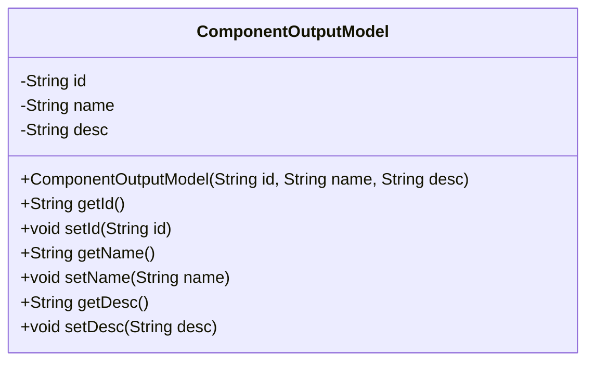
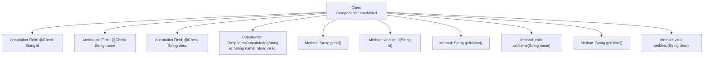

# Basic Information

|      |      |
|------|------|
| Name | ComponentOutputModel |
| Language | .java |
| Code Path | WeFe/board/board-service/src/main/java/com/welab/wefe/board/service/dto/entity/component/ComponentOutputModel.java |
| Package Name | com.welab.wefe.board.service.dto.entity.component |
| Dependencies | ['com.welab.wefe.common.fieldvalidate.annotation.Check'] |
| Brief Description | The ComponentOutputModel class includes three attributes: id, name, and desc, representing the component's unique identifier, Chinese name, and description respectively, along with constructors and getter/setter methods. |

# Description

ComponentOutputModel is a Java class used to represent the component output model. This class contains three private fields: id (the unique identifier of the component), name (the Chinese name of the component), and desc (description), each annotated with the @Check annotation to indicate its purpose. The class provides a constructor with these three parameters, as well as getter and setter methods for each field to access and modify the field values.

# Class Summary

| Name   | Type  | Description |
|-------|------|-------------|
| ComponentOutputModel | class | The ComponentOutputModel class includes three attributes: id, name, and desc, representing the component's unique identifier, Chinese name, and description respectively, and provides constructors and getter/setter methods. |

## Class ComponentOutputModel

|      |      |
|------|------|
| Access Modifier | public |
| Type | class |
| Name | ComponentOutputModel |
| Description | The ComponentOutputModel class includes three attributes: id, name, and desc, representing the component's unique identifier, Chinese name, and description respectively, and provides constructors and getter/setter methods. |

### UML Class Diagram

This code defines a class named ComponentOutputModel, which represents the data structure of a component output model. The class contains three private fields: id (unique component identifier), name (component name in Chinese), and desc (description), each annotated with @Check for validation. The class provides a complete constructor and getter/setter methods, allowing external code to access and modify these field values. This class is primarily used to encapsulate component-related output data, facilitating the transfer and processing of component information within the system.

### Internal Method Call Graph

This code defines a class named ComponentOutputModel, which includes three private fields (id, name, desc) annotated with @Check, along with corresponding constructor and getter/setter methods. The flowchart illustrates the overall structure of the class, including annotated fields, constructor, and six accessor methods, clearly presenting the class member composition and method invocation relationships. This class is primarily used to encapsulate the data structure of a component output model, marking fields for validation through annotations and providing operational interfaces for these fields via standard accessor methods.

### Field List

| Name  | Type  | Description |
|-------|-------|------|
| id | String | The code defines a private string variable named id, and marks it with the @Check annotation to indicate it must satisfy the validation condition of being a "unique component identifier". |
| name | String | The code defines a private string variable named "name", annotated with the @Check annotation to specify the component's Chinese name. |
| desc | String | The private String type variable desc is annotated with @Check and labeled as "Description". |

### Method List

| Name  | Type  | Description |
|-------|-------|------|
| setDesc | void | Java method: Set the value of the desc attribute. The parameter is a String type desc, which is assigned to the desc attribute of the current object. |
| setName | void | Methods for setting the object name, assigning the parameter `name` to the `name` property of the object. |
| getName | String | The method returns the value of the name variable, which is of type string. |
| setId | void | Methods for setting the object ID: Assign the parameter `id` to the `id` property of the current object. |
| getId | String | The method returns an id value of string type. |
| getDesc | String | Methods for obtaining descriptive information, returning a string `desc`. |

