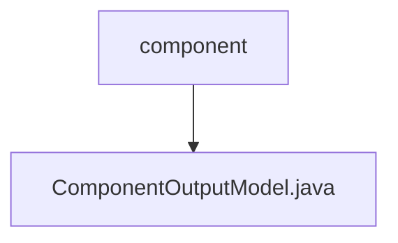

# Basic Information

|      |      |
|------|------|
| Name | component |
| Language | .java |
| Code Path | WeFe/board/board-service/src/main/java/com/welab/wefe/board/service/dto/entity/component |
| Package Name | docs.board.board-service.src.main.java.com.welab.wefe.board.service.dto.entity.component |
| Brief Description | The ComponentOutputModel class includes three attributes: id, name, and desc, representing the component's unique identifier, Chinese name, and description respectively, with constructors and getter/setter methods provided. |

# Description

ComponentOutputModel is a Java class used to represent a component output model. This class contains three private fields: id (the unique identifier of the component), name (the Chinese name of the component), and desc (description), each annotated with the @Check annotation to indicate its purpose. The class provides a constructor that includes these three parameters, as well as getter and setter methods for each field to access and modify their values.

### Package Internal Structure View

This flowchart illustrates the hierarchical relationship between the component directory and the output model file. The `component` serves as the parent directory node, while `ComponentOutputModel.java` is its child node, indicating that this Java class file resides within the `component` directory. Such a structure is commonly found in the DTO layer of a project, used to define output data models related to components.

# File List

| Name   | Type  | Description |
|-------|------|-------------|
| [ComponentOutputModel.java](ComponentOutputModel.md) | file | The ComponentOutputModel class contains three attributes: id, name, and desc, representing the component's unique identifier, Chinese name, and description respectively, along with constructor methods and getter/setter methods. |

