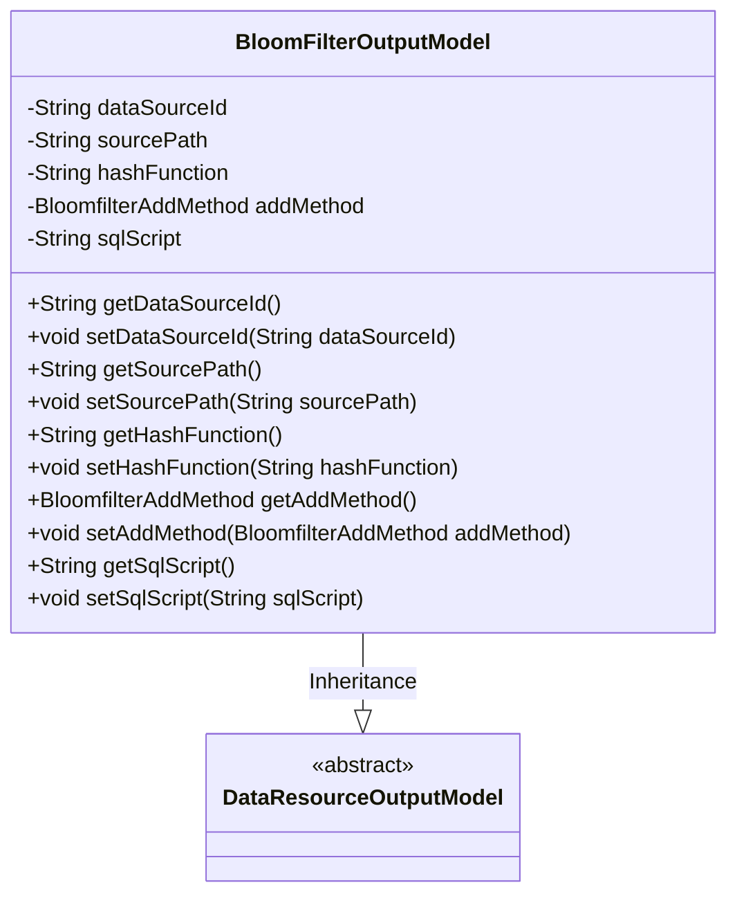

# Basic Information

|      |      |
|------|------|
| Name | BloomFilterOutputModel |
| Language | .java |
| Code Path | WeFe/board/board-service/src/main/java/com/welab/wefe/board/service/dto/entity/data_resource/output/BloomFilterOutputModel.java |
| Package Name | com.welab.wefe.board.service.dto.entity.data_resource.output |
| Dependencies | ['com.welab.wefe.board.service.constant.BloomfilterAddMethod', 'com.welab.wefe.common.fieldvalidate.annotation.Check'] |
| Brief Description | The BloomFilterOutputModel class inherits from DataResourceOutputModel and includes fields such as data source ID, address, primary key hash method, Bloom filter addition method, SQL statements, and their corresponding getter/setter methods. |

# Description

The BloomFilterOutputModel class inherits from DataResourceOutputModel and includes five key fields: data source ID, data source address, primary key hash generation method, Bloom filter addition method, and SQL statement. Each field is validated via the @Check annotation and comes with corresponding getter and setter methods. This class is primarily used to handle data output models related to Bloom filters.

# Class Summary

| Name   | Type  | Description |
|-------|------|-------------|
| BloomFilterOutputModel | class | The BloomFilterOutputModel class inherits from DataResourceOutputModel and includes fields such as data source ID, address, primary key hash method, Bloom filter addition method, and SQL statement, along with their corresponding getter/setter methods. |

## Class BloomFilterOutputModel

|      |      |
|------|------|
| Access Modifier | public |
| Type | class |
| Name | BloomFilterOutputModel |
| Description | The BloomFilterOutputModel class inherits from DataResourceOutputModel and includes fields such as data source ID, address, primary key hash method, Bloom filter addition method, and SQL statement, along with their corresponding getter/setter methods. |

### UML Class Diagram

This code demonstrates the BloomFilterOutputModel class, which inherits from the abstract base class DataResourceOutputModel. The class contains five core private fields: data source ID, source path, hash function, Bloom filter addition method, and SQL script, each with corresponding getter and setter methods. The @Check annotation validates these fields, primarily used for handling data output scenarios related to Bloom filters, reflecting design principles of data validation and encapsulation.

### Internal Method Call Graph

```mermaid
graph TD
    A["Class BloomFilterOutputModel"]
    B["Inherits from: DataResourceOutputModel"]
    C["Property: String dataSourceId"]
    D["Property: String sourcePath"]
    E["Property: String hashFunction"]
    F["Property: BloomfilterAddMethod addMethod"]
    G["Property: String sqlScript"]
    H["Method: getDataSourceId()"]
    I["Method: setDataSourceId(String)"]
    J["Method: getSourcePath()"]
    K["Method: setSourcePath(String)"]
    L["Method: getHashFunction()"]
    M["Method: setHashFunction(String)"]
    N["Method: getAddMethod()"]
    O["Method: setAddMethod(BloomfilterAddMethod)"]
    P["Method: getSqlScript()"]
    Q["Method: setSqlScript(String)"]

    A --> B
    A --> C
    A --> D
    A --> E
    A --> F
    A --> G
    A --> H
    A --> I
    A --> J
    A --> K
    A --> L
    A --> M
    A --> N
    A --> O
    A --> P
    A --> Q
```

This code defines a class named BloomFilterOutputModel, which inherits from DataResourceOutputModel. The class contains five private properties: dataSourceId, sourcePath, hashFunction, addMethod, and sqlScript, each with corresponding getter and setter methods. These properties are annotated with @Check to validate field effectiveness. The class is primarily used to store Bloom filter-related output data models, including data source information, hash functions, addition methods, and SQL scripts.

### Field List

| Name  | Type  | Description |
|-------|-------|------|
| dataSourceId | String | The field dataSourceId carries a data source ID validation annotation. |
| hashFunction | String | The variable hashFunction corresponding to the primary key hash generation method. |
| sourcePath | String | The code defines a private string variable named sourcePath, and marks it with the @Check annotation with the name "Data Source Address". |
| sqlScript | String | The class member variable sqlScript is marked with the @Check annotation as a SQL statement that requires validation. |
| addMethod | BloomfilterAddMethod | Bloom filter addition method configuration item, defining the addition approach. |

### Method List

| Name  | Type  | Description |
|-------|-------|------|
| setSqlScript | void | This is a Java method used to set the sqlScript property value of a class. The method accepts a string parameter sqlScript and assigns it to the member variable of the same name in the class. |
| getSqlScript | String | The method returns the sqlScript property value of string type. |
| setSourcePath | void | Methods for setting the source path, assigning the input parameter to the `sourcePath` member variable of the class. |
| setDataSourceId | void | The method to set the data source ID assigns the input parameter to the class member variable dataSourceId. |
| getDataSourceId | String | This is a Java method that returns the value of the private member variable dataSourceId. |
| setHashFunction | void | This is a Java method used to set the hashFunction property value of an object. The method accepts a string parameter named hashFunction and assigns it to the property of the same name in the current object. |
| setAddMethod | void | Set the Bloom filter addition method. |
| getSourcePath | String | The method returns the sourcePath value of string type. |
| getAddMethod | BloomfilterAddMethod | Get the add method of Bloomfilter. |
| getHashFunction | String | Methods to Obtain Hash Function Names. |

