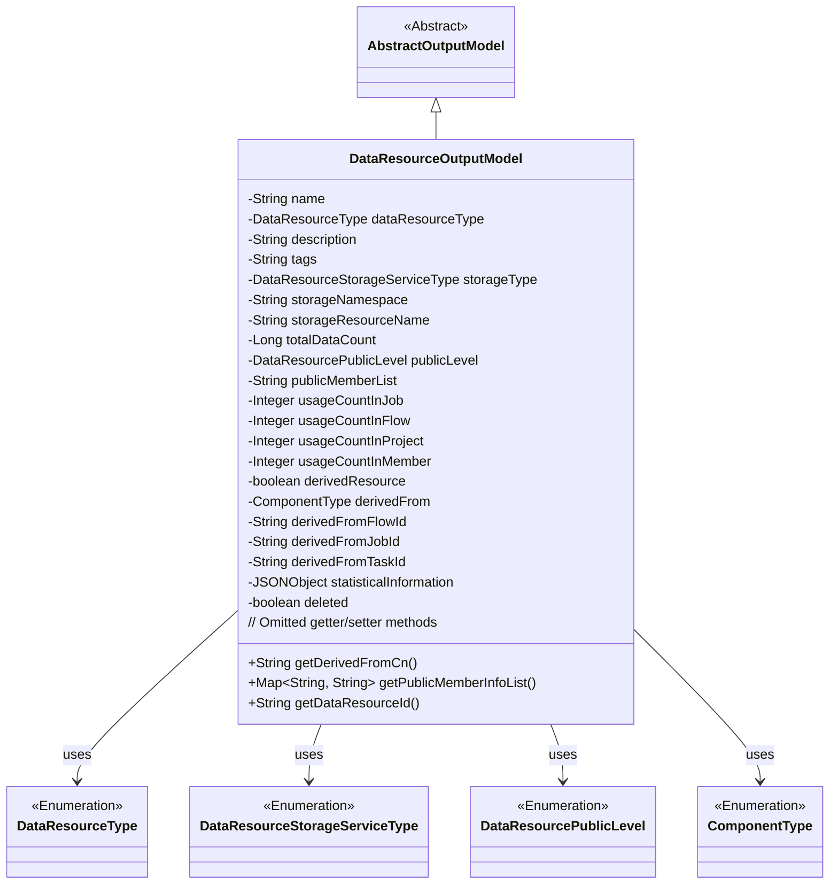

# Basic Information

|      |      |
|------|------|
| Name | DataResourceOutputModel |
| Language | .java |
| Code Path | WeFe/board/board-service/src/main/java/com/welab/wefe/board/service/dto/entity/data_resource/output/DataResourceOutputModel.java |
| Package Name | com.welab.wefe.board.service.dto.entity.data_resource.output |
| Dependencies | ['com.alibaba.fastjson.JSONObject', 'com.welab.wefe.board.service.dto.entity.AbstractOutputModel', 'com.welab.wefe.board.service.service.CacheObjects', 'com.welab.wefe.common.fieldvalidate.annotation.Check', 'com.welab.wefe.common.util.StringUtil', 'com.welab.wefe.common.wefe.enums.ComponentType', 'com.welab.wefe.common.wefe.enums.DataResourcePublicLevel', 'com.welab.wefe.common.wefe.enums.DataResourceStorageServiceType', 'com.welab.wefe.common.wefe.enums.DataResourceType', 'java.util.Map', 'java.util.TreeMap'] |
| Brief Description | The DataResourceOutputModel class defines the output model for data resources, including attributes such as name, type, description, labels, storage information, usage statistics, visibility, and derived sources. |

# Description

The DataResourceOutputModel class inherits from AbstractOutputModel and is used to describe the output model of a data resource. It includes basic information such as resource name, type, description, tags, storage type, storage namespace, and resource name. It records the total data volume of the resource, visibility level, list of visible members, and usage counts in different scenarios (job, flow, project, member). It identifies whether the resource is derived, records the derived source type, process ID, task ID, and subtask ID. It includes resource statistics and deletion status markers. The class provides methods to retrieve the Chinese description of the derived source and the list of public member information, as well as getter and setter methods for each attribute.

# Class Summary

| Name   | Type  | Description |
|-------|------|-------------|
| DataResourceOutputModel | class | The DataResourceOutputModel class defines the output model for data resources, including attributes such as name, type, description, storage information, usage statistics, visibility, and derived sources. |

## Class DataResourceOutputModel

|      |      |
|------|------|
| Access Modifier | public |
| Type | class |
| Name | DataResourceOutputModel |
| Description | The DataResourceOutputModel class defines the output model for data resources, including attributes such as name, type, description, storage information, usage statistics, visibility, and derived sources. |

### UML Class Diagram

This code defines a data resource output model class `DataResourceOutputModel`, which inherits from the abstract class `AbstractOutputModel`. The class contains numerous private fields (marked with `@Check` annotation) describing various attributes of data resources, such as name, type, storage information, usage statistics, etc., along with corresponding getter/setter methods. Notably, the class also includes two business methods: `getDerivedFromCn()` for obtaining Chinese labels of derivation sources, and `getPublicMemberInfoList()` for processing visible member list information. The class has dependencies with multiple enumeration types (`DataResourceType`, `DataResourceStorageServiceType`, etc.).

### Internal Method Call Graph

```mermaid
graph TD
    A["Class DataResourceOutputModel"]
    B["Inherits: AbstractOutputModel"]
    C["Property: String name"]
    D["Property: DataResourceType dataResourceType"]
    E["Property: String description"]
    F["Property: String tags"]
    G["Property: DataResourceStorageServiceType storageType"]
    H["Property: String storageNamespace"]
    I["Property: String storageResourceName"]
    J["Property: Long totalDataCount"]
    K["Property: DataResourcePublicLevel publicLevel"]
    L["Property: String publicMemberList"]
    M["Property: Integer usageCountInJob"]
    N["Property: Integer usageCountInFlow"]
    O["Property: Integer usageCountInProject"]
    P["Property: Integer usageCountInMember"]
    Q["Property: boolean derivedResource"]
    R["Property: ComponentType derivedFrom"]
    S["Property: String derivedFromFlowId"]
    T["Property: String derivedFromJobId"]
    U["Property: String derivedFromTaskId"]
    V["Property: JSONObject statisticalInformation"]
    W["Property: boolean deleted"]
    X["Method: String getDerivedFromCn()"]
    Y["Method: Map<String,String> getPublicMemberInfoList()"]
    Z["Method: String getDataResourceId()"]
    AA["Method: Standard getter/setter"]

    A --> B
    A --> C
    A --> D
    A --> E
    A --> F
    A --> G
    A --> H
    A --> I
    A --> J
    A --> K
    A --> L
    A --> M
    A --> N
    A --> O
    A --> P
    A --> Q
    A --> R
    A --> S
    A --> T
    A --> U
    A --> V
    A --> W
    A --> X
    A --> Y
    A --> Z
    A --> AA
```

This code defines a class named DataResourceOutputModel, which inherits from AbstractOutputModel and is primarily used to describe the output model of data resources. The class contains over 20 properties covering multiple dimensions such as resource name, type, description, storage information, and usage statistics, with each property annotated with @Check for validation. The class provides three custom methods: getDerivedFromCn() for obtaining the Chinese label of the derivation source, getPublicMemberInfoList() for processing the visible member list, and getDataResourceId(), which inherits the parent class method to retrieve the resource ID. The rest are standard getter/setter methods for property access and modification. The overall class structure is clear, with well-categorized properties, making it suitable as a core model for data resource management.

### Field List

| Name  | Type  | Description |
|-------|-------|------|
| description | String | Field description annotation, private string type variable. |
| dataResourceType | DataResourceType | The code defines a private field dataResourceType, annotated with @Check and specified with the name "Resource Type" of type DataResourceType. |
| storageResourceName | String | Define a private string variable `storageResourceName` to store resource names (such as table names or file names), with validation performed via the `@Check` annotation. |
| derivedFromTaskId | String | Check the string field for the derived source subtask ID. |
| derivedResource | boolean | private boolean derivedResource, annotated with @Check to verify if it is a derived resource. |
| usageCountInMember | Integer | Member resource usage count, recording the number of times it is used by other members. |
| storageNamespace | String | The code defines a private string variable `storageNamespace`, which is used to check the namespace, library name, and directory path of resources in storage. |
| publicMemberList | String | The private string `publicMemberList` is used to control the visible member list, allowing only federated members within the list to view basic resource information. |
| storageType | DataResourceStorageServiceType | Define a private variable storageType, use the @Check annotation to validate "storage type" with the type DataResourceStorageServiceType. |
| publicLevel | DataResourcePublicLevel | Visibility check field for resources, with the type being DataResourcePublicLevel. |
| usageCountInJob | Integer | The field `usageCountInJob` records the number of times a resource is used in a job, with the inspection item marked by the `@Check` annotation. |
| derivedFromJobId | String | Derived Source Task ID field, used to identify the source of the task. |
| usageCountInProject | Integer | Statistics on the frequency of resource usage in the project. |
| name | String | Define a private string variable named "name", and mark the resource name with the @Check annotation. |
| tags | String | The code defines a private string variable named tags and annotates it with @Check, specifying its display name as "tags". |
| totalDataCount | Long | Defined a private long integer variable totalDataCount to store the total data volume, with the inspection name annotated. |
| derivedFromFlowId | String | Derived Source Process ID field, used to identify the source process from which the current process is derived. |
| derivedFrom | ComponentType | Define the component type source enumeration, including three types: original, aligned, and binned. |
| usageCountInFlow | Integer | Check the number of times resources are used in the process. |
| deleted | boolean | Boolean variable to check if the dataset has been deleted. |
| statisticalInformation | JSONObject | Defined a private JSONObject variable named statisticalInformation for storing statistical information of data resources, with validation performed via the @Check annotation. |

### Method List

| Name  | Type  | Description |
|-------|-------|------|
| getDerivedFromCn | String | Get the Chinese label of the derived source. If it exists, return it; otherwise, return an empty string. |
| setStorageNamespace | void | The method to set the storage namespace assigns the input parameter to the class member variable `storageNamespace`. |
| setUsageCountInProject | void | Method to set the usage count within the project, with the parameter being an integer value. |
| setStorageType | void | Method to set the storage type, with the parameter of type DataResourceStorageServiceType, assigned to the member variable storageType. |
| setDerivedResource | void | The method for setting the derived resource flag, with the parameter being the boolean value `derivedResource`. |
| setPublicMemberList | void | The method to set the public member list assigns the input string to the class member variable `publicMemberList`. |
| isDeleted | boolean | This method returns a boolean value indicating whether the object is marked as deleted. |
| setDerivedFromFlowId | void | The method to set the derived process ID assigns the parameter value to the member variable of the class. |
| getDataResourceId | String | This method returns the parent class ID as the data resource ID. |
| setDerivedFromJobId | void | Set the derived task ID method, assigning the parameter value to the class member variable derivedFromJobId. |
| getUsageCountInJob | Integer | Get the usage count in the task. |
| setStatisticalInformation | void | This is a Java method used to set the statistical information properties of a class, which takes a JSONObject type parameter and assigns it to member variables. |
| getTotalDataCount | Long | The method getTotalDataCount returns the long integer value of totalDataCount. |
| getDerivedFromFlowId | String | The method to obtain the derived flow ID returns a string-type variable `derivedFromFlowId`. |
| getStorageType | DataResourceStorageServiceType | Methods to obtain the current storage service type, returning a value of type DataResourceStorageServiceType. |
| getUsageCountInProject | Integer | Get the integer value of usage count within the project. |
| getPublicMemberList | String | The method to obtain the public member list returns a string-type variable named publicMemberList. |
| setDerivedFrom | void | The method `setDerivedFrom` is used to set the derivation source of the current component, where the parameter `derivedFrom` represents the source component type. |
| isDerivedResource | boolean | The method checks whether it is a derived resource and returns a boolean value, derivedResource. |
| getPublicMemberInfoList | Map<String, String> | This method returns a mapping of the public member information list. If the list is empty, it returns an empty map; otherwise, it stores the member IDs and names in a TreeMap and returns it. |
| setDataResourceType | void | This is a Java method used to set the data resource type. The method is named setDataResourceType, which takes a parameter of type DataResourceType and assigns it to the dataResourceType property of the current object. |
| getDerivedFromJobId | String | This method returns a string value derived from the job ID. |
| getDataResourceType | DataResourceType | Methods for obtaining the data resource type, returns the value of the dataResourceType field. |
| setUsageCountInFlow | void | Common methods for setting the number of uses within a process. |
| getStatisticalInformation | JSONObject | Method for obtaining statistical information in JSON object format. |
| setPublicLevel | void | Set the public level of the data resource by assigning the parameter `publicLevel` to the `publicLevel` property of the current object. |
| setTags | void | This is a Java method used to set the tags property of an object. The method accepts a string parameter, tags, and assigns it to the tags field of the current object. |
| setUsageCountInMember | void | Sets a public method for the usage count within members, with the parameter as an integer usageCountInMember, which is assigned to the class variable. |
| getDerivedFromTaskId | String | Methods to obtain the derived task ID, returns the derived task ID as a string. |
| setName | void | Methods for setting the object name, assigning the parameter `name` to the `name` property of the object. |
| setDescription | void | Methods for setting description information, which assigns the input parameters to the object's description property. |
| setUsageCountInJob | void | This is a Java method used to set the usage count variable in a job. The method accepts an integer parameter and assigns it to the class member variable `usageCountInJob`. |
| setDerivedFromTaskId | void | The method for setting a derived task ID assigns the parameter value to the class's member variable. |
| getPublicLevel | DataResourcePublicLevel | Obtain the public access level of data resources. |
| getUsageCountInMember | Integer | Get the integer value of member usage count. |
| getUsageCountInFlow | Integer | Get the number of uses in the process. |
| getStorageNamespace | String | The method to obtain the storage namespace returns a string-type value `storageNamespace`. |
| getDerivedFrom | ComponentType | Get the component type of the derived source. |
| getDescription | String | This is a Java method that returns the value of the description attribute as a string. |
| getName | String | The method getName returns the value of the string name. |
| setTotalDataCount | void | The method for setting the total data volume assigns the input value to the class variable totalDataCount. |
| setDeleted | void | This is a Java method used to set the deletion status of an object. The method accepts a boolean parameter `deleted` and assigns it to the `deleted` property of the object. |
| getTags | String | The method getTags returns the value of the member variable tags of type string. |
| getStorageResourceName | String | The method to obtain the storage resource name returns a string-type variable `storageResourceName`. |
| setStorageResourceName | void | Method for setting the storage resource name, which assigns the input parameter to the class member variable storageResourceName. |

