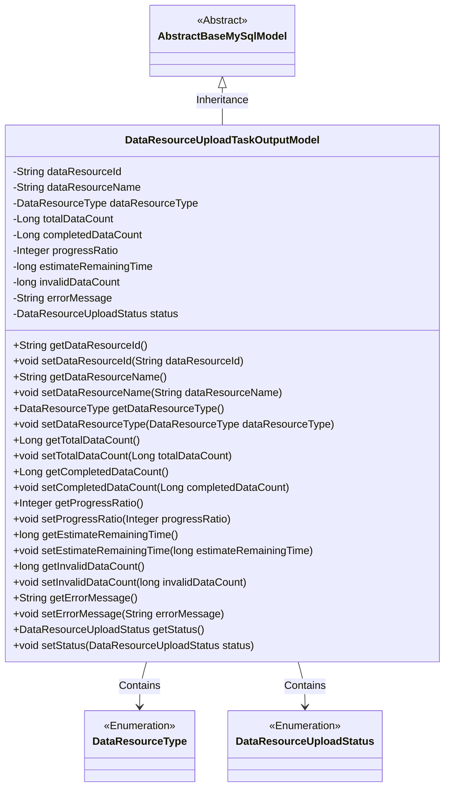

# Basic Information

|      |      |
|------|------|
| Name | DataResourceUploadTaskOutputModel |
| Language | .java |
| Code Path | WeFe/board/board-service/src/main/java/com/welab/wefe/board/service/dto/entity/data_resource/output/DataResourceUploadTaskOutputModel.java |
| Package Name | com.welab.wefe.board.service.dto.entity.data_resource.output |
| Dependencies | ['com.welab.wefe.board.service.database.entity.base.AbstractBaseMySqlModel', 'com.welab.wefe.common.fieldvalidate.annotation.Check', 'com.welab.wefe.common.wefe.enums.DataResourceType', 'com.welab.wefe.common.wefe.enums.DataResourceUploadStatus'] |
| Brief Description | Data resource upload task output model, including fields such as resource ID, name, type, data volume, progress, remaining time, invalid data volume, error information, and status. |

# Description

The DataResourceUploadTaskOutputModel is a class that inherits from AbstractBaseMySqlModel and is used to describe the output information of a data resource upload task. It includes fields such as data resource ID, name, type, total data rows, completed data rows, progress percentage, estimated remaining time, invalid data volume, error message, and status. Each field has corresponding getter and setter methods for retrieving and setting property values. The status field uses the DataResourceUploadStatus enum to represent task states, such as uploading, completed, or failed.

# Class Summary

| Name   | Type  | Description |
|-------|------|-------------|
| DataResourceUploadTaskOutputModel | class | Data resource upload task output model, including information such as resource ID, name, type, data volume, progress, remaining time, invalid data, error messages, and status. |

## Class DataResourceUploadTaskOutputModel

|      |      |
|------|------|
| Access Modifier | public |
| Type | class |
| Name | DataResourceUploadTaskOutputModel |
| Description | Data resource upload task output model, including information such as resource ID, name, type, data volume, progress, remaining time, invalid data, error messages, and status. |

### UML Class Diagram

This code defines a DataResourceUploadTaskOutputModel class that inherits from the abstract base class AbstractBaseMySqlModel. The class includes multiple private fields such as data resource ID, name, type, total data count, completed data count, progress ratio, etc., along with corresponding getter and setter methods. DataResourceType and DataResourceUploadStatus are enumeration types used to represent data resource types and upload statuses. This class is primarily used to encapsulate various status information and statistical data during the data resource upload process.

### Internal Method Call Graph

This code defines a class named DataResourceUploadTaskOutputModel, which inherits from AbstractBaseMySqlModel and represents the output model for data resource upload tasks. The class includes multiple properties such as data resource ID, name, type, total data count, completed data count, progress ratio, estimated remaining time, invalid data count, error message, and status, along with corresponding getter and setter methods for each property. These properties are annotated with @Check for validation. This model is primarily used to track and record various states and statistical information during the data resource upload process.

### Field List

| Name  | Type  | Description |
|-------|-------|------|
| invalidDataCount | long | The field `invalidDataCount` is used to record the number of invalid data entries and duplicate primary key records. |
| progressRatio | Integer | Task progress percentage field, type is integer. |
| dataResourceName | String | Define a private String variable dataResourceName, and validate the data resource name using the @Check annotation. |
| errorMessage | String | The code defines a private string variable named `errorMessage`, with an inspection annotation labeled "Error Message". |
| status | DataResourceUploadStatus | The field "status" indicates the upload status of the data resource, with optional values being uploading, completed, or failed. |
| dataResourceType | DataResourceType | Define a private variable `dataResourceType` of type `DataResourceType`, validated with the `@Check` annotation for resource type. |
| totalDataCount | Long | Defined a private long variable totalDataCount to store the total number of data rows, with validation performed via the @Check annotation. |
| estimateRemainingTime | long | The class member variable `estimateRemainingTime` is used to store the estimated remaining time and is marked with the `@Check` annotation. |
| dataResourceId | String | Data Resource ID Verification Field |
| completedDataCount | Long | The check field for the number of data rows written, with a data type of long integer. |

### Method List

| Name  | Type  | Description |
|-------|-------|------|
| getDataResourceName | String | The method to obtain the data resource name, which returns a string-type value dataResourceName. |
| getEstimateRemainingTime | long | The method to obtain the estimated remaining time returns a long integer variable estimateRemainingTime. |
| setInvalidDataCount | void | The method for setting the invalid data count assigns the parameter value to the class member variable `invalidDataCount`. |
| getErrorMessage | String | Methods to obtain error messages, returns error messages in string format. |
| getCompletedDataCount | Long | Methods for obtaining the count of completed data, returning a long integer value. |
| getTotalDataCount | Long | The method getTotalDataCount returns the long integer value of totalDataCount. |
| getDataResourceType | DataResourceType | Methods for obtaining data resource types, returns dataResourceType. |
| setDataResourceName | void | The method for setting the data resource name assigns the input parameter to the member variable of the class. |
| getDataResourceId | String | Methods to obtain the data resource ID, which returns the dataResourceId as a string type. |
| setProgressRatio | void | The method to set the progress ratio, with the parameter being an integer progressRatio, assigns the value to the class member variable progressRatio. |
| setEstimateRemainingTime | void | Methods for setting the remaining time estimate, with parameters of type long. |
| setDataResourceId | void | The method for setting the data resource ID assigns the input parameter to the class member variable `dataResourceId`. |
| setDataResourceType | void | The method for setting the data resource type assigns the input parameters to the member variables of the class. |
| getInvalidDataCount | long | Method to obtain invalid data count, returns the number of invalid data. |
| getProgressRatio | Integer | Method to obtain the progress ratio value, returns an integer type progressRatio. |
| setCompletedDataCount | void | This is a Java method used to set the value of the completedDataCount property. The method takes a parameter of type Long and assigns it to the class's member variable completedDataCount. |
| setTotalDataCount | void | Method to set the total data volume, with the parameter being a long integer totalDataCount. |
| setErrorMessage | void | This is a Java method used to set an error message. The method is named setErrorMessage, which takes a string parameter errorMessage and assigns it to the class's member variable errorMessage. |
| getStatus | DataResourceUploadStatus | The method to retrieve the current data resource upload status returns a DataResourceUploadStatus object. |
| setStatus | void | This method is used to set the data resource upload status, assigning the incoming status parameter to the status property of the current object. |

