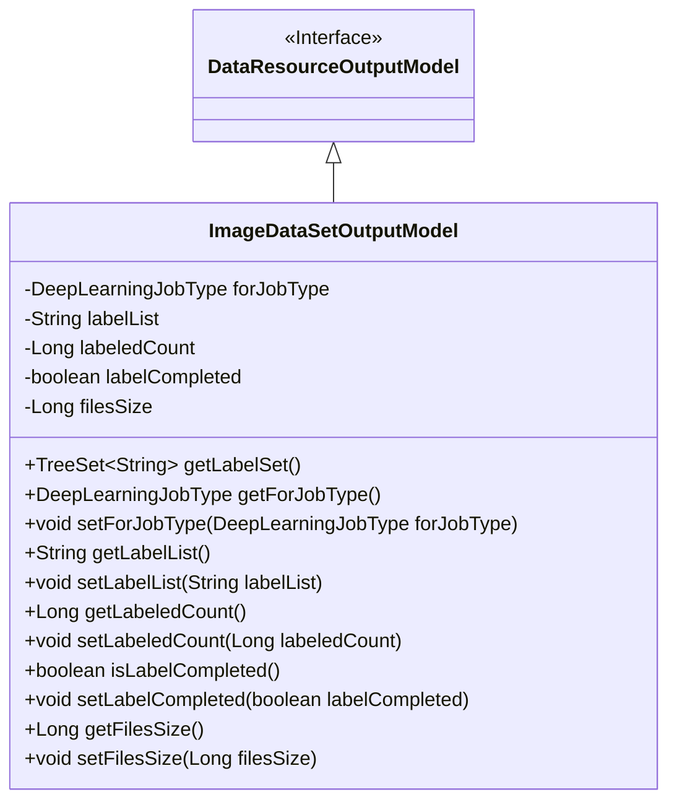
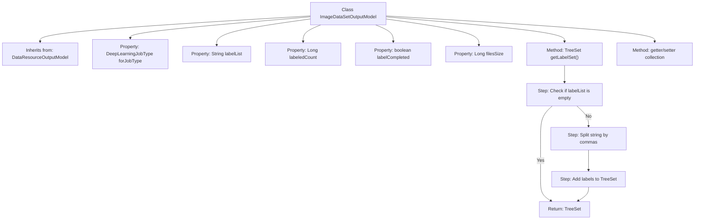

# Basic Information

|      |      |
|------|------|
| Name | ImageDataSetOutputModel |
| Language | .java |
| Code Path | WeFe/board/board-service/src/main/java/com/welab/wefe/board/service/dto/entity/data_resource/output/ImageDataSetOutputModel.java |
| Package Name | com.welab.wefe.board.service.dto.entity.data_resource.output |
| Dependencies | ['com.alibaba.fastjson.annotation.JSONField', 'com.welab.wefe.common.fieldvalidate.annotation.Check', 'com.welab.wefe.common.util.StringUtil', 'com.welab.wefe.common.wefe.enums.DeepLearningJobType', 'java.util.List', 'java.util.TreeSet'] |
| Brief Description | The ImageDataSetOutputModel class inherits from DataResourceOutputModel, containing attributes such as task type, label list, annotated count, annotation completion status, and dataset size. It provides label set conversion methods and getter/setter functions. |

# Description

The ImageDataSetOutputModel inherits from DataResourceOutputModel and contains five core fields: forJobType indicates the task type (e.g., object detection), labelList stores the label list as a string, labeledCount records the number of labeled items, labelCompleted marks whether labeling is complete, and filesSize records the dataset size. It provides the getLabelSet method to convert the comma-separated labelList into an ordered label set and includes standard getter/setter methods for each field. The JSONField annotation ensures the getLabelSet method is not serialized.

# Class Summary

| Name   | Type  | Description |
|-------|------|-------------|
| ImageDataSetOutputModel | class | Image dataset output model class, containing attributes such as task type, label list, annotation count, annotation completion status, and dataset size, providing label set conversion methods and standard getter/setter. |

## Class ImageDataSetOutputModel

|      |      |
|------|------|
| Access Modifier | public |
| Type | class |
| Name | ImageDataSetOutputModel |
| Description | Image dataset output model class, containing attributes such as task type, label list, annotation count, annotation completion status, and dataset size, providing label set conversion methods and standard getter/setter. |

### UML Class Diagram

This code defines a class named ImageDataSetOutputModel, which inherits from the DataResourceOutputModel interface. The class is primarily used for handling output models of image datasets, containing attributes such as job type, label list, labeled count, labeling completion status, and dataset size. The getLabelSet() method converts comma-separated label strings into an ordered TreeSet collection. All fields are annotated with @Check for validation, with some fields additionally annotated with @JSONField to control serialization behavior.

### Internal Method Call Graph

This code demonstrates an image dataset output model class that inherits from a base data resource model. Core functionalities include maintaining properties such as deep learning job type, label list, and annotation status, with special emphasis on a method that converts comma-separated label strings into an ordered collection. The flowchart clearly illustrates the class inheritance structure and the processing logic of the getLabelSet() method: first checking for null values, then splitting the string, and finally constructing and returning an ordered collection. All properties are equipped with standard getter/setter methods, complying with JavaBean specifications.

### Field List

| Name  | Type  | Description |
|-------|-------|------|
| labelList | String | The Java annotation @Check marks the private string variable labelList, with the parameter name value set to "label;list". |
| labelCompleted | boolean | The class member variable `labelCompleted`, of boolean type, is annotated with the check annotation `@Check(name="Whether labeling is completed")`. |
| labeledCount | Long | The class member variable labeledCount is annotated with @Check as "labeled count" and has a type of Long. |
| forJobType | DeepLearningJobType | The code defines a private variable `forJobType` of type `DeepLearningJobType`, with the `@Check` annotation specifying the task type as "object detection". |
| filesSize | Long | Check the private long integer variable filesSize for the dataset size. |

### Method List

| Name  | Type  | Description |
|-------|-------|------|
| getLabelList | String | Methods to obtain the label list, returning a string-type labelList variable. |
| getFilesSize | Long | The method returns the file size value. |
| setFilesSize | void | The method to set the file size, with the parameter being a long integer filesSize, assigns the value to the class variable this.filesSize. |
| setLabelCompleted | void | This is a Java method used to set the boolean value of the labelCompleted property. The method accepts one parameter and assigns it to the class member variable. |
| isLabelCompleted | boolean | This method returns a boolean value indicating whether the label has been completed. |
| getForJobType | DeepLearningJobType | Get the deep learning job type of the current task. |
| getLabelSet | TreeSet<String> | This method returns a deduplicated and sorted collection of tags, or an empty collection if the input is empty. JSONField is used to ignore serialization. |
| setLabeledCount | void | Method to set the marked quantity, with a parameter of type long. |
| setForJobType | void | Methods for setting up deep learning task types. |
| setLabelList | void | This is a Java method used to set the value of the labelList property of a class. The method takes a string parameter labelList and assigns it to the member variable of the same name in the class. |
| getLabeledCount | Long | The method getLabeledCount returns a long integer value labeledCount. |

