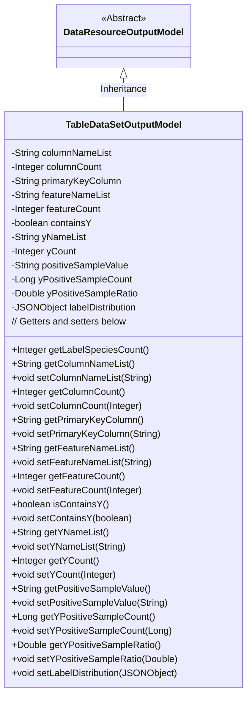

# Basic Information

|      |      |
|------|------|
| Name | TableDataSetOutputModel |
| Language | .java |
| Code Path | WeFe/board/board-service/src/main/java/com/welab/wefe/board/service/dto/entity/data_resource/output/TableDataSetOutputModel.java |
| Package Name | com.welab.wefe.board.service.dto.entity.data_resource.output |
| Dependencies | ['com.alibaba.fastjson.JSONObject', 'com.alibaba.fastjson.annotation.JSONField', 'com.welab.wefe.board.service.dto.vo.data_set.table_data_set.LabelDistribution', 'com.welab.wefe.common.fieldvalidate.annotation.Check'] |
| Brief Description | Dataset output model, including field list, column count, primary key, feature list, Y-value related attributes, and positive sample information. |

# Description

The code defines a class named `TableDataSetOutputModel`, which inherits from `DataResourceOutputModel`. The class contains multiple fields to describe various attributes of a dataset, such as a list of column names, the number of columns, primary key fields, a list of features, the number of features, whether it includes Y values, a list of Y column names, the number of Y columns, positive sample values, the count and proportion of positive examples, and more. The `labelDistribution` field stores label distribution information but is marked as not directly output. The class also provides getter and setter methods for all fields, as well as a method `getLabelSpeciesCount` to retrieve the number of label classifications.

# Class Summary

| Name   | Type  | Description |
|-------|------|-------------|
| TableDataSetOutputModel | class | The TableDataSetOutputModel class inherits from DataResourceOutputModel, containing dataset fields, primary keys, features, Y-value-related attributes, and statistical information such as column count, feature quantity, positive sample ratio, etc., while restricting the serialized output of the labelDistribution field. |


## Class TableDataSetOutputModel

|      |      |
|------|------|
| Access Modifier | public |
| Type | class |
| Name | TableDataSetOutputModel |
| Description | The TableDataSetOutputModel class inherits from DataResourceOutputModel, containing dataset fields, primary keys, features, Y-value-related attributes, and statistical information such as column count, feature quantity, positive sample ratio, etc., while restricting the serialized output of the labelDistribution field. |


### UML Class Diagram



This class diagram illustrates the structure where TableDataSetOutputModel inherits from the abstract class DataResourceOutputModel. TableDataSetOutputModel contains multiple private fields for storing various dataset attributes such as column name list, column count, primary key field, feature list, etc., along with corresponding getter and setter methods. Notably, the getLabelSpeciesCount() method returns the number of label categories based on the state of the containsY and labelDistribution fields. The diagram clearly demonstrates the inheritance relationship and class member structure, making it suitable for understanding the design of this data output model.


### Internal Method Call Graph

```mermaid
graph TD
    A["Class TableDataSetOutputModel"]
    B["Inherits from: DataResourceOutputModel"]
    C["Property: String columnNameList"]
    D["Property: Integer columnCount"]
    E["Property: String primaryKeyColumn"]
    F["Property: String featureNameList"]
    G["Property: Integer featureCount"]
    H["Property: boolean containsY"]
    I["Property: String yNameList"]
    J["Property: Integer yCount"]
    K["Property: String positiveSampleValue"]
    L["Property: Long yPositiveSampleCount"]
    M["Property: Double yPositiveSampleRatio"]
    N["Property: JSONObject labelDistribution"]
    O["Method: Integer getLabelSpeciesCount()"]
    P["Method: All getter/setter methods"]

    A --> B
    A --> C
    A --> D
    A --> E
    A --> F
    A --> G
    A --> H
    A --> I
    A --> J
    A --> K
    A --> L
    A --> M
    A --> N
    A --> O
    A --> P

    O -->|Conditional check| H["containsY"]
    O -->|Conditional check| N["labelDistribution"]
    O -->|Conversion| "labelDistribution.toJavaObject()"
```

This code demonstrates the TableDataSetOutputModel class, which inherits from DataResourceOutputModel and is primarily used for managing output models of tabular datasets. The class contains 12 properties annotated with @Check and one non-serializable JSONObject property. The getLabelSpeciesCount() method serves as the core business logic, returning the number of label categories after conditional checks based on containsY and labelDistribution. All properties are equipped with standard getter/setter methods, with the overall structure clearly reflecting data encapsulation and validation logic.

### Field List

| Name  | Type  | Description |
|-------|-------|------|
| yNameList | String | The code defines a private string variable yNameList, annotated with @Check, where the parameter name has a value of "y column name list". |
| yCount | Integer | Define a private integer variable yCount to check the number of y columns. |
| containsY | boolean | The private boolean variable `containsY` is used to check whether it contains the Y value. |
| primaryKeyColumn | String | The code defines a private string variable named primaryKeyColumn and marks it with the @Check annotation as the "primary key field". |
| positiveSampleValue | String | The code defines a private string variable named `positiveSampleValue` and adds a validation annotation labeled "Value of positive sample". |
| featureNameList | String | The code defines a private string variable featureNameList for storing feature lists, which is validated using the @Check annotation. |
| columnCount | Integer | Define a private integer variable columnCount to check the number of columns in the dataset, annotated with @Check. |
| featureCount | Integer | The class member variable `featureCount` is annotated with `@Check`, labeled as "Feature Count" with the type `Integer`. |
| labelDistribution | JSONObject | The code defines a private JSONObject variable named labelDistribution, which is used to store label distribution data. It is annotated to prevent JSON serialization and marked for inspection purposes. |
| yPositiveSampleCount | Long | The class member variable `yPositiveSampleCount` is used to record the number of positive samples, annotated with `@Check`. |
| columnNameList | String | The column name variables of the dataset field list are marked with the @Check annotation. |
| yPositiveSampleRatio | Double | Positive sample ratio check field, type is Double, variable name is yPositiveSampleRatio. |

### Method List

| Name  | Type  | Description |
|-------|-------|------|
| setContainsY | void | A boolean method to set whether to include Y. |
| getyPositiveSampleRatio | Double | Method to obtain the proportion of y positive samples, returns a Double value yPositiveSampleRatio. |
| setyCount | void | The method to set the yCount property, with the parameter of type Integer. |
| setyPositiveSampleCount | void | Set the method for the number of y positive samples, with the parameter being a long integer yPositiveSampleCount, and assign it to the class member variable. |
| setPrimaryKeyColumn | void | Methods for setting the primary key column, assigning the input parameter to the class member variable primaryKeyColumn. |
| getPrimaryKeyColumn | String | Methods to obtain the primary key column name, returning a string-type primaryKeyColumn. |
| setColumnNameList | void | Methods for setting the column name list, assigning the input parameters to the member variable columnNameList of the class. |
| isContainsY | boolean | The method isContainsY returns the state of the boolean containsY. |
| getyCount | Integer | A public method to get the yCount value, returning an integer type. |
| getFeatureNameList | String | This method returns the featureNameList string. |
| getLabelSpeciesCount | Integer | The method getLabelSpeciesCount returns the count of label species. It returns null if there is no y data or if labelDistribution is empty; otherwise, it returns the labelSpeciesCount value from labelDistribution. |
| setFeatureNameList | void | Methods for setting the feature name list, assigning the input string to the class member variable `featureNameList`. |
| setyNameList | void | This is a Java method used to set the value of the yNameList property. The method takes a string parameter and assigns it to the class's member variable. |
| getFeatureCount | Integer | Methods to obtain the number of features, returns an integer value featureCount. |
| setyPositiveSampleRatio | void | The method for setting the positive sample ratio accepts a parameter of type Double and assigns it to the class member variable yPositiveSampleRatio. |
| getyPositiveSampleCount | Long | The method to obtain the yPositiveSampleCount value, with a return type of Long. |
| setFeatureCount | void | Set the feature count method, assigning the input parameter to the class member variable featureCount. |
| setColumnCount | void | Method for setting the number of columns: assigns the input integer value to the class's column count property. |
| setPositiveSampleValue | void | A public method for setting the positive sample value, with the parameter being of string type. |
| getPositiveSampleValue | String | The public method to obtain the positive sample value, which returns a string-type variable positiveSampleValue. |
| getColumnNameList | String | Methods to Get a List of Column Names. |
| getyNameList | String | Method to obtain the yNameList string. |
| getColumnCount | Integer | Methods to obtain the number of columns, returning the value of the integer variable columnCount. |
| setLabelDistribution | void | Set the label distribution data, with the parameter being a JSON object. |


