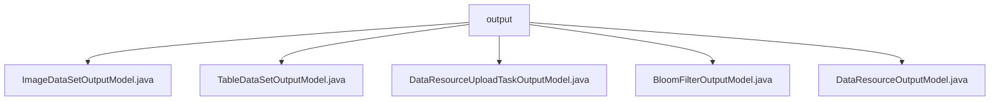

# Basic Information

|      |      |
|------|------|
| Name | output |
| Language | .java |
| Code Path | WeFe/board/board-service/src/main/java/com/welab/wefe/board/service/dto/entity/data_resource/output |
| Package Name | docs.board.board-service.src.main.java.com.welab.wefe.board.service.dto.entity.data_resource.output |
| Brief Description | The ImageDataSetOutputModel inherits from DataResourceOutputModel and includes fields such as task type, label list, and annotation status. The TableDataSetOutputModel describes dataset attributes like column names, features, and label distribution. The DataResourceUploadTaskOutputModel records upload task information, including progress and status. The BloomFilterOutputModel handles Bloom filter-related data. The DataResourceOutputModel serves as the base class, containing basic resource information and usage statistics. |

# Description

## Overview  
The core responsibility of this module is to provide a unified output model system for data resource management, supporting standardized description and state tracking of heterogeneous data such as image datasets, tabular datasets, and Bloom filters. The interface specification follows the Java Bean pattern, achieving field reuse through inheritance hierarchies (e.g., DataResourceOutputModel as the base class), with each subclass extending specific attributes and including field validation annotations (e.g., @Check) and serialization controls (e.g., JSONField). Key data structures include label lists (labelList), feature distributions (labelDistribution), task progress (progressPercentage), etc., with enumerated types (e.g., DataResourceUploadStatus) constraining state fields. External dependencies primarily involve Spring Framework's serialization annotations and validation tools. For example, ImageDataSetOutputModel implements label format conversion via getLabelSet, while TableDataSetOutputModel provides getLabelSpeciesCount to count classification quantities.

## Key Business Scenarios  
The module supports full lifecycle management of data resources, covering processes such as upload (e.g., DataResourceUploadTaskOutputModel tracks progress), labeling (labeledCount marks completion), and feature analysis (e.g., positive sample ratio calculation). The interaction mode resembles an event bus pattern, where standardized output models communicate data state changes, such as Bloom filter parameters (BloomFilterOutputModel) containing SQL statements and primary key hash methods. Typical applications include federated learning task scheduling (forJobType specifies task types) and data quality monitoring (invalidDataCount records anomalies). API types encompass resource metadata queries (e.g., getStorageNamespace) and statistical aggregation (e.g., getUsageCountInProject), with integration examples visible in data dashboard displays and task pipeline state synchronization scenarios.

### Package Internal Structure View

This flowchart illustrates the hierarchical relationship among 5 Java files under the `output` directory. All files are directly subordinate to the `output` directory without deeper nested structures. These files include data resource-related output model classes such as ImageDataSetOutputModel and TableDataSetOutputModel, collectively forming the core components of the data resource output module.

# File List

| Name   | Type  | Description |
|-------|------|-------------|
| [ImageDataSetOutputModel.java](ImageDataSetOutputModel.md) | file | The ImageDataSetOutputModel class inherits from DataResourceOutputModel, containing attributes such as task type, label list, annotated count, annotation completion status, and dataset size, while providing label set conversion methods and getter/setter functions. |
| [TableDataSetOutputModel.java](TableDataSetOutputModel.md) | file | Dataset output model, including field list, column count, primary key, feature list, Y-value related attributes, and positive sample information. |
| [DataResourceUploadTaskOutputModel.java](DataResourceUploadTaskOutputModel.md) | file | Data resource upload task output model, including fields such as resource ID, name, type, data volume, progress, remaining time, invalid data volume, error messages, and status. |
| [BloomFilterOutputModel.java](BloomFilterOutputModel.md) | file | The `BloomFilterOutputModel` class extends `DataResourceOutputModel` and includes fields such as data source ID, address, primary key hash method, Bloom filter addition method, SQL statements, along with their corresponding getter and setter methods. |
| [DataResourceOutputModel.java](DataResourceOutputModel.md) | file | The DataResourceOutputModel class defines the output model for data resources, including attributes such as name, type, description, labels, storage information, usage statistics, visibility, and derived sources. |

