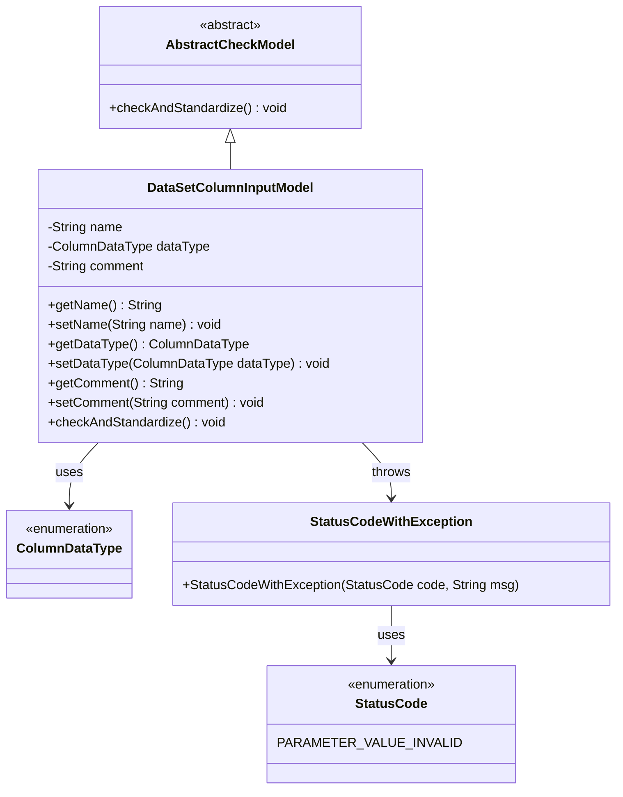
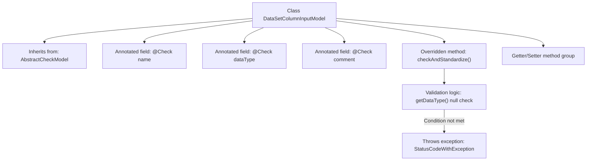

# Basic Information

|      |      |
|------|------|
| Name | DataSetColumnInputModel |
| Language | .java |
| Code Path | WeFe/board/board-service/src/main/java/com/welab/wefe/board/service/dto/entity/data_set/DataSetColumnInputModel.java |
| Package Name | com.welab.wefe.board.service.dto.entity.data_set |
| Dependencies | ['com.welab.wefe.common.StatusCode', 'com.welab.wefe.common.exception.StatusCodeWithException', 'com.welab.wefe.common.fieldvalidate.AbstractCheckModel', 'com.welab.wefe.common.fieldvalidate.annotation.Check', 'com.welab.wefe.common.wefe.enums.ColumnDataType'] |
| Brief Description | Dataset column input model class, including fields for name, data type, and comments, with a comment length limit of 250 characters and mandatory validation for data type. |

# Description

The DataSetColumnInputModel class inherits from AbstractCheckModel and contains three fields: name (field name, required), dataType (data type, required and non-nullable), and comment (comment, with a length limit of 250 characters). The class implements the checkAndStandardize method to validate that dataType is not null, otherwise throwing an exception. It provides getter and setter methods for each field.

# Class Summary

| Name   | Type  | Description |
|-------|------|-------------|
| DataSetColumnInputModel | class | Dataset column input model class, containing fields for name, data type, and comments, with validation logic to ensure data type is not empty and comment length does not exceed 250 characters. |

## Class DataSetColumnInputModel

|      |      |
|------|------|
| Access Modifier | public |
| Type | class |
| Name | DataSetColumnInputModel |
| Description | Dataset column input model class, containing fields for name, data type, and comments, with validation logic to ensure data type is not empty and comment length does not exceed 250 characters. |

### UML Class Diagram

This code demonstrates a dataset column input model `DataSetColumnInputModel`, which inherits from the abstract class `AbstractCheckModel`. It contains three attributes: name, data type, and comment, with parameter validation performed via the `@Check` annotation. The class diagram clearly illustrates the inheritance relationship (`AbstractCheckModel` as the parent class), enumeration dependencies (`ColumnDataType` and `StatusCode`), and exception handling (`StatusCodeWithException`). The core method of this model is `checkAndStandardize()`, which executes parameter validation logic and throws an exception with a status code when the data type is null. The overall design complies with the JavaBean specification, exposing private properties through getter/setter methods.

### Internal Method Call Graph

This flowchart illustrates the core structure of the DataSetColumnInputModel class, which inherits from AbstractCheckModel and contains three fields with validation annotations. It highlights the workflow of the overridden checkAndStandardize() method, which first invokes parent class validation, then checks if the dataType field is null, throwing an invalid parameter exception if empty. The class also includes standard getter/setter method groups for field access and modification. The entire design embodies parameter validation and standardization logic.

### Field List

| Name  | Type  | Description |
|-------|-------|------|
| comment | String | Code Annotation: Limit comment length to no more than 250 characters. If exceeded, prompt "Comment too long~". |
| dataType | ColumnDataType | Define private fields for data type checking. |
| name | String | The code defines a private string field "name" and annotates it with @Check, with the annotation parameter specifying the field name as "Field Name". |

### Method List

| Name  | Type  | Description |
|-------|-------|------|
| getName | String | The method returns the value of the name variable of type string. |
| setName | void | Methods for setting the object name, assigning the parameter `name` to the `name` property of the object. |
| getComment | String | Public method to retrieve the value of the comment field. |
| checkAndStandardize | void | The method checks and standardizes the data, throwing an exception if the data type is not set. |
| setDataType | void | This is a Java method used to set the data type of a column. The method is named setDataType, which takes a parameter of type ColumnDataType called dataType and assigns it to the property of the same name in the current object. |
| getDataType | ColumnDataType | Data types of the columns returned by the method. |
| setComment | void | This is a Java method used to set the comment property value of an object. The method takes a string parameter comment and assigns it to the comment member variable of the current object. |

