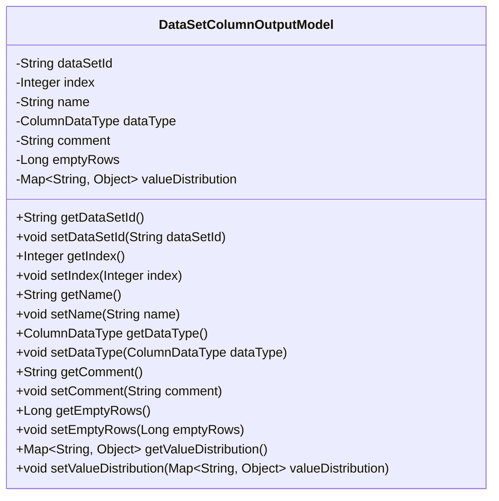

# Basic Information

|      |      |
|------|------|
| Name | DataSetColumnOutputModel |
| Language | .java |
| Code Path | WeFe/board/board-service/src/main/java/com/welab/wefe/board/service/dto/entity/data_set/DataSetColumnOutputModel.java |
| Package Name | com.welab.wefe.board.service.dto.entity.data_set |
| Dependencies | ['com.welab.wefe.common.fieldvalidate.annotation.Check', 'com.welab.wefe.common.wefe.enums.ColumnDataType', 'java.util.Map'] |
| Brief Description | Dataset column output model class, containing attributes such as dataset ID, field sequence number, name, data type, comments, null value row count, and value distribution, along with their corresponding getter/setter methods. |

# Description

The DataSetColumnOutputModel is a Java class used to describe dataset columns, containing attributes such as dataset ID, field sequence number, field name, data type, comments, count of null-value data rows, and value distribution. Each attribute has corresponding getter and setter methods, with some attributes annotated with names using the @Check annotation. The value distribution is stored as key-value pairs using a Map type. This class is primarily used for processing and storing information related to dataset columns.

# Class Summary

| Name   | Type  | Description |
|-------|------|-------------|
| DataSetColumnOutputModel | class | Dataset column output model class, containing attributes such as dataset ID, field sequence number, name, data type, comments, null value row count, and value distribution, along with corresponding getter/setter methods. |

## Class DataSetColumnOutputModel

|      |      |
|------|------|
| Access Modifier | public |
| Type | class |
| Name | DataSetColumnOutputModel |
| Description | Dataset column output model class, containing attributes such as dataset ID, field sequence number, name, data type, comments, null value row count, and value distribution, along with corresponding getter/setter methods. |

### UML Class Diagram

This code defines a Java class named DataSetColumnOutputModel, which represents the output model of a dataset column. The class contains multiple private fields such as dataSetId, index, name, etc., each annotated with @Check for validation. It provides getter and setter methods for all fields to access and modify the values of these private fields. This class is primarily used to encapsulate information related to dataset columns, including data type, comments, count of empty rows, and value distribution.

### Internal Method Call Graph

```mermaid
graph TD
    A["Class DataSetColumnOutputModel"]
    B["Attribute: String dataSetId '@Check'"]
    C["Attribute: Integer index '@Check'"]
    D["Attribute: String name '@Check'"]
    E["Attribute: ColumnDataType dataType '@Check'"]
    F["Attribute: String comment '@Check'"]
    G["Attribute: Long emptyRows '@Check'"]
    H["Attribute: Map<String,Object> valueDistribution '@Check'"]
    I["getter/setter: getDataSetId()/setDataSetId()"]
    J["getter/setter: getIndex()/setIndex()"]
    K["getter/setter: getName()/setName()"]
    L["getter/setter: getDataType()/setDataType()"]
    M["getter/setter: getComment()/setComment()"]
    N["getter/setter: getEmptyRows()/setEmptyRows()"]
    O["getter/setter: getValueDistribution()/setValueDistribution()"]

    A --> B
    A --> C
    A --> D
    A --> E
    A --> F
    A --> G
    A --> H
    A --> I
    A --> J
    A --> K
    A --> L
    A --> M
    A --> N
    A --> O
```

This code defines a Java class named DataSetColumnOutputModel, which represents the output model for dataset columns. The class contains 7 attributes annotated with @Check, corresponding to dataset ID, field index, field name, data type, comment, empty data row count, and value distribution. Each attribute has corresponding getter and setter methods for reading and setting the properties. This model is primarily used for outputting and validating dataset column information, with annotations ensuring validity checks on the attributes.

### Field List

| Name  | Type  | Description |
|-------|-------|------|
| name | String | Java field validation annotation: Use @Check to annotate the field "name" with type String. |
| emptyRows | Long | Field for checking the number of rows with null values: emptyRows. |
| dataType | ColumnDataType | Define a private variable named dataType, use the @Check annotation to validate the data type, and label it as "Data Type". |
| index | Integer | Field sequence check annotation, private integer variable index. |
| valueDistribution | Map<String, Object> | Map-type fields for numerical distribution checks. |
| comment | String | The class private field `comment` is marked with the `@Check` annotation as "comment". |
| dataSetId | String | The field `dataSetId` is marked with the `@Check` annotation for dataset ID validation. |

### Method List

| Name  | Type  | Description |
|-------|-------|------|
| setName | void | This is a Java method used to set the name property of an object. The method accepts a string parameter name and assigns it to the name field of the current object. |
| getDataSetId | String | Methods to obtain the dataset ID, returning a dataSetId string. |
| getName | String | The method returns the value of the name variable of type String. |
| getIndex | Integer | This is a Java method that returns the value of an integer variable named index. |
| setDataType | void | Define the method `setDataType` to set the `dataType` property of the class, with the parameter of type `ColumnDataType`. |
| setEmptyRows | void | Method to set the number of empty lines, with the parameter being emptyRows. |
| getComment | String | The method returns the value of the comment variable, which is of type String. |
| getEmptyRows | Long | Method returns the number of empty lines. |
| getDataType | ColumnDataType | Methods to obtain column data types, returning the value of the dataType field. |
| setComment | void | Method for setting the object comment attribute, which assigns the input string to the internal variable comment. |
| setIndex | void | Methods for setting integer index values. |
| getValueDistribution | Map<String, Object> | Methods for obtaining value distribution, with a return type of Map<String, Object>, directly returning the valueDistribution variable. |
| setDataSetId | void | The method for setting the dataset ID assigns the input parameter to the class's dataSetId member variable. |
| setValueDistribution | void | This is a Java method used to set the valueDistribution property of an object, with the parameter being of type Map, where the key is String and the value is Object. |

