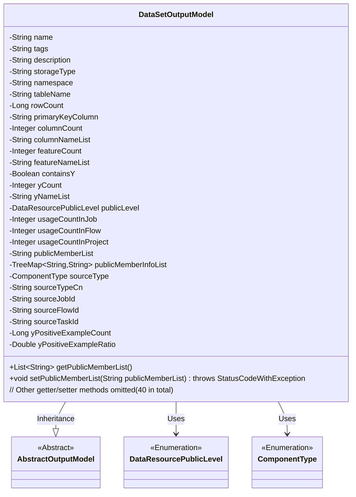

# Basic Information

|      |      |
|------|------|
| Name | DataSetOutputModel |
| Language | .java |
| Code Path | WeFe/board/board-service/src/main/java/com/welab/wefe/board/service/dto/entity/data_set/DataSetOutputModel.java |
| Package Name | com.welab.wefe.board.service.dto.entity.data_set |
| Dependencies | ['java.util.List', 'java.util.TreeMap', 'com.welab.wefe.board.service.dto.entity.AbstractOutputModel', 'com.welab.wefe.board.service.service.CacheObjects', 'com.welab.wefe.common.exception.StatusCodeWithException', 'com.welab.wefe.common.util.StringUtil', 'com.welab.wefe.common.wefe.enums.ComponentType', 'com.welab.wefe.common.wefe.enums.DataResourcePublicLevel'] |
| Brief Description | Dataset output model class, including attributes such as name, label, description, storage type, namespace, table name, row and column count, primary key, features, Y value, visibility, usage count, source task, and member list. |

# Description

The `DataSetOutputModel` class is a dataset output model that inherits from `AbstractOutputModel`. It contains basic information about the dataset, such as its name, label, description, storage type, namespace, table name, row count, primary key fields, column count, and field list. It also includes the number of features, feature list, whether it contains Y values, the count of Y columns, and their name list. The visibility of the dataset is controlled by `publicLevel`, and it records the usage count in jobs, workflows, and projects. The list of visible members and related information is managed by `publicMemberList` and `publicMemberInfoList`. The dataset source type is categorized into raw, aligned, and binned, and it records the source task, workflow, and subtask IDs. Additionally, it includes statistics on the number and proportion of positive samples. The class provides getter and setter methods for all attributes and implements special handling logic for `publicMemberList`.

# Class Summary

| Name   | Type  | Description |
|-------|------|-------------|
| DataSetOutputModel | class | Dataset output model class, containing attributes such as name, label, description, storage type, namespace, table name, row/column count, primary key, features, Y-value, visibility, usage count, source type, and task ID. |

## Class DataSetOutputModel

|      |      |
|------|------|
| Access Modifier | public |
| Type | class |
| Name | DataSetOutputModel |
| Description | Dataset output model class, containing attributes such as name, label, description, storage type, namespace, table name, row/column count, primary key, features, Y-value, visibility, usage count, source type, and task ID. |

### UML Class Diagram

Class diagram description: The DataSetOutputModel class inherits from the abstract class AbstractOutputModel, containing dataset-related metadata (e.g., name, tags, storage type) and statistical information (e.g., row count, column count, feature quantity). This class utilizes two enumeration types (DataResourcePublicLevel and ComponentType) and manages public member information through TreeMap. It provides over 40 getter/setter methods, with the setPublicMemberList method containing special logic to handle wildcard "*" cases.

### Internal Method Call Graph

```mermaid
graph TD
    A["Class DataSetOutputModel"]
    B["Inheritance: AbstractOutputModel"]
    C["Attribute: String name"]
    D["Attribute: String tags"]
    E["Attribute: String description"]
    F["Attribute: String storageType"]
    G["Attribute: String namespace"]
    H["Attribute: String tableName"]
    I["Attribute: Long rowCount"]
    J["Attribute: String primaryKeyColumn"]
    K["Attribute: Integer columnCount"]
    L["Attribute: String columnNameList"]
    M["Attribute: Integer featureCount"]
    N["Attribute: String featureNameList"]
    O["Attribute: Boolean containsY"]
    P["Attribute: Integer yCount"]
    Q["Attribute: String yNameList"]
    R["Attribute: DataResourcePublicLevel publicLevel"]
    S["Attribute: Integer usageCountInJob"]
    T["Attribute: Integer usageCountInFlow"]
    U["Attribute: Integer usageCountInProject"]
    V["Attribute: String publicMemberList"]
    W["Attribute: TreeMap<String,String> publicMemberInfoList"]
    X["Attribute: ComponentType sourceType"]
    Y["Attribute: String sourceTypeCn"]
    Z["Attribute: String sourceJobId"]
    AA["Attribute: String sourceFlowId"]
    AB["Attribute: String sourceTaskId"]
    AC["Attribute: Long yPositiveExampleCount"]
    AD["Attribute: Double yPositiveExampleRatio"]
    AE["Method: List<String> getPublicMemberList()"]
    AF["Method: void setPublicMemberList(String)"]
    AG["Method: 38 standard getter/setter"]

    A --> B
    A --> C
    A --> D
    A --> E
    A --> F
    A --> G
    A --> H
    A --> I
    A --> J
    A --> K
    A --> L
    A --> M
    A --> N
    A --> O
    A --> P
    A --> Q
    A --> R
    A --> S
    A --> T
    A --> U
    A --> V
    A --> W
    A --> X
    A --> Y
    A --> Z
    A --> AA
    A --> AB
    A --> AC
    A --> AD
    A --> AE
    A --> AF
    A -.-> AG
```

This flowchart illustrates the complete structure of the DataSetOutputModel class, including its inheritance relationship, 25 attribute fields, and 3 main method categories. It particularly highlights the two core methods getPublicMemberList() and setPublicMemberList(), as well as 38 standard getter/setter methods. The class primarily describes metadata information of dataset output models, covering dimensions such as basic attributes, statistical features, access control, and source tracing. It maintains member visibility information through TreeMap and provides parsing capabilities for special-format member lists.

### Field List

| Name  | Type  | Description |
|-------|-------|------|
| description | String | Private string type variable description. |
| name | String | private String variable name |
| publicLevel | DataResourcePublicLevel | The private data resource's public level variable `publicLevel`. |
| containsY | Boolean | Private boolean variable used to determine whether it contains Y. |
| usageCountInJob = 0 | Integer | The variable `usageCountInJob` records the number of uses within a job, with an initial value of 0 and a type of Integer. |
| storageType | String | The private string variable `storageType` is used to store type information. |
| tableName | String | The private string variable tableName is used to store the table name. |
| featureCount | Integer | Private integer variable used to record the number of features. |
| featureNameList | String | The private string variable featureNameList is used to store the list of feature names. |
| primaryKeyColumn | String | Primary Key Column Field Declaration |
| sourceType | ComponentType | The private member variable sourceType, of type ComponentType. |
| yPositiveExampleCount = 0L | Long | The private long integer variable yPositiveExampleCount has an initial value of 0. |
| sourceJobId | String | Declare a private string variable sourceJobId. |
| rowCount | Long | Private long integer variable, recording the number of rows. |
| sourceTaskId | String | Declare a private string variable sourceTaskId. |
| yPositiveExampleRatio = 0D | Double | The variable yPositiveExampleRatio is initialized to 0.0, with the type being Double. |
| sourceTypeCn | String | Private string variable representing the Chinese name of the source type. |
| usageCountInFlow = 0 | Integer | The variable `usageCountInFlow` records the number of times the flow is used, with an initial value of 0. |
| publicMemberInfoList = new TreeMap<>() | TreeMap<String, String> | A private variable `publicMemberInfoList` of type TreeMap is defined to store public member information in key-value pairs, where both the key and value are of String type. |
| columnNameList | String | The private string variable columnNameList is used to store the list of column names. |
| yCount | Integer | Private integer variable yCount. |
| tags | String | Private string variable tags |
| publicMemberList | String | Private string variable publicMemberList |
| namespace | String | Private string variable namespace. |
| columnCount | Integer | Private integer variable representing the number of columns. |
| sourceFlowId | String | The private string variable sourceFlowId is used to store the source flow ID. |
| usageCountInProject = 0 | Integer | Project internal usage counter, initial value is 0. |
| yNameList | String | The private string variable yNameList is used to store the list of names. |

### Method List

| Name  | Type  | Description |
|-------|-------|------|
| setPublicMemberInfoList | void | Set the public member information list, with the parameter being of type TreeMap, where both keys and values are strings. |
| setColumnCount | void | The method to set the number of columns involves assigning the parameter `columnCount` to the class property of the same name. |
| setFeatureCount | void | Set the feature count method, assigning the input parameter to the class member variable featureCount. |
| getPublicMemberInfoList | TreeMap<String, String> | Retrieve the list of public member information, with the return type being TreeMap<String, String>. |
| getSourceJobId | String | Method to obtain the source job ID, returns the sourceJobId as a string type. |
| getColumnCount | Integer | Methods to obtain the number of columns, returns an integer value columnCount. |
| getContainsY | Boolean | This is a Java method that returns a boolean value containsY, used to check whether it contains Y. |
| setUsageCountInProject | void | Method for setting the number of uses within a project, with the parameter being an integer value. |
| setPrimaryKeyColumn | void | Method to set the primary key column, assigning the input parameter to the class member variable primaryKeyColumn. |
| getDescription | String | Methods for obtaining descriptive information, returning the string-type description value. |
| getRowCount | Long | Methods to obtain the number of rows, returning the rowCount value. |
| setTags | void | Method for setting tags: Assign the input string to the object's tags property. |
| setTableName | void | Methods for setting the table name, assigning the input parameter `tableName` to the `tableName` property of the current object. |
| setUsageCountInJob | void | This is a Java method used to set the number of uses in a job. The method accepts an integer parameter and assigns it to the class member variable `usageCountInJob`. |
| getUsageCountInJob | Integer | Get the number of uses in the assignment. |
| setRowCount | void | Methods for setting the number of rows: assign the parameter rowCount to the rowCount property of the class. |
| getTableName | String | Methods to obtain the table name, returns the tableName of string type. |
| getUsageCountInFlow | Integer | Get the usage count in the process. |
| setNamespace | void | The method to set the namespace assigns the input parameter to the `namespace` property of the class. |
| getPublicLevel | DataResourcePublicLevel | Obtain the public access level of the data resource. |
| getPublicMemberList | List<String> | The method `getPublicMemberList` checks if `publicMemberList` is `"[\"*\"]"` or `"*"`. If so, it returns `null`; otherwise, it splits the string by commas and returns a list of non-empty items. |
| getNamespace | String | The method returns the namespace string. |
| setyNameList | void | The method to set the yNameList property assigns the input parameter to the class member variable yNameList. |
| setSourceTypeCn | void | This is a Java method used to set the value of the sourceTypeCn property. The method accepts a string parameter and assigns it to the class's member variable sourceTypeCn. |
| getyNameList | String | The method returns the value of the string variable yNameList. |
| setStorageType | void | The method to set the storage type assigns the input parameter to the class member variable `storageType`. |
| getPrimaryKeyColumn | String | Methods to obtain the primary key column name, returning a string-type primaryKeyColumn value. |
| setyCount | void | This is a Java method used to set the value of the yCount property. The method takes an Integer parameter and assigns it to the yCount member variable of the class. |
| getStorageType | String | Methods to obtain the storage type, returning a string-type storageType value. |
| setPublicLevel | void | Method for setting the public level of data resources, with the parameter being publicLevel. |
| setDescription | void | The method for setting description information assigns the input parameter to the `description` property of the object. |
| setUsageCountInFlow | void | Method to set the number of uses within the flow, with the parameter being an integer usageCountInFlow. |
| setContainsY | void | Java Method: Set the value of the boolean property containsY. |
| getName | String | Methods to get the name, returns the value of the variable name. |
| getTags | String | Methods to obtain the tags string. |
| setPublicMemberList | void | Set the public member list, processing comma-separated IDs. Skip special characters "*" or "[\"*\"]". Fetch member names via cache, and refresh the cache if not found. Store IDs and member names in publicMemberInfoList. |
| setSourceFlowId | void | Method for setting the source flow ID, which assigns the input parameter to the `sourceFlowId` member variable of the class. |
| getSourceTaskId | String | The method to obtain the source task ID directly returns the value of the `sourceTaskId` field. |
| setSourceTaskId | void | The method to set the source task ID assigns the input parameter to the class member variable sourceTaskId. |
| getyPositiveExampleCount | Long | Method to obtain the yPositiveExampleCount value. |
| setyPositiveExampleCount | void | The method to set the number of positive examples, with a parameter of type long. |
| getyPositiveExampleRatio | Double | Method to obtain the proportion of positive examples, returns a double value yPositiveExampleRatio. |
| setyPositiveExampleRatio | void | Set the positive example ratio method, which accepts a double parameter and assigns it to the class member variable yPositiveExampleRatio. |
| getyCount | Integer | A public method to get the yCount value, returning an Integer type. |
| getUsageCountInProject | Integer | Method to obtain the integer value of usage count within a project. |
| getFeatureCount | Integer | Method to get the number of features, returns an integer value featureCount. |
| setFeatureNameList | void | This is a Java method used to set the value of the featureNameList property. The method accepts a string parameter and assigns it to the member variable of the class. |
| setSourceType | void | The method `setSourceType` is used to set the `sourceType` property, and the parameter type is `ComponentType`. |
| setColumnNameList | void | Methods for setting the column name list, assigning the input string to the member variable columnNameList of the class. |
| getSourceType | ComponentType | Methods to obtain the component source type, returns the value of the sourceType variable. |
| getColumnNameList | String | Methods to obtain a list of column names, returning a list of column names of string type. |
| getSourceTypeCn | String | Methods to obtain the Chinese source type, returning the value of the sourceTypeCn variable. |
| getSourceFlowId | String | Method to obtain the string value of sourceFlowId. |
| setName | void | Methods for setting the object name, assigning the parameter `name` to the `name` property of the object. |
| setSourceJobId | void | The method to set the source task ID assigns the input parameter to the `sourceJobId` member variable of the class. |
| getFeatureNameList | String | Methods to obtain the list of feature names, returning a string-type featureNameList. |

