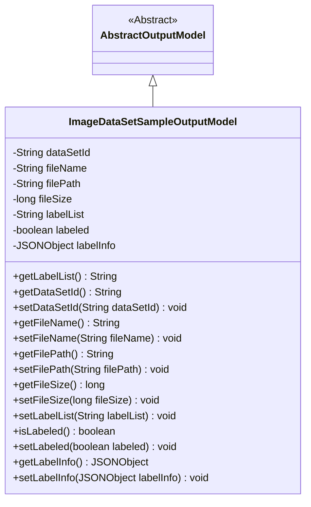

# Basic Information

|      |      |
|------|------|
| Name | ImageDataSetSampleOutputModel |
| Language | .java |
| Code Path | WeFe/board/board-service/src/main/java/com/welab/wefe/board/service/dto/entity/data_set/ImageDataSetSampleOutputModel.java |
| Package Name | com.welab.wefe.board.service.dto.entity.data_set |
| Dependencies | ['com.alibaba.fastjson.JSONObject', 'com.welab.wefe.board.service.dto.entity.AbstractOutputModel', 'com.welab.wefe.common.fieldvalidate.annotation.Check', 'com.welab.wefe.common.util.StringUtil'] |
| Brief Description | The ImageDataSetSampleOutputModel class inherits from AbstractOutputModel and includes fields such as dataset ID, filename, path, size, label list, annotation status, and JSON annotation information, providing getter/setter methods. |

# Description

The `ImageDataSetSampleOutputModel` class inherits from `AbstractOutputModel` and is used to handle the output information of image dataset samples. It includes the following fields: dataset ID, file name, file path, file size, label list, annotation flag, and annotation information in JSON format. Each field is validated via the `@Check` annotation and comes with corresponding getter and setter methods. Notably, the `getLabelList` method removes commas before and after the label list to prevent frontend errors. This class encapsulates the basic attributes and annotation status of image samples, facilitating data management and transmission.

# Class Summary

| Name   | Type  | Description |
|-------|------|-------------|
| ImageDataSetSampleOutputModel | class | The ImageDataSetSampleOutputModel class inherits from AbstractOutputModel and includes fields such as dataset ID, filename, path, size, label list, annotation status, and JSON annotation information, providing getter/setter methods. |

## Class ImageDataSetSampleOutputModel

|      |      |
|------|------|
| Access Modifier | public |
| Type | class |
| Name | ImageDataSetSampleOutputModel |
| Description | The ImageDataSetSampleOutputModel class inherits from AbstractOutputModel and includes fields such as dataset ID, filename, path, size, label list, annotation status, and JSON annotation information, providing getter/setter methods. |

### UML Class Diagram

This code demonstrates an image dataset sample output model class `ImageDataSetSampleOutputModel`, which inherits from the abstract class `AbstractOutputModel`. The class contains private fields such as dataset ID, file name, file path, file size, label list, labeling status, and label information, along with corresponding getter and setter methods. The `getLabelList()` method performs special processing on the label list to remove leading and trailing commas to prevent front-end errors. The class diagram clearly illustrates the inheritance relationship and all member methods, showcasing the model's capability to encapsulate output information for image dataset samples.

### Internal Method Call Graph

```mermaid
graph TD
    A["Class ImageDataSetSampleOutputModel"]
    B["Inherits from: AbstractOutputModel"]
    C["Property: String dataSetId"]
    D["Property: String fileName"]
    E["Property: String filePath"]
    F["Property: long fileSize"]
    G["Property: String labelList"]
    H["Property: boolean labeled"]
    I["Property: JSONObject labelInfo"]
    J["Method: getLabelList()"]
    K["Method: getDataSetId()"]
    L["Method: setDataSetId(String)"]
    M["Method: getFileName()"]
    N["Method: setFileName(String)"]
    O["Method: getFilePath()"]
    P["Method: setFilePath(String)"]
    Q["Method: getFileSize()"]
    R["Method: setFileSize(long)"]
    S["Method: setLabelList(String)"]
    T["Method: isLabeled()"]
    U["Method: setLabeled(boolean)"]
    V["Method: getLabelInfo()"]
    W["Method: setLabelInfo(JSONObject)"]

    A --> B
    A --> C
    A --> D
    A --> E
    A --> F
    A --> G
    A --> H
    A --> I
    A --> J
    A --> K
    A --> L
    A --> M
    A --> N
    A --> O
    A --> P
    A --> Q
    A --> R
    A --> S
    A --> T
    A --> U
    A --> V
    A --> W
```

This code defines a class named `ImageDataSetSampleOutputModel`, which inherits from `AbstractOutputModel`. The class includes multiple properties such as `dataSetId`, `fileName`, `filePath`, etc., each with corresponding getter and setter methods. Notably, the `getLabelList()` method performs special processing on the `labelList` property to remove leading and trailing commas to avoid frontend errors. All properties are annotated with the `@Check` annotation, indicating these attributes require validation in a specific context.

### Field List

| Name  | Type  | Description |
|-------|-------|------|
| labelInfo | JSONObject | The private variable `labelInfo`, annotated with `@Check`, stores annotation information in JSON format. |
| fileName | String | Define a private String variable fileName, and use the @Check annotation to validate the filename. |
| labelList | String | The code defines a private string variable named labelList, annotated with @Check and setting the name attribute to "label". |
| dataSetId | String | The field dataSetId is marked with the @Check annotation, indicating that the dataset ID needs to be validated. |
| fileSize | long | Define a private long integer variable fileSize, marked with the @Check annotation as the "file size" check item. |
| filePath | String | Define a private String variable filePath, and use the @Check annotation to validate the file path. |
| labeled | boolean | The private boolean variable labeled is used to check whether it has been labeled. |

### Method List

| Name  | Type  | Description |
|-------|-------|------|
| getFilePath | String | This is a Java method that returns the file path string filePath. |
| getFileName | String | Common method to obtain the file name, returns the fileName variable value of string type. |
| getLabelList | String | This method is used to remove commas before and after the string labelList to avoid front-end errors, and returns the processed result. |
| setFileName | void | Method for setting the file name: Assign the input string to the fileName variable of the class. |
| setFilePath | void | This is a Java method used to set the file path property. The method accepts a string parameter filePath and assigns it to the class's member variable filePath. |
| setFileSize | void | This is a Java method used to set the file size attribute, which takes a long integer parameter fileSize and assigns it to the class member variable fileSize. |
| getDataSetId | String | This is a Java method that returns the value of a string variable named dataSetId. |
| setLabeled | void | Methods for setting object label status, with a boolean parameter to indicate whether it has been labeled. |
| setLabelList | void | This is a Java method used to set the value of the class's labelList property. The method takes a string parameter labelList and assigns it to the class's member variable of the same name. |
| getLabelInfo | JSONObject | Method for obtaining JSON object of label information. |
| isLabeled | boolean | The method isLabeled returns the boolean state of labeled. |
| getFileSize | long | Methods to obtain file size, returning the fileSize value. |
| setDataSetId | void | The method to set the dataset ID assigns the input parameter to the class's dataSetId member variable. |
| setLabelInfo | void | Method for setting label information, which takes a JSONObject parameter and assigns it to the member variable labelInfo. |

