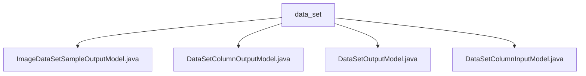

# Basic Information

|      |      |
|------|------|
| Name | data_set |
| Language | .java |
| Code Path | WeFe/board/board-service/src/main/java/com/welab/wefe/board/service/dto/entity/data_set |
| Package Name | docs.board.board-service.src.main.java.com.welab.wefe.board.service.dto.entity.data_set |
| Brief Description | The ImageDataSetSampleOutputModel handles image sample outputs, containing fields such as ID, file name, and labels, and provides validation and getter/setter methods. The DataSetColumnOutputModel describes dataset columns, including attributes such as field name, type, and distribution. The DataSetOutputModel contains basic dataset information, features, visibility, etc., and manages usage count and source. The DataSetColumnInputModel validates field names, types, and annotations, and provides standard methods. |

# Description

## Overview  
The core responsibility of this module is to manage dataset metadata and sample data, providing standardized input/output models. The interface specification uniformly adopts the Java Bean pattern, validates fields using the @Check annotation, and strictly follows the Getter/Setter conventions. Key data structures include the image sample model (with annotation information), dataset column model (with numerical distribution), and dataset model (with feature statistics). External dependencies are limited to the basic validation framework. For example, the ImageDataSetSampleOutputModel automatically cleanses label formats, while the DataSetOutputModel tracks dataset usage.  

## Key Business Scenarios  
The module supports full lifecycle management of datasets, similar to a data middle platform model. Typical workflows include: column definition validation (e.g., DataSetColumnInputModel enforces type checks), dataset feature analysis (e.g., DataSetOutputModel calculates Y-value distribution), and sample annotation processing (e.g., ImageDataSetSampleOutputModel standardizes labels). The interaction pattern is implemented through layered models, with base attributes inherited from AbstractOutputModel. For instance, numerical distributions are stored using Maps, and the positive case ratio is dynamically computed via DataSetOutputModel.

### Package Internal Structure View

This flowchart illustrates the hierarchical relationships between four Java files under the data_set directory. All files are directly subordinate to the data_set directory with no deeper nesting structure. The diagram consists of one parent node (data_set) and four child node files, clearly presenting the organization of model class files within this DTO entity package.

# File List

| Name   | Type  | Description |
|-------|------|-------------|
| [ImageDataSetSampleOutputModel.java](ImageDataSetSampleOutputModel.md) | file | The ImageDataSetSampleOutputModel class inherits from AbstractOutputModel and includes fields such as dataset ID, filename, path, size, label list, annotation status, and JSON annotation information, providing getter/setter methods. |
| [DataSetColumnOutputModel.java](DataSetColumnOutputModel.md) | file | The dataset column output model class includes attributes such as dataset ID, field sequence number, name, data type, comments, null value row count, and value distribution, along with their corresponding getter/setter methods. |
| [DataSetOutputModel.java](DataSetOutputModel.md) | file | Dataset output model class, including attributes such as name, label, description, storage type, namespace, table name, row/column count, primary key, features, Y-value, visibility, usage count, source task, and member list. |
| [DataSetColumnInputModel.java](DataSetColumnInputModel.md) | file | The dataset column input model class includes fields for name, data type, and comments, with a comment length limit of 250 characters, and mandatory validation for the data type field. |

