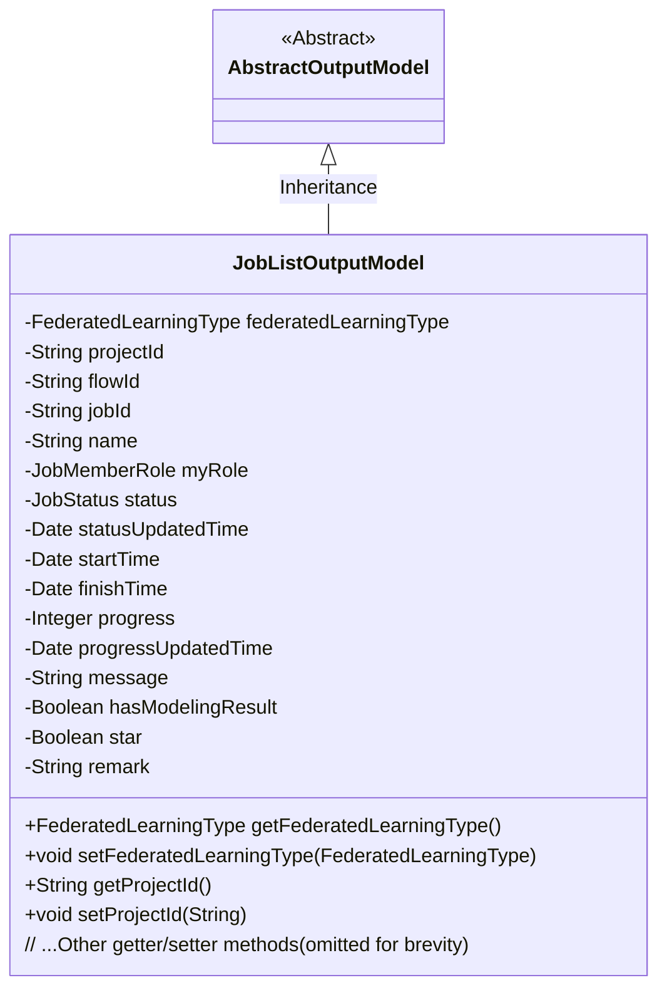

# Basic Information

|      |      |
|------|------|
| Name | JobListOutputModel |
| Language | .java |
| Code Path | WeFe/board/board-service/src/main/java/com/welab/wefe/board/service/dto/entity/job/JobListOutputModel.java |
| Package Name | com.welab.wefe.board.service.dto.entity.job |
| Dependencies | ['com.welab.wefe.board.service.dto.entity.AbstractOutputModel', 'com.welab.wefe.common.fieldvalidate.annotation.Check', 'com.welab.wefe.common.wefe.enums.FederatedLearningType', 'com.welab.wefe.common.wefe.enums.JobMemberRole', 'com.welab.wefe.common.wefe.enums.JobStatus', 'java.util.Date'] |
| Brief Description | The JobListOutputModel class includes fields such as federated task type, project ID, process ID, task ID, name, identity, status, time, progress, message, result, tags, and remarks, along with their corresponding getter/setter methods. |

# Description

The JobListOutputModel class inherits from AbstractOutputModel and contains attributes related to federated learning tasks. Key fields include task type, project ID, process ID, task ID, name, identity role, status and update time, start and end time, progress and update time, message notes, whether modeling results are included, favorite markers, and remarks. Each field has corresponding getter and setter methods for attribute access and modification.

# Class Summary

| Name   | Type  | Description |
|-------|------|-------------|
| JobListOutputModel | class | The JobListOutputModel class includes attributes such as federated task type, project ID, process ID, task ID, name, identity role, status, time information, progress, message remarks, modeling result flag, favorite marker, and remarks, along with their corresponding getter/setter methods. |

## Class JobListOutputModel

|      |      |
|------|------|
| Access Modifier | public |
| Type | class |
| Name | JobListOutputModel |
| Description | The JobListOutputModel class includes attributes such as federated task type, project ID, process ID, task ID, name, identity role, status, time information, progress, message remarks, modeling result flag, favorite marker, and remarks, along with their corresponding getter/setter methods. |

### UML Class Diagram

Class Diagram Description:
The JobListOutputModel class inherits from the AbstractOutputModel abstract class and serves as an output model class containing detailed information about federated learning tasks. It includes 15 private fields that record core attributes such as task type, project ID, flow ID, task status, timestamps, and progress. These fields are accessed and modified through public getter/setter methods. All fields are validated using the @Check annotation, reflecting robust protection for task data integrity. This model is primarily used for encapsulating and transmitting federated learning task list data.

### Internal Method Call Graph

```mermaid
graph TD
    A["Class JobListOutputModel"]
    B["Inherits from: AbstractOutputModel"]
    C["Property: FederatedLearningType federatedLearningType"]
    D["Property: String projectId"]
    E["Property: String flowId"]
    F["Property: String jobId"]
    G["Property: String name"]
    H["Property: JobMemberRole myRole"]
    I["Property: JobStatus status"]
    J["Property: Date statusUpdatedTime"]
    K["Property: Date startTime"]
    L["Property: Date finishTime"]
    M["Property: Integer progress"]
    N["Property: Date progressUpdatedTime"]
    O["Property: String message"]
    P["Property: Boolean hasModelingResult"]
    Q["Property: Boolean star"]
    R["Property: String remark"]
    S["Getter/Setter Method Group"]

    A --> B
    A --> C
    A --> D
    A --> E
    A --> F
    A --> G
    A --> H
    A --> I
    A --> J
    A --> K
    A --> L
    A --> M
    A --> N
    A --> O
    A --> P
    A --> Q
    A --> R
    A --> S
```

This code defines a JobListOutputModel class that inherits from AbstractOutputModel, containing 15 properties annotated with @Check and corresponding getter/setter methods. The class represents an output model for federated learning job lists, including fields such as job type, project ID, flow ID, job ID, name, role, status, time information, progress, message, modeling result flag, star mark, and remarks. All properties are accessed and modified through standard getter/setter methods, forming a complete data encapsulation structure.

### Field List

| Name  | Type  | Description |
|-------|-------|------|
| jobId | String | The code defines a private string variable named jobId, marked with the @Check annotation, where the annotation parameter name is set to "Task ID". |
| finishTime | Date | End time validation field, type is Date. |
| statusUpdatedTime | Date | The field `statusUpdatedTime` is used to record the status update time and is marked as a check item. |
| progressUpdatedTime | Date | Progress update time field, marked with @Check annotation, of type Date. |
| status | JobStatus | Job status enumeration field JobStatus. |
| remark | String | The field "remark" is used for remarks and is marked with the @Check annotation. |
| progress | Integer | Progress check field, type integer. |
| message | String | The class field "message" is annotated with @Check to store message remarks or failure reasons. |
| name | String | The code defines a private string variable named "name" and annotates it with @Check, specifying its display name as "Name". |
| federatedLearningType | FederatedLearningType | Check the federated task type (horizontal/vertical), private variable federatedLearningType. |
| projectId | String | Define a private String variable projectId, and validate the project ID using the @Check annotation. |
| startTime | Date | Define a private date-type variable startTime, marked with the @Check annotation as "Start Time". |
| flowId | String | Define the process ID field and validate it using the @Check annotation. |
| myRole | JobMemberRole | The code defines a private enum variable `myRole` to identify our identity (promoter/provider/arbiter), which is validated through the `@Check` annotation. |
| hasModelingResult | Boolean | The class member variable `hasModelingResult` is marked with the `@Check` annotation to verify whether it contains modeling results. |
| star | Boolean | The field `star` is used to mark favorites/pinning/status, and its type is boolean. |

### Method List

| Name  | Type  | Description |
|-------|-------|------|
| getMyRole | JobMemberRole | Get the role information of the current user. |
| setProjectId | void | This is a Java method used to set the projectId property value of a class. The method takes a string parameter projectId and assigns it to the member variable of the same name in the class. |
| getFederatedLearningType | FederatedLearningType | Method to obtain the federated learning type, returns the federatedLearningType value. |
| setHasModelingResult | void | Set Boolean value method for modeling result status. |
| setStartTime | void | The method to set the start time, with the parameter being of type Date. |
| setStatus | void | Methods for setting task status, which assign the passed status parameter to the status property of the current object. |
| setMyRole | void | Java Method: Sets the role attribute of the current user. The parameter is of type JobMemberRole and is assigned to the member variable myRole. |
| setProgress | void | The method to set the progress value assigns the input parameter `progress` to the class member variable `progress`. |
| getProgress | Integer | Methods to obtain the progress value, returning an integer-type progress variable. |
| getStartTime | Date | Method to get the start time, returns the startTime object. |
| getHasModelingResult | Boolean | The method returns a boolean value `hasModelingResult`, indicating whether modeling results are present. |
| setFederatedLearningType | void | The method for setting the federated learning type takes a parameter of type FederatedLearningType and assigns it to the member variable federatedLearningType. |
| setProgressUpdatedTime | void | The method for setting the progress update time assigns the parameter `progressUpdatedTime` to the class member variable of the same name. |
| setMessage | void | Set the value of the class member variable `message`. |
| getProgressUpdatedTime | Date | The method to obtain the progress update time, which returns the progressUpdatedTime variable. |
| setFinishTime | void | Java method: Set completion time, parameter is of Date type, assigned to the class member variable finishTime. |
| setStatusUpdatedTime | void | The method for setting the status update time assigns the input parameter to the class member variable `statusUpdatedTime`. |
| getStatusUpdatedTime | Date | Method to obtain the status update time, returns the statusUpdatedTime value. |
| getStatus | JobStatus | The method returns the current task status. |
| setFlowId | void | Method for setting the flow ID: Assign the input parameter flowId to the flowId property of the current object. |
| getFlowId | String | The method to obtain the flowId directly returns the value of the member variable flowId. |
| getJobId | String | Get the unique identifier jobId of the current task. |
| setJobId | void | Methods for setting task ID: assign the input parameter jobId to the jobId property of the current object. |
| setName | void | This is a Java method used to set the name property of an object, assigning the passed name parameter to the name field of the current object. |
| getProjectId | String | Methods to obtain the project ID, returning a string-type projectId. |
| getName | String | The method returns the value of the name variable of type string. |
| getFinishTime | Date | Methods to obtain the completion time, returning a finishTime date object. |
| getStar | Boolean | Public method to obtain the boolean value of star. |
| setStar | void | Public method for setting an object's starred status, with a boolean parameter `star`. |
| getRemark | String | Public method for retrieving remark information, returns the remark content as a string. |
| setRemark | void | The method for setting remark information assigns the input string to the class's remark property. |
| getMessage | String | Methods to obtain the message string. |

