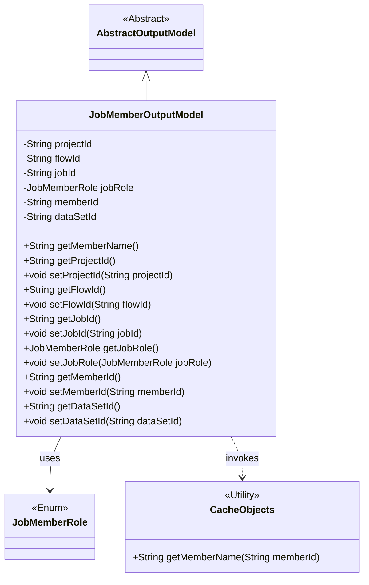
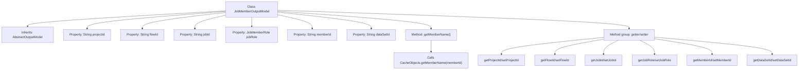

# Basic Information

|      |      |
|------|------|
| Name | JobMemberOutputModel |
| Language | .java |
| Code Path | WeFe/board/board-service/src/main/java/com/welab/wefe/board/service/dto/entity/job/JobMemberOutputModel.java |
| Package Name | com.welab.wefe.board.service.dto.entity.job |
| Dependencies | ['com.welab.wefe.board.service.dto.entity.AbstractOutputModel', 'com.welab.wefe.board.service.service.CacheObjects', 'com.welab.wefe.common.fieldvalidate.annotation.Check', 'com.welab.wefe.common.wefe.enums.JobMemberRole'] |
| Brief Description | The JobMemberOutputModel class contains project, process, task IDs, member roles, IDs, and dataset IDs, providing getter/setter methods for each field. |

# Description

The JobMemberOutputModel class inherits from AbstractOutputModel and is used to represent task member-related information. It includes fields such as project ID, process ID, task ID, member role (enum values: promoter/provider/arbiter), member ID, and dataset ID. Each field has corresponding getter and setter methods. Additionally, it provides the getMemberName method to retrieve the member name from the cache using the member ID. All fields are validated using the @Check annotation.

# Class Summary

| Name   | Type  | Description |
|-------|------|-------------|
| JobMemberOutputModel | class | The JobMemberOutputModel class extends AbstractOutputModel, containing project, process, task IDs, member roles, IDs, and dataset IDs, providing getter/setter methods for each field. |

## Class JobMemberOutputModel

|      |      |
|------|------|
| Access Modifier | public |
| Type | class |
| Name | JobMemberOutputModel |
| Description | The JobMemberOutputModel class extends AbstractOutputModel, containing project, process, task IDs, member roles, IDs, and dataset IDs, providing getter/setter methods for each field. |

### UML Class Diagram

This class diagram illustrates that JobMemberOutputModel inherits from AbstractOutputModel, containing multiple private fields with @Check annotations and their corresponding getter/setter methods. The jobRole field utilizes the JobMemberRole enumeration type and retrieves member names through the CacheObjects utility class. The class structure demonstrates fundamental characteristics of a data model, incorporating core attributes such as project/flow/job IDs, while achieving code reuse through inheritance.

### Internal Method Call Graph

This flowchart illustrates the structure of the JobMemberOutputModel class, which inherits from the AbstractOutputModel class and contains six properties annotated with @Check along with a method to retrieve member names. The class defines a complete set of getter/setter methods, where the getMemberName() method implements its functionality by calling CacheObjects.getMemberName(). All properties are private fields exposed through public methods, demonstrating good encapsulation. The flowchart clearly presents the class inheritance relationship, property declarations, and method call chains.

### Field List

| Name  | Type  | Description |
|-------|-------|------|
| memberId | String | Member ID field, validated using the @Check annotation. |
| jobId | String | The class member variable jobId is validated using the @Check annotation to verify the task ID. |
| flowId | String | Define a private String variable flowId, and validate the process ID using the @Check annotation. |
| projectId | String | Define a private String variable projectId, and validate the project ID using the @Check annotation. |
| jobRole | JobMemberRole | Check the private variable jobRole of the task role enumeration (promoter/provider/arbiter). |
| dataSetId | String | Dataset ID field, validated using the @Check annotation. |

### Method List

| Name  | Type  | Description |
|-------|-------|------|
| getJobRole | JobMemberRole | Get the jobRole property value of the current object. |
| getProjectId | String | Methods to obtain the project ID, returning a string-type projectId. |
| setJobId | void | Set the jobId property value of the current object to the passed jobId parameter value. |
| getMemberName | String | Method to obtain member name: Query and return the member name from the cache using the member ID. |
| setFlowId | void | The method to set the flow ID assigns the parameter flowId to the flowId property of the current object. |
| setJobRole | void | The method `setJobRole` is used to set the `jobRole` attribute, with the parameter being of type `JobMemberRole`. |
| getMemberId | String | The method returns the member ID string. |
| setMemberId | void | The method to set the member ID assigns the passed string parameter to the class's member variable `memberId`. |
| getDataSetId | String | Methods to obtain the dataset ID, returning a dataSetId string. |
| setDataSetId | void | Method for setting the dataset ID, assigning the input parameter to the class member variable dataSetId. |
| setProjectId | void | This is a Java method used to set the projectId property value of a class. The method takes a string parameter projectId and assigns it to the member variable of the same name in the current object. |
| getJobId | String | Get the ID of the current task. |
| getFlowId | String | Methods to obtain the current process ID, returning a string-type flowId. |

