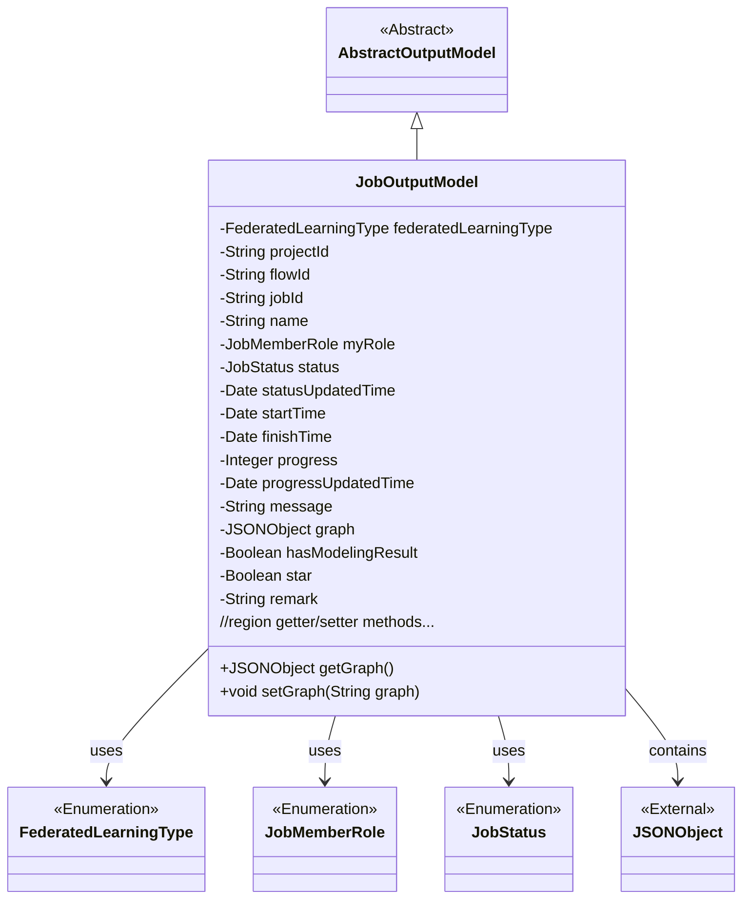

# Basic Information

|      |      |
|------|------|
| Name | JobOutputModel |
| Language | .java |
| Code Path | WeFe/board/board-service/src/main/java/com/welab/wefe/board/service/dto/entity/job/JobOutputModel.java |
| Package Name | com.welab.wefe.board.service.dto.entity.job |
| Dependencies | ['com.alibaba.fastjson.JSON', 'com.alibaba.fastjson.JSONObject', 'com.welab.wefe.board.service.dto.entity.AbstractOutputModel', 'com.welab.wefe.common.fieldvalidate.annotation.Check', 'com.welab.wefe.common.wefe.enums.FederatedLearningType', 'com.welab.wefe.common.wefe.enums.JobMemberRole', 'com.welab.wefe.common.wefe.enums.JobStatus', 'java.util.Date'] |
| Brief Description | The JobOutputModel class defines the federated learning task output model, including attributes such as task type, ID, status, time, progress, role, remarks, and corresponding getter/setter methods. |

# Description

The JobOutputModel class inherits from AbstractOutputModel and contains attributes related to federated learning tasks. The main fields include task type, project ID, process ID, task ID, name, identity role, status and update time, start and end time, progress and update time, message notes, directed acyclic graph, whether it includes modeling results, favorite mark, and remarks. Each field has corresponding getter and setter methods, with the setter method for the graph field supporting conversion from string to JSON object.

# Class Summary

| Name   | Type  | Description |
|-------|------|-------------|
| JobOutputModel | class | The JobOutputModel class inherits from AbstractOutputModel and includes attributes such as federated learning task type, project ID, process ID, task ID, name, identity role, status, time, progress, message, directed acyclic graph, modeling results, and favorite mark, along with their corresponding getter/setter methods. |

## Class JobOutputModel

|      |      |
|------|------|
| Access Modifier | public |
| Type | class |
| Name | JobOutputModel |
| Description | The JobOutputModel class inherits from AbstractOutputModel and includes attributes such as federated learning task type, project ID, process ID, task ID, name, identity role, status, time, progress, message, directed acyclic graph, modeling results, and favorite mark, along with their corresponding getter/setter methods. |

### UML Class Diagram

This class diagram illustrates that JobOutputModel inherits from AbstractOutputModel and contains multiple private fields with corresponding getter/setter methods. The class primarily describes the output model of a federated learning task, including attributes such as task type, project information, status tracking, timestamps, progress, and remarks. Enumeration types define the value ranges for specific fields, while JSONObject stores directed acyclic graph data. The diagram clearly shows inheritance relationships and dependencies on external types.

### Internal Method Call Graph

```mermaid
graph TD
    A["Class JobOutputModel"]
    B["Inherits: AbstractOutputModel"]
    C["Property: FederatedLearningType federatedLearningType"]
    D["Property: String projectId"]
    E["Property: String flowId"]
    F["Property: String jobId"]
    G["Property: String name"]
    H["Property: JobMemberRole myRole"]
    I["Property: JobStatus status"]
    J["Property: Date statusUpdatedTime"]
    K["Property: Date startTime"]
    L["Property: Date finishTime"]
    M["Property: Integer progress"]
    N["Property: Date progressUpdatedTime"]
    O["Property: String message"]
    P["Property: JSONObject graph"]
    Q["Property: Boolean hasModelingResult"]
    R["Property: Boolean star"]
    S["Property: String remark"]
    T["Method: JSONObject getGraph()"]
    U["Method: void setGraph(String graph)"]
    V["Method group: getter/setter"]

    A --> B
    A --> C
    A --> D
    A --> E
    A --> F
    A --> G
    A --> H
    A --> I
    A --> J
    A --> K
    A --> L
    A --> M
    A --> N
    A --> O
    A --> P
    A --> Q
    A --> R
    A --> S
    A --> T
    A --> U
    A -.-> V
    U --> P["JSON.parseObject(graph)"]
```

This code illustrates a federated learning job output model class JobOutputModel, which inherits from AbstractOutputModel. The class contains 15 private properties with validation annotations, covering core fields such as job type, project information, status timestamps, progress, and markers. Property access is managed through getter/setter methods, with the setGraph() method implementing string-to-JSON object conversion logic. The flowchart clearly depicts the class inheritance relationship, property structure, and method call chain, particularly highlighting the special JSON parsing processing flow.

### Field List

| Name  | Type  | Description |
|-------|-------|------|
| status | JobStatus | The code snippet defines a private enum field named status, annotated with @Check and labeled as "Status Enum". |
| projectId | String | The code defines a private string variable named projectId, and marks it with the @Check annotation as "Project ID". |
| progress | Integer | Progress check field, type integer. |
| star | Boolean | The class member variable `star` is used to mark the favorite/pinned status, identified by the `@Check` annotation. |
| finishTime | Date | End time check field, type is Date. |
| jobId | String | Define a private String variable jobId, and validate the task ID using the @Check annotation. |
| remark | String | The field `remark` has a remark validation annotation. |
| progressUpdatedTime | Date | The field `progressUpdatedTime` is used to record the progress update time and is marked as an item requiring verification. |
| startTime | Date | The class private field startTime is annotated with @Check as "start time" and has a type of Date. |
| myRole | JobMemberRole | The field myRole is marked with a check annotation, restricted to the enumeration values of our party's identity (promoter/provider/arbiter). |
| graph | JSONObject | The private JSONObject variable `graph` is annotated with `@Check` to mark it as a directed acyclic graph. |
| message | String | The private field `message` is used to store message notes or failure reasons, annotated with `@Check` for validation. |
| federatedLearningType | FederatedLearningType | Check the federated task type (horizontal/vertical), private variable federatedLearningType. |
| hasModelingResult | Boolean | Check if it contains a boolean-type private variable for modeling results. |
| statusUpdatedTime | Date | The field `statusUpdatedTime` is used to record the status update time and is marked as an item requiring verification. |
| name | String | Define a private String variable name, and use the @Check annotation to validate the name. |
| flowId | String | Define the process ID field and validate it using the @Check annotation. |

### Method List

| Name  | Type  | Description |
|-------|-------|------|
| setStatus | void | Methods for setting task status, assigning the incoming status parameter to the status property of the current object. |
| getStartTime | Date | The method to get the start time, returns the startTime of Date type. |
| getStatus | JobStatus | Methods to obtain the current task status, returning a JobStatus object. |
| getGraph | JSONObject | Methods for Obtaining JSON Objects of Graphic Data. |
| getName | String | Methods to obtain the name, returning the value of the name variable of string type. |
| getFederatedLearningType | FederatedLearningType | This is a Java method that returns an enum type object named federatedLearningType. |
| setProgressUpdatedTime | void | The method to set the progress update time assigns the parameter to the member variable progressUpdatedTime. |
| getFinishTime | Date | Methods to obtain the completion time, returns a finishTime object. |
| getMyRole | JobMemberRole | Get the role information of the current user. |
| setFederatedLearningType | void | The method to set the federated learning type, with the parameter of type FederatedLearningType, assigns the value to the member variable federatedLearningType. |
| getMessage | String | Methods to obtain the message string. |
| getStatusUpdatedTime | Date | Method to obtain the status update time, returns the statusUpdatedTime variable. |
| getProgressUpdatedTime | Date | Method to get the progress update time, returns the progressUpdatedTime date object. |
| getJobId | String | Get the unique identifier jobId of the current task. |
| getProgress | Integer | Methods to obtain the progress value, returning an integer-type progress variable. |
| setProjectId | void | Defines a public method `setProjectId` for setting the value of the class member variable `projectId`. The parameter is of string type `projectId`. |
| setProgress | void | Methods for setting the progress value: assign the passed integer value to the `progress` property of the class. |
| setFlowId | void | Method for setting the flow ID: Assign the input parameter flowId to the class member variable with the same name. |
| setFinishTime | void | The method to set the completion time, with the parameter of type Date `finishTime`, assigns the value to the `finishTime` property of the current object. |
| setName | void | The method to set the object name assigns the parameter `name` to the `name` property of the object. |
| setJobId | void | Methods for setting the task ID: Assign the input parameter jobId to the jobId property of the current object. |
| getProjectId | String | Methods to obtain the project ID, returns a string-type projectId. |
| setStartTime | void | Method to set the start time, with the parameter being of type Date. |
| setStatusUpdatedTime | void | The method for setting the state update time assigns the parameter to the class's member variable. |
| setMyRole | void | This is a Java method used to set the myRole property of an object, with the parameter being of type JobMemberRole. The method assigns the passed myRole to the property of the same name in the current object. |
| getFlowId | String | This is a Java method that returns the value of the flowId variable of type String. |
| setGraph | void | The method serializes the input string into a JSON object and assigns it to the member variable graph, provided the input is not empty. |
| setMessage | void | Methods for setting the message attribute, which assigns the passed string to the message member variable of the current object. |
| getHasModelingResult | Boolean | Method for obtaining the boolean value of modeling result status. |
| setHasModelingResult | void | Methods for setting model result flags, used to update the hasModelingResult boolean value. |
| getStar | Boolean | Method to obtain the boolean value of star, returns the star variable. |
| setStar | void | Method for setting the object's star attribute, with a boolean parameter. |
| getRemark | String | Public method for retrieving remark information, returns the remark value as a string. |
| setRemark | void | This is a Java method used to set the value of the remark property of an object. The method takes a string parameter and assigns it to the remark field of the object. |

