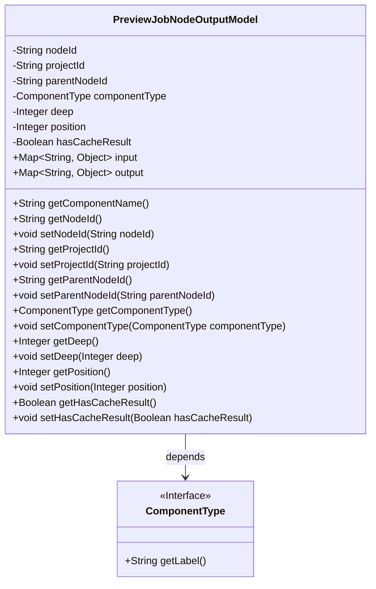

# Basic Information

|      |      |
|------|------|
| Name | PreviewJobNodeOutputModel |
| Language | .java |
| Code Path | WeFe/board/board-service/src/main/java/com/welab/wefe/board/service/dto/entity/job/PreviewJobNodeOutputModel.java |
| Package Name | com.welab.wefe.board.service.dto.entity.job |
| Dependencies | ['com.welab.wefe.common.fieldvalidate.annotation.Check', 'com.welab.wefe.common.wefe.enums.ComponentType', 'java.util.Map'] |
| Brief Description | The PreviewJobNodeOutputModel class defines the output model for front-end canvas nodes, including node ID, project ID, parent node, component type, depth, execution sequence number, cache result flag, and input-output mappings, while providing getter/setter methods for each attribute. |

# Description

The PreviewJobNodeOutputModel class defines the data structure for the output of a preview job node. It includes core attributes such as node ID, project ID, parent node ID, component type, depth, execution sequence number, cache result flag, as well as input-output mapping tables. The getComponentName method retrieves the component name, and getter/setter methods are provided for all attributes. A null position indicates the node is not executed, and the componentType determines the component name.

# Class Summary

| Name   | Type  | Description |
|-------|------|-------------|
| PreviewJobNodeOutputModel | class | Preview task node output model class, containing fields such as node ID, project ID, parent node ID, component type, depth, execution sequence number, cache result flag, and input-output mappings, with getter/setter methods provided for each field. |

## Class PreviewJobNodeOutputModel

|      |      |
|------|------|
| Access Modifier | public |
| Type | class |
| Name | PreviewJobNodeOutputModel |
| Description | Preview task node output model class, containing fields such as node ID, project ID, parent node ID, component type, depth, execution sequence number, cache result flag, and input-output mappings, with getter/setter methods provided for each field. |

### UML Class Diagram

This code defines a class named PreviewJobNodeOutputModel, which represents the data model for preview job node outputs. The class contains multiple private fields (such as nodeId, projectId, etc.) with corresponding getter/setter methods, as well as two public Map-type fields: input and output. The componentType field is of the ComponentType interface type, and the component label can be obtained via the getComponentName() method. The class diagram clearly illustrates the class structure and its dependency relationship with the ComponentType interface, embodying the principles of data encapsulation and modular design.

### Internal Method Call Graph

```mermaid
graph TD
    A["Class PreviewJobNodeOutputModel"]
    B["Property: String nodeId"]
    C["Property: String projectId"]
    D["Property: String parentNodeId"]
    E["Property: ComponentType componentType"]
    F["Property: Integer deep"]
    G["Property: Integer position"]
    H["Property: Boolean hasCacheResult"]
    I["Property: Map<String, Object> input"]
    J["Property: Map<String, Object> output"]
    K["Method: getComponentName()"]
    L["Method: getNodeId()/setNodeId()"]
    M["Method: getProjectId()/setProjectId()"]
    N["Method: getParentNodeId()/setParentNodeId()"]
    O["Method: getComponentType()/setComponentType()"]
    P["Method: getDeep()/setDeep()"]
    Q["Method: getPosition()/setPosition()"]
    R["Method: getHasCacheResult()/setHasCacheResult()"]

    A --> B
    A --> C
    A --> D
    A --> E
    A --> F
    A --> G
    A --> H
    A --> I
    A --> J
    A --> K
    A --> L
    A --> M
    A --> N
    A --> O
    A --> P
    A --> Q
    A --> R
    K -->|Calls| E
```

This code defines a class named PreviewJobNodeOutputModel, which represents the data model for preview job node outputs. The class includes multiple properties such as node ID, project ID, parent node ID, component type, depth, position, whether it has cached results, etc., along with corresponding getter and setter methods. Notably, the getComponentName method returns the corresponding label based on the componentType. Most properties in the class are annotated with @Check, likely for validation or documentation purposes. The overall structure is clear and primarily used for managing and manipulating preview job node output data.

### Field List

| Name  | Type  | Description |
|-------|-------|------|
| nodeId | String | Front-end canvas node ID, generated by the front end. |
| parentNodeId | String | The code defines a private string variable named parentNodeId, and marks it with the @Check annotation with the name "Parent Node". |
| deep | Integer | The class member variable `deep` is marked with the `@Check` annotation as "depth" and has a type of `Integer`. |
| hasCacheResult | Boolean | Check if there are any available historical cached results. |
| input | Map<String, Object> | Java method parameters: an input variable of Map type with keys as strings and values as arbitrary objects. |
| position | Integer | Task node sequence number, null indicates not to execute. |
| projectId | String | Define a private String variable projectId, and validate the project ID using the @Check annotation. |
| componentType | ComponentType | The private variable `componentType` is checked for component type using the `@Check` annotation. |
| output | Map<String, Object> | Defined a public Map variable named output, with keys of type String and values of type Object. |

### Method List

| Name  | Type  | Description |
|-------|-------|------|
| getComponentType | ComponentType | Methods to obtain the component type, returning the value of the componentType variable. |
| getParentNodeId | String | Methods to obtain the parent node ID, returns a parentNodeId string. |
| setDeep | void | Methods for setting the depth value, assigning the parameter `deep` to the class member variable `deep`. |
| setComponentType | void | Set the component type method with a parameter of ComponentType object, assigned to the member variable componentType. |
| setParentNodeId | void | The method to set the parent node ID assigns the passed parentNodeId to the parentNodeId property of the current object. |
| getNodeId | String | Methods to obtain the node ID, returning nodeId. |
| setNodeId | void | This is a Java method used to set the nodeId property value of a class. The method takes a string parameter nodeId and assigns it to the member variable of the same name in the current object. |
| getDeep | Integer | Methods to obtain depth values, returning integer type. |
| getComponentName | String | This method checks whether the component type is empty; if it is, it returns null; otherwise, it returns the label of the component type. |
| setProjectId | void | The method to set the project ID assigns the input parameter `projectId` to the `projectId` property of the current object. |
| getProjectId | String | Methods to obtain the project ID, returns the projectId as a string. |
| getPosition | Integer | Get the integer value of the current position. |
| setPosition | void | This is a Java method used to set the value of the object's position property. The method takes an Integer parameter and assigns it to the object's position field. |
| getHasCacheResult | Boolean | The method to obtain the cache result status returns a boolean value `hasCacheResult`. |
| setHasCacheResult | void | Methods for setting the cache result status, with a boolean parameter. |

