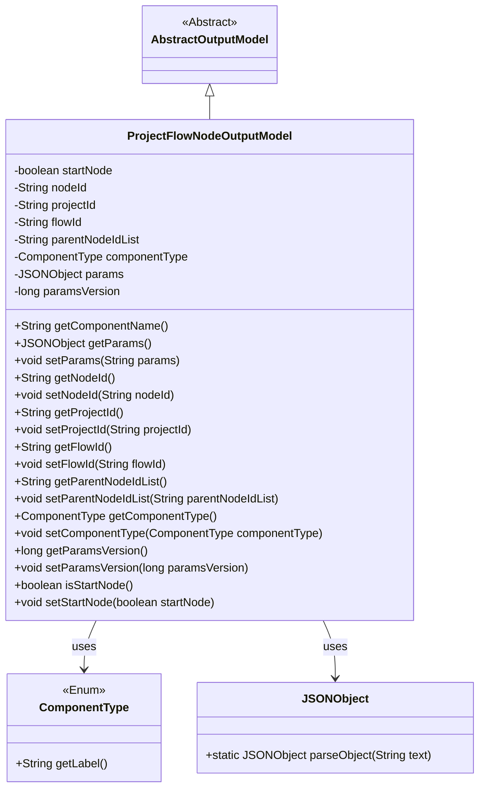
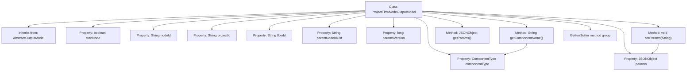

# Basic Information

|      |      |
|------|------|
| Name | ProjectFlowNodeOutputModel |
| Language | .java |
| Code Path | WeFe/board/board-service/src/main/java/com/welab/wefe/board/service/dto/entity/job/ProjectFlowNodeOutputModel.java |
| Package Name | com.welab.wefe.board.service.dto.entity.job |
| Dependencies | ['com.alibaba.fastjson.JSONObject', 'com.welab.wefe.board.service.dto.entity.AbstractOutputModel', 'com.welab.wefe.common.fieldvalidate.annotation.Check', 'com.welab.wefe.common.wefe.enums.ComponentType'] |
| Brief Description | The ProjectFlowNodeOutputModel class inherits from AbstractOutputModel and includes attributes such as node ID, project ID, flow ID, parent node list, component type, parameter JSON, and version number, providing getter/setter methods. |

# Description

The `ProjectFlowNodeOutputModel` class inherits from `AbstractOutputModel` and includes multiple attributes: `startNode` identifies the start node, `nodeId` is the node ID generated by the frontend, `projectId` and `flowId` represent the project and flow IDs respectively, `parentNodeIdList` records the list of parent nodes, `componentType` defines the component type, `params` stores the JSON object of component parameters, and `paramsVersion` marks the parameter version number. It provides the `getComponentName` method to return the component type label, as well as getter and setter methods for each attribute.

# Class Summary

| Name   | Type  | Description |
|-------|------|-------------|
| ProjectFlowNodeOutputModel | class | The ProjectFlowNodeOutputModel class inherits from AbstractOutputModel and includes attributes such as node ID, project ID, flow ID, parent node list, component type, parameters, and version number, providing getter/setter methods. |

## Class ProjectFlowNodeOutputModel

|      |      |
|------|------|
| Access Modifier | public |
| Type | class |
| Name | ProjectFlowNodeOutputModel |
| Description | The ProjectFlowNodeOutputModel class inherits from AbstractOutputModel and includes attributes such as node ID, project ID, flow ID, parent node list, component type, parameters, and version number, providing getter/setter methods. |

### UML Class Diagram

This code demonstrates a project flow node output model class (ProjectFlowNodeOutputModel), which inherits from the abstract output model class (AbstractOutputModel). The class contains multiple private fields such as node ID, project ID, flow ID, etc., and provides corresponding getter and setter methods. Notably, it retrieves component names through the ComponentType enum class and processes parameter data using JSONObject. This class is primarily used for managing output data of project flow nodes, including node attributes, relationships, and component configurations.

### Internal Method Call Graph

This flowchart illustrates the complete structure of the ProjectFlowNodeOutputModel class, including 8 property fields with @Check annotation, 3 core methods, and a set of standard Getters/Setters. Notably, the getComponentName() method retrieves label values through the componentType object, while the setParams() method implements JSON string to JSONObject conversion logic. All properties are encapsulated via standard accessor methods, demonstrating sound object-oriented design principles.

### Field List

| Name  | Type  | Description |
|-------|-------|------|
| paramsVersion | long | A private long variable for parameter version number check annotation. |
| projectId | String | Define a private String variable projectId, and validate the project ID using the @Check annotation. |
| nodeId | String | Front-end canvas node ID, generated by the front end. |
| flowId | String | Define a private String variable flowId, and validate the process ID using the @Check annotation. |
| componentType | ComponentType | Define private variables for component type checking. |
| params | JSONObject | The class member variable `params`, of type `JSONObject`, is annotated with `@Check` as "component parameters". |
| startNode | boolean | Check if it is the boolean variable `startNode` indicating the start node. |
| parentNodeIdList | String | Define a private string variable parentNodeIdList and mark the parent node check with the @Check annotation. |

### Method List

| Name  | Type  | Description |
|-------|-------|------|
| getFlowId | String | Methods to obtain the current flow ID, which returns a string-type flowId. |
| getParentNodeIdList | String | Method for obtaining the list of parent node IDs. |
| setParentNodeIdList | void | Method for setting the parent node ID list, which assigns the input string to the class's parentNodeIdList member variable. |
| setParams | void | The method `setParams` accepts a string parameter `params`. If it is empty, it is set to `null`; otherwise, it is parsed into a `JSONObject` and assigned to the member variable `params`. |
| setNodeId | void | Methods for setting node ID, assigning the parameter nodeId to the nodeId property of the current object. |
| getComponentName | String | This method checks whether the component type is empty, returns null if it is, otherwise returns the tag name of the component type. |
| getNodeId | String | Methods to obtain the node ID, returning a string-type nodeId. |
| getComponentType | ComponentType | This method returns the component type of the current object. |
| setProjectId | void | Define the public method setProjectId, which accepts a string parameter projectId and assigns it to the projectId property of the current object. |
| setFlowId | void | Method to set the flow ID, assigning the input parameter to the flowId member variable of the class. |
| getParams | JSONObject | Methods to obtain JSON object parameters, returning the params variable. |
| getProjectId | String | Methods to obtain the project ID, returns a string-type projectId. |
| setComponentType | void | The method for setting the component type assigns the passed-in `componentType` to the `componentType` property of the current object. |
| getParamsVersion | long | Methods to obtain the parameter version number, returns the paramsVersion value. |
| setParamsVersion | void | The method `setParamsVersion` is used to set the parameter version number, assigning the passed `paramsVersion` to the property of the same name in the current object. |
| isStartNode | boolean | The method isStartNode returns the boolean value startNode, determining whether it is the start node. |
| setStartNode | void | Method to set whether the current node is the starting node. |

