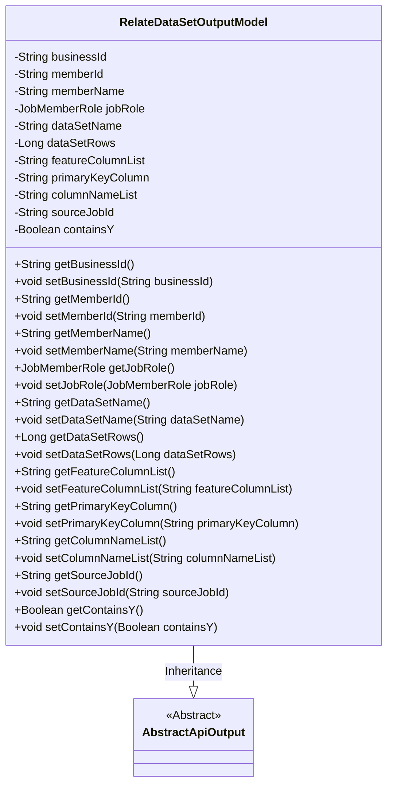

# Basic Information

|      |      |
|------|------|
| Name | RelateDataSetOutputModel |
| Language | .java |
| Code Path | WeFe/board/board-service/src/main/java/com/welab/wefe/board/service/dto/entity/job/RelateDataSetOutputModel.java |
| Package Name | com.welab.wefe.board.service.dto.entity.job |
| Dependencies | ['com.welab.wefe.common.fieldvalidate.annotation.Check', 'com.welab.wefe.common.web.dto.AbstractApiOutput', 'com.welab.wefe.common.wefe.enums.JobMemberRole'] |
| Brief Description | The RelateDataSetOutputModel class includes attributes such as task ID, member information, dataset name, data volume, feature columns, primary key columns, field list, source dataset ID, and whether it contains Y values. |

# Description

The `RelateDataSetOutputModel` class inherits from `AbstractApiOutput` and is used to represent the output model of a related dataset. It includes the following fields: task ID (`businessId`), member ID (`memberId`), member name (`memberName`), task role (`jobRole`, with enumerated values: `promoter`/`provider`/`arbiter`), dataset name (`dataSetName`), data volume (`dataSetRows`), feature columns (`featureColumnList`), primary key column (`primaryKeyColumn`), field list (`columnNameList`), source dataset ID (`sourceJobId`), and whether it contains a Y value (`containsY`). Each field has corresponding getter and setter methods.

# Class Summary

| Name   | Type  | Description |
|-------|------|-------------|
| RelateDataSetOutputModel | class | The RelateDataSetOutputModel class includes attributes such as task ID, member information, dataset name, data volume, feature columns, primary key columns, field list, source dataset ID, and whether it contains Y values. |

## Class RelateDataSetOutputModel

|      |      |
|------|------|
| Access Modifier | public |
| Type | class |
| Name | RelateDataSetOutputModel |
| Description | The RelateDataSetOutputModel class includes attributes such as task ID, member information, dataset name, data volume, feature columns, primary key columns, field list, source dataset ID, and whether it contains Y values. |

### UML Class Diagram

Class diagram description: The RelateDataSetOutputModel class inherits from the AbstractApiOutput abstract class, containing multiple private fields for storing task-related data (such as business ID, member information, dataset features, etc.), and provides standard getter/setter methods for each field. This class is primarily used to encapsulate the output model of task-associated datasets, implementing basic API output functionality through inheritance. Fields are marked with @Check annotations for validation purposes.

### Internal Method Call Graph

```mermaid
graph TD
    A["Class RelateDataSetOutputModel"]
    B["Inherits: AbstractApiOutput"]
    C["Property: String businessId"]
    D["Property: String memberId"]
    E["Property: String memberName"]
    F["Property: JobMemberRole jobRole"]
    G["Property: String dataSetName"]
    H["Property: Long dataSetRows"]
    I["Property: String featureColumnList"]
    J["Property: String primaryKeyColumn"]
    K["Property: String columnNameList"]
    L["Property: String sourceJobId"]
    M["Property: Boolean containsY"]
    N["Method: get/set businessId"]
    O["Method: get/set memberId"]
    P["Method: get/set memberName"]
    Q["Method: get/set jobRole"]
    R["Method: get/set dataSetName"]
    S["Method: get/set dataSetRows"]
    T["Method: get/set featureColumnList"]
    U["Method: get/set primaryKeyColumn"]
    V["Method: get/set columnNameList"]
    W["Method: get/set sourceJobId"]
    X["Method: get/set containsY"]

    A --> B
    A --> C
    A --> D
    A --> E
    A --> F
    A --> G
    A --> H
    A --> I
    A --> J
    A --> K
    A --> L
    A --> M
    A --> N
    A --> O
    A --> P
    A --> Q
    A --> R
    A --> S
    A --> T
    A --> U
    A --> V
    A --> W
    A --> X
```

This code defines a class named RelateDataSetOutputModel, which inherits from AbstractApiOutput and is primarily used to encapsulate dataset-related output information. The class includes multiple properties such as businessId, memberId, dataSetName, etc., each with corresponding getter and setter methods. These properties are validated using the @Check annotation and describe metadata such as task IDs, member information, and dataset features. This model is suitable for structured output of dataset relationships in scenarios like federated learning.

### Field List

| Name  | Type  | Description |
|-------|-------|------|
| jobRole | JobMemberRole | Define the enumeration field for task member roles, with optional values being promoter/provider/arbiter, representing different roles in the task. |
| columnNameList | String | Field validation annotation, marking the field list name as columnNameList. |
| sourceJobId | String | The field sourceJobId is used to identify the source dataset ID and is validated through the @Check annotation. |
| containsY | Boolean | The class member variable `containsY` is marked with the `@Check` annotation to verify whether it contains the Y value. |
| memberName | String | The Java annotation @Check is used to validate member names, with the variable name being memberName. |
| dataSetRows | Long | Define a private long integer variable dataSetRows, marked with the @Check annotation as the "Data Volume" inspection item. |
| memberId | String | Member ID Validation Annotation |
| featureColumnList | String | The code defines a private string variable named `featureColumnList` and marks it with the `@Check` annotation as "feature column". |
| dataSetName | String | Define a private String variable dataSetName, and validate the dataset name using the @Check annotation. |
| primaryKeyColumn | String | The code defines a private string variable named primaryKeyColumn and marks it as the primary key column with the @Check annotation. |
| businessId | String | The private String variable businessId is annotated with @Check as "Task ID". |

### Method List

| Name  | Type  | Description |
|-------|-------|------|
| setDataSetName | void | This is a Java method used to set the dataset name. The method takes a string parameter `dataSetName` and assigns it to the class member variable `this.dataSetName`. |
| getMemberName | String | Methods to obtain the member name, which returns the value of the member variable `memberName`. |
| getMemberId | String | This is a Java method that returns a member ID string. |
| getPrimaryKeyColumn | String | Methods to obtain the primary key column name, returning a string-type primaryKeyColumn. |
| setMemberName | void | The method to set the member variable memberName, with a parameter of type String. |
| setBusinessId | void | This is a Java method used to set the value of the businessId property of a class. The method takes a string parameter businessId and assigns it to the member variable of the same name in the class. |
| setFeatureColumnList | void | Method to set the feature column list, assigning the input string to the class member variable featureColumnList. |
| getJobRole | JobMemberRole | Get the jobRole property value of the current object. |
| setJobRole | void | This is a Java method used to set the jobRole property of an object, with the parameter type being JobMemberRole. |
| setMemberId | void | The method to set the member ID assigns the input string to the member variable memberId. |
| getBusinessId | String | This is a Java method that returns the value of the string-type variable businessId. |
| setPrimaryKeyColumn | void | Methods for setting the primary key column, assigning the input parameter to the member variable primaryKeyColumn of the class. |
| getDataSetRows | Long | Methods to obtain the number of rows in a dataset, with the return value being a long integer. |
| getFeatureColumnList | String | This is a Java method that returns a string variable named featureColumnList. |
| getDataSetName | String | Methods for obtaining dataset names, returning dataset name variables of string type. |
| setDataSetRows | void | The method to set the number of dataset rows, with the parameter being a long integer dataSetRows, assigns the value to the member variable this.dataSetRows. |
| getColumnNameList | String | This method returns a list of column name strings. |
| setColumnNameList | void | Methods for setting the column name list, assigning the parameter to the member variable columnNameList. |
| getSourceJobId | String | Method to obtain the string value of sourceJobId. |
| setSourceJobId | void | The method to set the source task ID assigns the input parameter to the class member variable sourceJobId. |
| getContainsY | Boolean | This is a Java method that returns the boolean variable containsY. |
| setContainsY | void | Define the method `setContainsY` to set the value of the boolean member variable `containsY`. |

