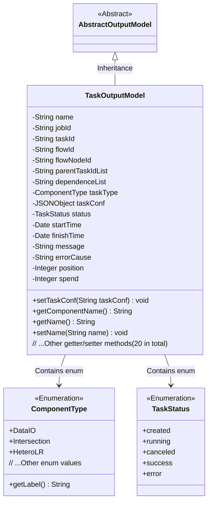
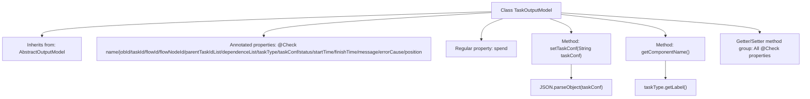

# Basic Information

|      |      |
|------|------|
| Name | TaskOutputModel |
| Language | .java |
| Code Path | WeFe/board/board-service/src/main/java/com/welab/wefe/board/service/dto/entity/job/TaskOutputModel.java |
| Package Name | com.welab.wefe.board.service.dto.entity.job |
| Dependencies | ['com.alibaba.fastjson.JSON', 'com.alibaba.fastjson.JSONObject', 'com.welab.wefe.board.service.dto.entity.AbstractOutputModel', 'com.welab.wefe.common.fieldvalidate.annotation.Check', 'com.welab.wefe.common.wefe.enums.ComponentType', 'com.welab.wefe.common.wefe.enums.TaskStatus', 'java.util.Date'] |
| Brief Description | The TaskOutputModel class contains fields such as task name, ID, process information, status, time, and error messages, and is used to manage task output data. |

# Description

The TaskOutputModel class inherits from AbstractOutputModel and includes task-related attributes: name, task ID, business ID, process number, process node ID, parent task ID list, child task dependencies, task type enumeration, task configuration JSON, status enumeration, start and end times, message notes, error reason, execution order, and duration. It provides getter and setter methods for each attribute, where taskConf supports string-to-JSON conversion, and taskType can retrieve the component name label.

# Class Summary

| Name   | Type  | Description |
|-------|------|-------------|
| TaskOutputModel | class | The TaskOutputModel class includes fields such as task name, ID, process information, status, time, configuration, and error messages, used for managing task execution data. |

## Class TaskOutputModel

|      |      |
|------|------|
| Access Modifier | public |
| Type | class |
| Name | TaskOutputModel |
| Description | The TaskOutputModel class includes fields such as task name, ID, process information, status, time, configuration, and error messages, used for managing task execution data. |

### UML Class Diagram

This code demonstrates a task output model class (TaskOutputModel) that inherits from the abstract class AbstractOutputModel, containing various task-related attributes and status information. Key features of this class include: 1) Using @Check annotations to mark field validation information; 2) Containing complex types such as task configuration (JSONObject), task type (ComponentType enum), and status (TaskStatus enum); 3) Providing complete getter/setter methods; 4) Including special methods like setTaskConf() for JSON parsing and getComponentName() to retrieve component labels. The class structure reflects the core data model in a task management system, ensuring field value standardization through enumeration types.

### Internal Method Call Graph

This code demonstrates a task output model class TaskOutputModel, which inherits from AbstractOutputModel. The class contains 15 properties annotated with @Check and 1 regular property. Its main functionalities include: converting strings to JSON objects via the setTaskConf method, obtaining task type labels through getComponentName, and providing standard getter/setter methods for all properties. This model is used to encapsulate various status and metadata information during task execution.

### Field List

| Name  | Type  | Description |
|-------|-------|------|
| taskId | String | The business ID field taskId serves as a unique identifier across multiple parties. |
| jobId | String | The field jobId is annotated with @Check, with the parameter name as "Task Id". |
| name | String | The code defines a private string variable named "name" and marks it with the @Check annotation, specifying its display name as "Name". |
| parentTaskIdList | String | The field `parentTaskIdList` is used to store the parent node ID list of subtasks, validated by the `@Check` annotation. |
| flowNodeId | String | Check the private string variable of the process node ID where the task is located. |
| dependenceList | String | The class field `dependenceList` is used to check subtask dependencies, and the annotation `@Check` marks its name as "Subtask Dependencies". |
| flowId | String | Define the flowId field and validate it using the @Check annotation. |
| errorCause | String | Define a private String variable errorCause to store error stack information, marked with @Check annotation for validation. |
| taskConf | JSONObject | The code defines a private JSONObject variable named taskConf, annotated with the check annotation "task conf_json". |
| spend | Integer | Private integer variable `spend`, used to store numerical values. |
| message | String | The class field `message` is used to store message notes or failure reasons, marked with the `@Check` annotation. |
| position | Integer | Sequence Numbering for Task Execution Order |
| taskType | ComponentType | Subtask type enumeration field, including DataIO, Intersection, HeteroLR, etc. |
| finishTime | Date | The private date-type variable finishTime is annotated with @Check as "End Time". |
| startTime | Date | Define a private date type variable startTime, and label the check name as "Start Time". |
| status | TaskStatus | Status check, enumeration values include created, running, canceled, success, error. |

### Method List

| Name  | Type  | Description |
|-------|-------|------|
| setDependenceList | void | This is a Java method used to set the value of the dependenceList property. The method accepts a string parameter and assigns it to the member variable dependenceList of the class. |
| getFlowId | String | Common method to obtain flowId, returns the flowId value as a string. |
| getName | String | The method getName returns the value of the string-type variable name. |
| setStatus | void | Method sets the task status by assigning the input parameter to the object's status property. |
| getFlowNodeId | String | This method returns the flowNodeId value of string type. |
| getDependenceList | String | Methods to obtain the dependency list, returning a string-type dependency list. |
| setTaskType | void | The method for setting the task type assigns the parameter taskType to the taskType property of the current object. |
| setFlowId | void | Java method: Set the flow ID, assigning the input parameter flowId to the class member variable this.flowId. |
| setParentTaskIdList | void | Method for setting the parent task ID list, which assigns the input string to the class member variable parentTaskIdList. |
| getErrorCause | String | Methods to obtain the cause of the error, returning a string-type variable errorCause. |
| setTaskId | void | Methods for setting the task ID, assigning the passed `taskId` to the `taskId` property of the current object. |
| getJobId | String | Common method to obtain jobId, returns the jobId value as a string. |
| getStatus | TaskStatus | Methods to obtain the current task status, returning a status value of type TaskStatus. |
| setFlowNodeId | void | The method for setting the flow node ID involves assigning the parameter `flowNodeId` to the property of the same name in the current object. |
| getMessage | String | Methods to obtain the message string. |
| getTaskType | ComponentType | Obtain the public method for task type, which returns the taskType of ComponentType type. |
| getTaskId | String | Methods to obtain the task ID, which returns a string-type taskId. |
| getComponentName | String | Get the label name of the task type. |
| getTaskConf | JSONObject | Get the JSON object of the task configuration. |
| setFinishTime | void | The method to set the completion time is to assign the parameter finishTime to the finishTime property of the object. |
| setJobId | void | Set the jobId property value of the current object to the passed jobId parameter value. |
| setTaskConf | void | The method `setTaskConf` accepts a string `taskConf`, and when it is not empty, parses it into a JSON object and assigns it to the member variable `taskConf`. |
| getParentTaskIdList | String | Method to obtain the list of parent task IDs, returns a string-type parentTaskIdList. |
| setErrorCause | void | Method for setting error reason, which assigns the input string to the class's errorCause variable. |
| getPosition | Integer | Public method to get the position value, returns an Integer type. |
| setPosition | void | Set the position properties of the object. |
| getSpend | Integer | Methods to obtain the integer value of spend. |
| setSpend | void | The method to set the spending amount, with the parameter being of integer type. |
| setMessage | void | Methods for setting message content, assigning the input string to the class member variable message. |
| getStartTime | Date | The method getStartTime returns the startTime date object. |
| setStartTime | void | The method to set the start time assigns the parameter startTime to the class's member variable startTime. |
| getFinishTime | Date | Methods to obtain the completion time, returning the finishTime date object. |
| setName | void | The method to set the object name assigns the parameter `name` to the `name` property of the object. |

