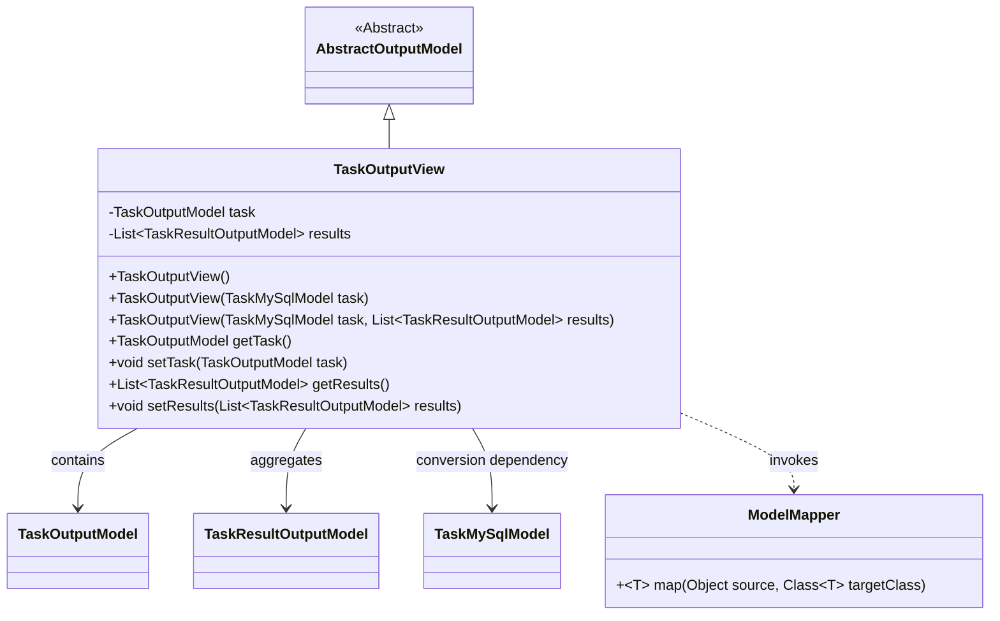
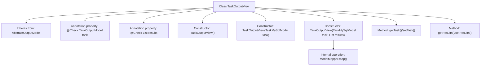

# Basic Information

|      |      |
|------|------|
| Name | TaskOutputView |
| Language | .java |
| Code Path | WeFe/board/board-service/src/main/java/com/welab/wefe/board/service/dto/entity/job/TaskOutputView.java |
| Package Name | com.welab.wefe.board.service.dto.entity.job |
| Dependencies | ['com.welab.wefe.board.service.database.entity.job.TaskMySqlModel', 'com.welab.wefe.board.service.dto.entity.AbstractOutputModel', 'com.welab.wefe.common.fieldvalidate.annotation.Check', 'com.welab.wefe.common.web.util.ModelMapper', 'java.util.List'] |
| Brief Description | The TaskOutputView class inherits from AbstractOutputModel, containing a TaskOutputModel task and a list of TaskResultOutputModel results, providing constructor methods and getter/setter. |

# Description

The TaskOutputView class inherits from AbstractOutputModel and contains two main fields: task and results. The task field is annotated as the task created by the component, with the type TaskOutputModel; the results field is annotated as the output results of the task, with the type being a list of TaskResultOutputModel. The class provides three constructors: a default constructor, a constructor that accepts a TaskMySqlModel parameter, and a constructor that accepts a TaskMySqlModel and a list of TaskResultOutputModel parameters. The latter uses ModelMapper to map TaskMySqlModel to TaskOutputModel. The class also provides getter and setter methods for the task and results fields.

# Class Summary

| Name   | Type  | Description |
|-------|------|-------------|
| TaskOutputView | class | The TaskOutputView class inherits from AbstractOutputModel and contains task and results attributes, providing constructors and getter/setter methods. The task is mapped from TaskMySqlModel, while results is a list of TaskResultOutputModel. |

## Class TaskOutputView

|      |      |
|------|------|
| Access Modifier | public |
| Type | class |
| Name | TaskOutputView |
| Description | The TaskOutputView class inherits from AbstractOutputModel and contains task and results attributes, providing constructors and getter/setter methods. The task is mapped from TaskMySqlModel, while results is a list of TaskResultOutputModel. |

### UML Class Diagram

Class diagram description: TaskOutputView inherits from the abstract class AbstractOutputModel and contains private members TaskOutputModel and a list of TaskResultOutputModel. It converts data from TaskMySqlModel through constructors and relies on ModelMapper for object mapping. This class provides standard getter/setter methods, maintains associations with multiple model classes, and implements the encapsulation and conversion functionality for task output data.

### Internal Method Call Graph

This flowchart illustrates the complete structure of the TaskOutputView class, including inheritance relationships, annotation properties, three overloaded constructors, and getter/setter methods. The core construction process utilizes ModelMapper for model conversion, mapping TaskMySqlModel to TaskOutputModel. The class design adheres to data encapsulation principles, employs annotations for validation markers, and supports flexible result set injection approaches.

### Field List

| Name  | Type  | Description |
|-------|-------|------|
| task | TaskOutputModel | Component-created task output model |
| results | List<TaskResultOutputModel> | The class member variable `results`, of type `TaskResultOutputModel` list, is annotated with `@Check` and labeled as "task output results". |

### Method List

| Name  | Type  | Description |
|-------|-------|------|
| setResults | void | Methods for setting up task result lists. |
| getTask | TaskOutputModel | The method getTask returns a task object of type TaskOutputModel. |
| getResults | List<TaskResultOutputModel> | The method to obtain the task result list returns a collection of type TaskResultOutputModel. |
| setTask | void | Set the task object. |

