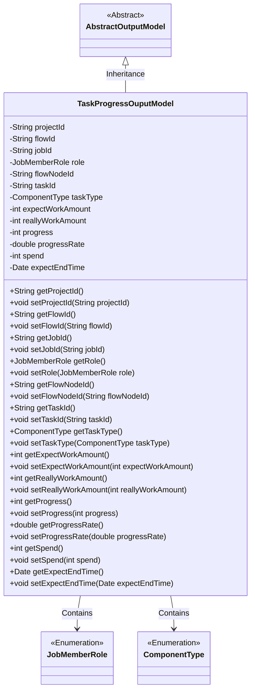

# Basic Information

|      |      |
|------|------|
| Name | TaskProgressOuputModel |
| Language | .java |
| Code Path | WeFe/board/board-service/src/main/java/com/welab/wefe/board/service/dto/entity/job/TaskProgressOuputModel.java |
| Package Name | com.welab.wefe.board.service.dto.entity.job |
| Dependencies | ['com.welab.wefe.board.service.dto.entity.AbstractOutputModel', 'com.welab.wefe.common.fieldvalidate.annotation.Check', 'com.welab.wefe.common.wefe.enums.ComponentType', 'com.welab.wefe.common.wefe.enums.JobMemberRole', 'javax.persistence.EnumType', 'javax.persistence.Enumerated', 'java.util.Date'] |
| Brief Description | Task progress output model class, including fields such as project ID, process number, task ID, role, process node ID, subtask type, estimated and actual workload, progress and percentage, time consumed, and estimated completion time. |

# Description

The `TaskProgressOuputModel` class inherits from `AbstractOutputModel` and includes task progress-related attributes: project ID, process number, task ID, role, process node ID, subtask type enumeration, estimated and actual quantities, progress value and percentage, time consumed in milliseconds, and estimated end time. All fields have getter and setter methods, with some fields validated via annotations or mapped to enumeration types.

# Class Summary

| Name   | Type  | Description |
|-------|------|-------------|
| TaskProgressOuputModel | class | Task progress output model class, including fields such as project ID, process number, task ID, role, process node ID, subtask type, estimated and actual workload, progress and percentage, time consumed, and estimated completion time. |

## Class TaskProgressOuputModel

|      |      |
|------|------|
| Access Modifier | public |
| Type | class |
| Name | TaskProgressOuputModel |
| Description | Task progress output model class, including fields such as project ID, process number, task ID, role, process node ID, subtask type, estimated and actual workload, progress and percentage, time consumed, and estimated completion time. |

### UML Class Diagram

Class diagram description: TaskProgressOuputModel inherits from the abstract class AbstractOutputModel and is used to track task progress information. It includes core identifier fields such as project ID, flow ID, and job ID, as well as statistical metrics like work amount, progress percentage, and estimated end time. The JobMemberRole and ComponentType enumeration classes define roles and task types. All fields are accessed through getter/setter methods, complying with JavaBean specifications.

### Internal Method Call Graph

```mermaid
graph TD
    A["Class TaskProgressOuputModel"]
    B["Inherits: AbstractOutputModel"]
    C["Property: String projectId"]
    D["Property: String flowId"]
    E["Property: String jobId"]
    F["Property: JobMemberRole role"]
    G["Property: String flowNodeId"]
    H["Property: String taskId"]
    I["Property: ComponentType taskType"]
    J["Property: int expectWorkAmount"]
    K["Property: int reallyWorkAmount"]
    L["Property: int progress"]
    M["Property: double progressRate"]
    N["Property: int spend"]
    O["Property: Date expectEndTime"]
    P["Method: getProjectId()"]
    Q["Method: setProjectId(String)"]
    R["Method: getFlowId()"]
    S["Method: setFlowId(String)"]
    T["Method: getJobId()"]
    U["Method: setJobId(String)"]
    V["Method: getRole()"]
    W["Method: setRole(JobMemberRole)"]
    X["Method: getFlowNodeId()"]
    Y["Method: setFlowNodeId(String)"]
    Z["Method: getTaskId()"]
    AA["Method: setTaskId(String)"]
    AB["Method: getTaskType()"]
    AC["Method: setTaskType(ComponentType)"]
    AD["Method: getExpectWorkAmount()"]
    AE["Method: setExpectWorkAmount(int)"]
    AF["Method: getReallyWorkAmount()"]
    AG["Method: setReallyWorkAmount(int)"]
    AH["Method: getProgress()"]
    AI["Method: setProgress(int)"]
    AJ["Method: getProgressRate()"]
    AK["Method: setProgressRate(double)"]
    AL["Method: getSpend()"]
    AM["Method: setSpend(int)"]
    AN["Method: getExpectEndTime()"]
    AO["Method: setExpectEndTime(Date)"]

    A --> B
    A --> C
    A --> D
    A --> E
    A --> F
    A --> G
    A --> H
    A --> I
    A --> J
    A --> K
    A --> L
    A --> M
    A --> N
    A --> O
    A --> P
    A --> Q
    A --> R
    A --> S
    A --> T
    A --> U
    A --> V
    A --> W
    A --> X
    A --> Y
    A --> Z
    A --> AA
    A --> AB
    A --> AC
    A --> AD
    A --> AE
    A --> AF
    A --> AG
    A --> AH
    A --> AI
    A --> AJ
    A --> AK
    A --> AL
    A --> AM
    A --> AN
    A --> AO
```

This code defines a class named TaskProgressOuputModel, which inherits from AbstractOutputModel and is used to track and manage task progress-related data. The class contains multiple properties such as project ID, flow ID, task ID, etc., along with corresponding getter and setter methods. These properties store detailed task information, including expected and actual work amounts, progress percentage, expected end time, etc. Through the enumeration types JobMemberRole and ComponentType, the valid ranges for roles and task types are clearly defined, ensuring data accuracy and consistency.

### Field List

| Name  | Type  | Description |
|-------|-------|------|
| taskType | ComponentType | Define an enumeration type field `taskType`, using string format to store the enumeration values. |
| flowId | String | Define the process number field and validate it using the @Check annotation. |
| expectEndTime | Date | The code defines a private date-type variable named expectEndTime and marks it with the @Check annotation, specifying its name as "Estimated End Time". |
| taskId | String | Define a private String variable taskId, and validate the task ID using the @Check annotation. |
| flowNodeId | String | Define a private String variable flowNodeId, and validate the process node ID using the @Check annotation. |
| progress | int | The private integer variable for progress check: progress. |
| spend | int | The field `spend` stores the time difference between `updated_time` and `created_time` in milliseconds. |
| reallyWorkAmount | int | The field reallyWorkAmount is labeled as the actual total engineering quantity inspection item. |
| role | JobMemberRole | Define an enumeration type field `role`, using string values to store enumeration constants. |
| jobId | String | Define a private String variable jobId, and mark the task id with the @Check annotation. |
| projectId | String | Define a private String variable projectId, and validate the project ID using the @Check annotation. |
| expectWorkAmount | int | Define a private integer variable expectWorkAmount, annotated with @Check as "Estimated total work amount". |
| progressRate | double | Progress percentage check item, private double variable progressRate. |

### Method List

| Name  | Type  | Description |
|-------|-------|------|
| getFlowNodeId | String | The method returns a flowNodeId string. |
| setFlowId | void | The method to set the flow ID involves assigning the parameter flowId to the flowId property of the current object. |
| setProjectId | void | This is a Java method used to set the projectId property of a class. The method takes a string parameter projectId and assigns it to the member variable of the same name in the class. |
| setExpectWorkAmount | void | This is a Java method used to set the integer value of the expected workload. The method accepts an integer parameter `expectWorkAmount` and assigns it to the class member variable of the same name. |
| setReallyWorkAmount | void | The method to set the actual workload assigns the parameter to the member variable `reallyWorkAmount`. |
| getFlowId | String | Public method to obtain the flowId, returns a string-type flowId value. |
| getProjectId | String | Methods to obtain the project ID, returns a string-type projectId. |
| getReallyWorkAmount | int | Methods for obtaining the integer value of actual workload. |
| getJobId | String | Get the unique identifier jobId of the current task. |
| getProgress | int | Methods to obtain the current progress value, returning the integer-type variable `progress`. |
| setRole | void | The method `setRole` is used to set the member role, with the parameter of type `JobMemberRole`, and assigns the value to the `role` property of the current object. |
| getRole | JobMemberRole | This is a Java method that returns the value of the role field of type JobMemberRole. |
| setProgressRate | void | Set the progress rate method, which accepts a double parameter and assigns it to the member variable progressRate. |
| setTaskId | void | Methods for setting the task ID: Assign the parameter taskId to the taskId property of the current object. |
| setFlowNodeId | void | Method for setting the flow node ID: Assign the passed string parameter to the class member variable flowNodeId. |
| setProgress | void | Methods for setting the progress value, where the parameter is an integer progress, which is directly assigned to the class member variable progress. |
| setJobId | void | The method to set the task ID assigns the input parameter jobId to the jobId property of the current object. |
| getExpectWorkAmount | int | This is a Java method that returns the value of an integer variable named expectWorkAmount. |
| getProgressRate | double | Methods to obtain the progress rate, returning a double-type progressRate value. |
| getSpend | int | Get the integer value of the spend variable. |
| setSpend | void | This is a Java method used to set the value of the class member variable 'spend'. The method takes an integer parameter and assigns it to the 'spend' property of the current object. |
| getExpectEndTime | Date | The method to obtain the expected end time, which returns a Date type value `expectEndTime`. |
| setExpectEndTime | void | The method to set the expected end time, with a parameter of type Date, assigns the value to the class member variable expectEndTime. |
| setTaskType | void | The method for setting the task type assigns the parameter `taskType` to the `taskType` property of the current object. |
| getTaskType | ComponentType | The method returns the task type ComponentType. |
| getTaskId | String | Methods to obtain the task ID, returns a string-type taskId. |

