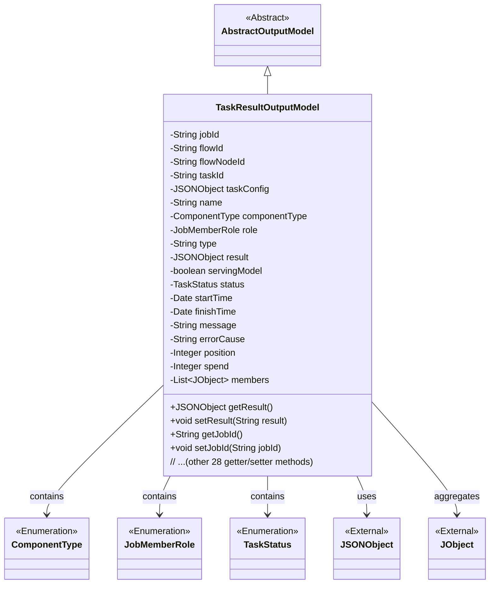

# Basic Information

|      |      |
|------|------|
| Name | TaskResultOutputModel |
| Language | .java |
| Code Path | WeFe/board/board-service/src/main/java/com/welab/wefe/board/service/dto/entity/job/TaskResultOutputModel.java |
| Package Name | com.welab.wefe.board.service.dto.entity.job |
| Dependencies | ['com.alibaba.fastjson.JSON', 'com.alibaba.fastjson.JSONObject', 'com.welab.wefe.board.service.dto.entity.AbstractOutputModel', 'com.welab.wefe.common.fieldvalidate.annotation.Check', 'com.welab.wefe.common.util.JObject', 'com.welab.wefe.common.wefe.enums.ComponentType', 'com.welab.wefe.common.wefe.enums.JobMemberRole', 'com.welab.wefe.common.wefe.enums.TaskStatus', 'java.util.Date', 'java.util.List'] |
| Brief Description | The TaskResultOutputModel class includes fields such as task ID, process ID, node ID, task parameters, status, time, and results, which are used to record task execution details and outcomes. |

# Description

TaskResultOutputModel is a Java class that inherits from AbstractOutputModel, designed to encapsulate output data from task execution results. This class includes multiple fields such as task ID, process ID, process node ID, subtask ID, task parameters, task name, component type, member role, result type, execution result JSON object, and a flag indicating whether it can be exported as a service model. Additionally, it contains fields like task status, start time, end time, message remarks, error cause, execution order, time consumption, and a list of participating parties. Each field has corresponding getter and setter methods for easy access and modification of property values. The class is primarily used to manage and convey various status and result information during task execution.

# Class Summary

| Name   | Type  | Description |
|-------|------|-------------|
| TaskResultOutputModel | class | The TaskResultOutputModel class contains fields such as task ID, process ID, node ID, task parameters, execution results, status, time, and error messages, used for managing task output data. |

## Class TaskResultOutputModel

|      |      |
|------|------|
| Access Modifier | public |
| Type | class |
| Name | TaskResultOutputModel |
| Description | The TaskResultOutputModel class contains fields such as task ID, process ID, node ID, task parameters, execution results, status, time, and error messages, used for managing task output data. |

### UML Class Diagram

This code describes a task result output model class `TaskResultOutputModel`, which inherits from the abstract class `AbstractOutputModel`. The class contains various attributes related to task execution, such as task ID, flow ID, task configuration, execution results, status, and timing information. It uses enumeration types to define component types, member roles, and task statuses. The class manages these attributes through numerous getter/setter methods, with the `result` attribute supporting JSON string conversion. The class also aggregates a member list of type `JObject` and has a dependency relationship with the external `JSONObject` class. The overall design reflects comprehensive data modeling for task execution results, including status tracking, time recording, and error handling functionalities.

### Internal Method Call Graph

```mermaid
graph TD
    A["Class TaskResultOutputModel"]
    B["Inherits: AbstractOutputModel"]
    C["Property: String jobId"]
    D["Property: String flowId"]
    E["Property: String flowNodeId"]
    F["Property: String taskId"]
    G["Property: JSONObject taskConfig"]
    H["Property: String name"]
    I["Property: ComponentType componentType"]
    J["Property: JobMemberRole role"]
    K["Property: String type"]
    L["Property: JSONObject result"]
    M["Property: boolean servingModel"]
    N["Property: TaskStatus status"]
    O["Property: Date startTime"]
    P["Property: Date finishTime"]
    Q["Property: String message"]
    R["Property: String errorCause"]
    S["Property: Integer position"]
    T["Property: Integer spend"]
    U["Property: List<JObject> members"]
    V["Method: JSONObject getResult()"]
    W["Method: void setResult(String result)"]
    X["Getter/Setter method group"]

    A --> B
    A --> C
    A --> D
    A --> E
    A --> F
    A --> G
    A --> H
    A --> I
    A --> J
    A --> K
    A --> L
    A --> M
    A --> N
    A --> O
    A --> P
    A --> Q
    A --> R
    A --> S
    A --> T
    A --> U
    A --> V
    A --> W
    A -.-> X
```

This code defines a class named TaskResultOutputModel, which inherits from AbstractOutputModel and is primarily used to encapsulate the output data model for task execution results. The class contains 20 private properties covering key fields such as task ID, workflow information, component type, execution status, and timestamps, with each property annotated with @Check for validation. It provides complete getter/setter methods, with special JSON format conversion handling for the result field. This model is designed to record detailed task execution status and result data in distributed task systems.

### Field List

| Name  | Type  | Description |
|-------|-------|------|
| role | JobMemberRole | Member role field, validated using the @Check annotation. |
| type | String | The code defines a private string variable `type` to identify the multi-line result type of a task, which is validated via the `@Check` annotation. |
| taskConfig | JSONObject | Task parameter configuration, stored using the JSONObject type. |
| members | List<JObject> | Declare a private member variable, which is a list of JObject objects. |
| spend | Integer | The private integer variable 'spend' is used to store expenditure values. |
| status | TaskStatus | Check the private variable for task status, of type TaskStatus. |
| startTime | Date | Define a private date-type variable startTime, annotated with @Check as "Start Time". |
| position | Integer | Checkmark for task execution order, private integer variable position. |
| componentType | ComponentType | Define private variables for component types, and use the @Check annotation to validate component IDs. |
| name | String | The code defines a private string variable named "name" to store the task name, which is validated using the @Check annotation. |
| finishTime | Date | End time check field, type is Date. |
| flowId | String | Define a private String variable flowId, and validate the process ID using the @Check annotation. |
| jobId | String | Task ID field, validated using the @Check annotation. |
| taskId | String | Define a private String variable taskId, and use the @Check annotation to validate the subtask ID. |
| message | String | The field `message` is used to store message notes or failure reasons, marked with the `@Check` annotation. |
| flowNodeId | String | Define a private String variable for the process node ID, and validate it using the Check annotation. |
| errorCause | String | Define a private String variable `errorCause` to store error stack information, annotated with `@Check`. |
| result | JSONObject | The code defines a private JSONObject variable named result, with the inspection label set as "Execution Result". |
| servingModel | boolean | The boolean variable servingModel that checks whether the model can be exported to serving. |

### Method List

| Name  | Type  | Description |
|-------|-------|------|
| setJobId | void | The method `setJobId` is used to set the value of the `jobId` property, with the parameter being of type `String`. |
| getMessage | String | Methods to obtain the message string. |
| setPosition | void | Set the position properties of the object. The parameters are of integer type. |
| getSpend | Integer | Method to obtain the consumption amount, returns an integer value. |
| setServingModel | void | Set the boolean method of the service model to control the current service status. |
| setTaskId | void | Methods for setting the task ID, assigning the passed `taskId` to the `taskId` property of the current object. |
| setResult | void | The method parses the input string parameter into a JSON object and assigns it to the member variable result. |
| setType | void | This is a Java method used to set the type property of an object. The method accepts a string parameter `type` and assigns it to the `type` field of the current object. |
| setFlowId | void | Methods for setting the flow ID: Assign the parameter flowId to the flowId property of the current object. |
| getErrorCause | String | Methods to obtain the cause of the error, returning a string-type errorCause. |
| setFlowNodeId | void | Methods for setting the flow node ID: Assign the parameter flowNodeId to the property of the same name in the current object. |
| getMembers | List<JObject> | This is a Java method that returns a list of JObjects named members. |
| setErrorCause | void | This is a Java method used to set the error cause string. The method accepts a string parameter `errorCause` and assigns it to the member variable of the same name in the current object. |
| getFlowNodeId | String | The method returns a flowNodeId string. |
| getPosition | Integer | Methods to obtain position values, returning position information of integer type. |
| setFinishTime | void | The method to set the completion time is to assign the parameter finishTime to the class's finishTime property. |
| getFinishTime | Date | Methods to obtain the completion time, returns the finishTime date object. |
| setStatus | void | The method `setStatus` is used to set the task status, assigning the passed `status` parameter to the `status` property of the current object. |
| setName | void | Methods for setting object names, assigning the parameter `name` to the `name` property of the object. |
| getFlowId | String | Common method to obtain flowId, returns a flowId of string type. |
| getStartTime | Date | Method to get the start time, returns the startTime of Date type. |
| getJobId | String | Get the unique identifier jobId of the current task. |
| setSpend | void | Java method: Set the value of the integer-type variable spend. |
| setComponentType | void | This is a Java method used to set the component type property. The method accepts a ComponentType parameter and assigns it to the componentType field of the current object. |
| isServingModel | boolean | This is a Java method used to return the boolean servingModel status. |
| getComponentType | ComponentType | Methods to obtain the component type, returning the `componentType` variable. |
| getName | String | This is a Java method that returns the value of the private variable name. |
| setStartTime | void | This is a Java method used to set the startTime property of a class, which accepts a parameter of type Date. |
| setRole | void | The method `setRole` is used to set the member role, with the parameter of type `JobMemberRole`, and assigns it to the `role` property of the current object. |
| getStatus | TaskStatus | Methods to obtain the current task status, returns a TaskStatus object. |
| getResult | JSONObject | The method returns a result object of type JSONObject. |
| getType | String | Methods to get the object type, returning a string-type `type` value. |
| getRole | JobMemberRole | Get the role information of the current object. |
| getTaskId | String | Methods to obtain the task ID, which returns a string-type taskId. |
| setMessage | void | This is a Java method used to set the message property value of a class. The method takes a string parameter message and assigns it to the member variable this.message of the class. |
| setMembers | void | This is a Java method used to set the value of the member variable `members`, with the parameter being a list of type `JObject`. |
| getTaskConfig | JSONObject | Get the JSON object of the task configuration. |
| setTaskConfig | void | This is a Java method used to set task configurations, which takes a parameter of type JSONObject named taskConfig and assigns it to the class member variable taskConfig. |

