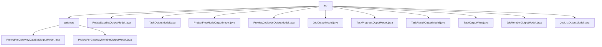

# Basic Information

|      |      |
|------|------|
| Name | job |
| Language | .java |
| Code Path | WeFe/board/board-service/src/main/java/com/welab/wefe/board/service/dto/entity/job |
| Package Name | docs.board.board-service.src.main.java.com.welab.wefe.board.service.dto.entity.job |
| Brief Description | This module manages datasets and member information for federated learning gateway projects, including structured data definitions and status tracking. Key data structures encompass dataset metadata, member roles, and audit status enumerations. It supports business scenarios such as member role approval and dataset feature validation, achieving joint state management through data entity classes. |

# Description

## Overview  
The core responsibility of this module is to uniformly manage task flows, datasets, and member collaboration information in federated learning projects, operating in a manner similar to a workflow engine. The interface specification adopts standard Getter/Setter methods combined with annotation validation, such as using @Check to constrain member role enums (Promoter/Provider/Arbiter) and dataset feature columns. Key data structures include task DAG graphs (e.g., JobOutputModel), node parameter JSON (e.g., ProjectFlowNodeOutputModel), and progress tracking models (e.g., TaskProgressOuputModel). External dependencies are limited to the Java base library and ModelMapper. For example, TaskOutputView utilizes ModelMapper to convert MySQL models to output models.

## Core Business Scenarios  
The module supports the full lifecycle management of federated learning, with key processes including: 1) Task flow orchestration (e.g., ProjectFlowNodeOutputModel defines parent-child node relationships); 2) Execution state synchronization (e.g., TaskProgressOuputModel tracks subtask progress); 3) Result aggregation (e.g., TaskOutputView combines tasks and result sets). Functional completeness is demonstrated in multi-model collaboration, such as JobMemberOutputModel dynamically retrieving names via member ID caching. Typical integration scenarios include gateway-pushed task topologies (using JobOutputModel) and previewing node execution order (controlled by the position field in PreviewJobNodeOutputModel).

### Package Internal Structure View

This flowchart illustrates the hierarchical structure under the job directory, containing 1 subdirectory (gateway) and 10 file nodes. The gateway subdirectory further includes 2 file nodes. The overall structure clearly demonstrates the organization of DTO entity classes within the job module, adhering to typical Java project layering conventions.

# File List

| Name   | Type  | Description |
|-------|------|-------------|
| [RelateDataSetOutputModel.java](RelateDataSetOutputModel.md) | file | The RelateDataSetOutputModel class includes attributes such as task ID, member information, dataset name, data volume, feature columns, primary key columns, field list, source dataset ID, and whether it contains Y values. |
| [TaskOutputModel.java](TaskOutputModel.md) | file | The TaskOutputModel class contains fields such as task name, ID, process information, status, time, and error messages, and is used to manage task output data. |
| [ProjectFlowNodeOutputModel.java](ProjectFlowNodeOutputModel.md) | file | The ProjectFlowNodeOutputModel class inherits from AbstractOutputModel and includes attributes such as node ID, project ID, flow ID, parent node list, component type, parameter JSON, and version number, providing getter/setter methods. |
| [PreviewJobNodeOutputModel.java](PreviewJobNodeOutputModel.md) | file | The PreviewJobNodeOutputModel class defines the output model for front-end canvas nodes, including node ID, project ID, parent node, component type, depth, execution sequence number, cache result flag, and input-output mappings, providing getter/setter methods for each attribute. |
| [JobOutputModel.java](JobOutputModel.md) | file | The JobOutputModel class defines the federated learning task output model, which includes attributes such as task type, ID, status, time, progress, role, remarks, and corresponding getter/setter methods. |
| [TaskProgressOuputModel.java](TaskProgressOuputModel.md) | file | Task progress output model class, including fields such as project ID, process number, task ID, role, process node ID, subtask type, estimated and actual workload, progress and percentage, time consumed, and estimated completion time. |
| [TaskResultOutputModel.java](TaskResultOutputModel.md) | file | The TaskResultOutputModel class includes fields such as task ID, process ID, node ID, task parameters, status, time, and results, used to record task execution details and outcomes. |
| [TaskOutputView.java](TaskOutputView.md) | file | The TaskOutputView class inherits from AbstractOutputModel, containing a TaskOutputModel task and a list of TaskResultOutputModel results, providing constructors and getter/setter methods. |
| [JobMemberOutputModel.java](JobMemberOutputModel.md) | file | The JobMemberOutputModel class includes project, process, task IDs, member roles, IDs, and dataset IDs, providing getter/setter methods for each field. |
| [JobListOutputModel.java](JobListOutputModel.md) | file | The JobListOutputModel class includes fields such as federated task type, project ID, process ID, task ID, name, identity, status, time, progress, message, result, tags, and remarks, along with their corresponding getter/setter methods. |
| [gateway](gateway/_module.md) | package | This model class is used for gateway dataset output, containing member information, dataset details, and status. The member model includes ID, name, role enumeration, and review results. All fields are provided with validation annotations and getter/setter methods. |

