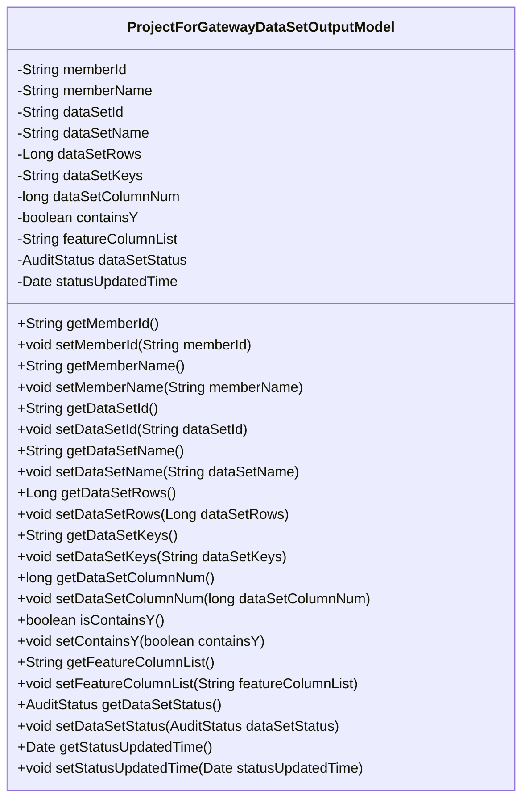
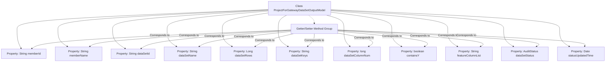

# Basic Information

|      |      |
|------|------|
| Name | ProjectForGatewayDataSetOutputModel |
| Language | .java |
| Code Path | WeFe/board/board-service/src/main/java/com/welab/wefe/board/service/dto/entity/job/gateway/ProjectForGatewayDataSetOutputModel.java |
| Package Name | com.welab.wefe.board.service.dto.entity.job.gateway |
| Dependencies | ['com.welab.wefe.common.fieldvalidate.annotation.Check', 'com.welab.wefe.common.wefe.enums.AuditStatus', 'javax.persistence.EnumType', 'javax.persistence.Enumerated', 'java.util.Date'] |
| Brief Description | Project gateway dataset output model class, including member ID, name, dataset ID, name, row count, column count, keywords, feature columns, whether it contains Y values, and status information. |

# Description

The model is a project class for gateway dataset output, containing member information (ID and name), dataset information (ID, name, data volume, keywords, column count, whether it includes Y value, feature column list), dataset status (enum type), and status update time. All fields are validated through annotations and provided with corresponding getter and setter methods.

# Class Summary

| Name   | Type  | Description |
|-------|------|-------------|
| ProjectForGatewayDataSetOutputModel | class | Project Gateway Dataset Output Model Class, including attributes such as member ID, name, dataset ID, name, row count, column count, keywords, feature columns, whether it contains Y values, status, update time, and corresponding getter/setter methods. |

## Class ProjectForGatewayDataSetOutputModel

|      |      |
|------|------|
| Access Modifier | public |
| Type | class |
| Name | ProjectForGatewayDataSetOutputModel |
| Description | Project Gateway Dataset Output Model Class, including attributes such as member ID, name, dataset ID, name, row count, column count, keywords, feature columns, whether it contains Y values, status, update time, and corresponding getter/setter methods. |

### UML Class Diagram

This code defines a class named `ProjectForGatewayDataSetOutputModel`, primarily used to represent the output model for gateway datasets. The class includes multiple private fields such as member ID, member name, dataset ID, dataset name, data volume, keywords, etc., each accompanied by corresponding getter and setter methods. Annotations like `@Check` and `@Enumerated` are used to validate fields and handle enumerated types, ensuring data validity and consistency. The main functionality of this class is to encapsulate dataset-related information and provide methods for accessing and modifying this information.

### Internal Method Call Graph

This flowchart illustrates the complete structure of the ProjectForGatewayDataSetOutputModel class, comprising 12 annotated properties and their corresponding Getter/Setter method group. All properties are validated or marked with enumeration types through @Check or @Enumerated annotations, particularly the dataSetStatus property which uses the AuditStatus enum type. The method group is represented in an aggregated manner, connected to the main class via dashed lines, clearly demonstrating the standard design pattern of a Java Bean.

### Field List

| Name  | Type  | Description |
|-------|-------|------|
| dataSetId | String | The field `dataSetId` is used to store the dataset ID, annotated with a name validation check. |
| statusUpdatedTime | Date | Status update time field, type is Date. |
| dataSetRows | Long | Define a check item named "Data Volume", corresponding to the private long integer variable dataSetRows. |
| dataSetName | String | Define a private String variable dataSetName, and use the @Check annotation to validate the dataset name. |
| memberId | String | Member ID field, validated using the @Check annotation. |
| dataSetKeys | String | Define a private String variable dataSetKeys, annotated with @Check as "keyword". |
| featureColumnList | String | The code defines a private string variable featureColumnList, annotated with @Check, with the parameter name set to "feature column". |
| containsY | boolean | The class member variable `containsY` is annotated with `@Check` to mark it for checking whether it contains a Y value, and its type is boolean. |
| dataSetStatus | AuditStatus | The entity class field dataSetStatus is mapped using the string enumeration type AuditStatus. |
| dataSetColumnNum | long | Private long integer variable for checking the number of columns in the dataset. |
| memberName | String | Member name field for member ID verification. |

### Method List

| Name  | Type  | Description |
|-------|-------|------|
| setDataSetColumnNum | void | The method to set the number of dataset columns assigns the input parameter to the class member variable `dataSetColumnNum`. |
| setDataSetId | void | Methods for setting the dataset ID, assigning the input parameter to the class's dataSetId member variable. |
| setMemberId | void | The method to set the member ID assigns the input parameter to the class's member variable `memberId`. |
| setDataSetKeys | void | The method setDataSetKeys is used to set the value of the dataSetKeys property, with the parameter being of string type. |
| setDataSetRows | void | This is a Java method used to set the dataset row count attribute. The method is named setDataSetRows, which takes a Long type parameter dataSetRows and assigns it to the class's member variable of the same name. |
| getDataSetColumnNum | long | Methods to obtain the number of columns in a dataset, returning a long integer value `dataSetColumnNum`. |
| getDataSetId | String | Methods to obtain the dataset ID, returning the value of the dataSetId field. |
| setMemberName | void | Methods for setting member names, assigning input parameters to the member variables of the class. |
| getMemberName | String | Methods to get the member name, which returns the value of the member variable `memberName`. |
| getDataSetKeys | String | Methods for obtaining dataset key values. |
| getDataSetRows | Long | Methods to get the number of rows in a dataset, with the return value being of long integer type. |
| getMemberId | String | The method returns the member ID string. |
| setDataSetName | void | The method to set the dataset name assigns the input parameter to the class member variable dataSetName. |
| isContainsY | boolean | The method isContainsY returns the state of the boolean value containsY. |
| setContainsY | void | This is a Java method used to set the value of the boolean member variable `containsY`. |
| getDataSetName | String | Methods to obtain the dataset name, returning the value of the variable dataSetName. |
| getFeatureColumnList | String | Methods to obtain the list of feature columns, returning a string-type featureColumnList. |
| setFeatureColumnList | void | The method to set the feature column list assigns the input string to the class member variable featureColumnList. |
| getDataSetStatus | AuditStatus | Public method for retrieving dataset status, returns a dataSetStatus value of type AuditStatus. |
| setDataSetStatus | void | This method is used to set the dataset status, with the parameter of type AuditStatus, assigned to the class's dataSetStatus property. |
| getStatusUpdatedTime | Date | Methods to obtain the status update time, returning the value of the `statusUpdatedTime` variable. |
| setStatusUpdatedTime | void | The method to set the status update time assigns the parameter to the object's `statusUpdatedTime` property. |

