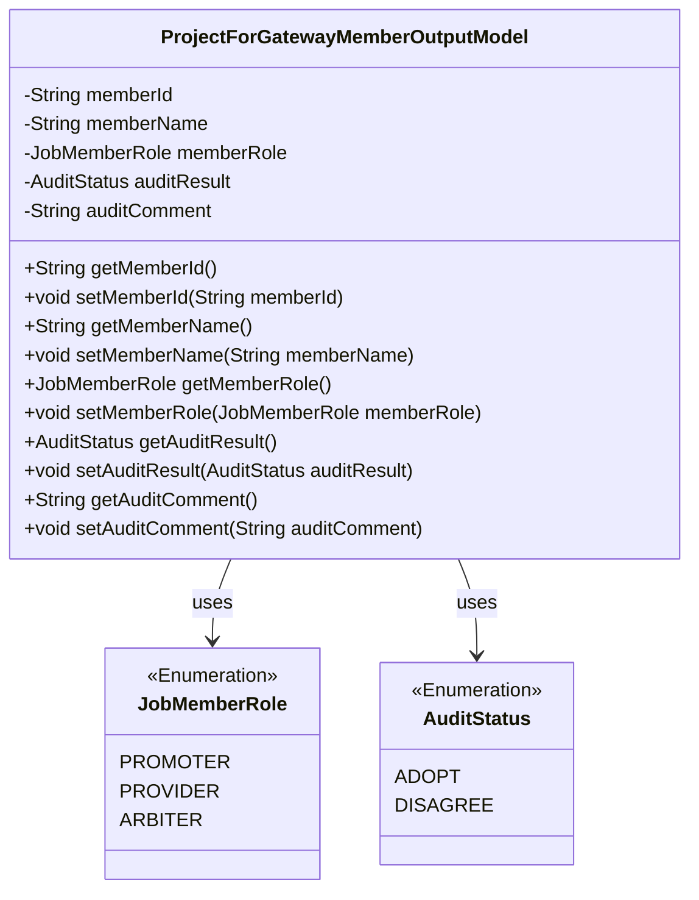

# Basic Information

|      |      |
|------|------|
| Name | ProjectForGatewayMemberOutputModel |
| Language | .java |
| Code Path | WeFe/board/board-service/src/main/java/com/welab/wefe/board/service/dto/entity/job/gateway/ProjectForGatewayMemberOutputModel.java |
| Package Name | com.welab.wefe.board.service.dto.entity.job.gateway |
| Dependencies | ['com.welab.wefe.common.fieldvalidate.annotation.Check', 'com.welab.wefe.common.wefe.enums.AuditStatus', 'com.welab.wefe.common.wefe.enums.JobMemberRole', 'javax.persistence.EnumType', 'javax.persistence.Enumerated'] |
| Brief Description | Project member gateway output model, including member ID, name, role (initiator/provider/arbiter), review result (approved/rejected), and review comments. |

# Description

The ProjectForGatewayMemberOutputModel class defines the gateway member project output model, which includes member ID and name fields, with validation annotations applied. The member role enumeration consists of three types: promoter, provider, and arbiter. The audit result enumeration values are adopt and disagree, along with an audit comment field. The class provides standard getter and setter methods for each field.

# Class Summary

| Name   | Type  | Description |
|-------|------|-------------|
| ProjectForGatewayMemberOutputModel | class | Gateway member project output model, including member ID, name, role (initiator/provider/arbiter), review result (approved/rejected), and review comments. |

## Class ProjectForGatewayMemberOutputModel

|      |      |
|------|------|
| Access Modifier | public |
| Type | class |
| Name | ProjectForGatewayMemberOutputModel |
| Description | Gateway member project output model, including member ID, name, role (initiator/provider/arbiter), review result (approved/rejected), and review comments. |

### UML Class Diagram

This code defines a gateway member output model class, which includes fields such as member ID, name, role (enumeration type), audit result (enumeration type), and audit comments, along with corresponding getter and setter methods. The class utilizes two enumeration types, JobMemberRole and AuditStatus, to represent member roles and audit statuses respectively. The overall structure is clear, with annotations used for field validation and enumeration type mapping.

### Internal Method Call Graph

```mermaid
graph TD
    A["Class ProjectForGatewayMemberOutputModel"]
    B["Field: @Check String memberId"]
    C["Field: @Check String memberName"]
    D["Field: @Enumerated JobMemberRole memberRole"]
    E["Field: @Enumerated AuditStatus auditResult"]
    F["Field: @Check String auditComment"]
    G["Method: getMemberId()"]
    H["Method: setMemberId(String)"]
    I["Method: getMemberName()"]
    J["Method: setMemberName(String)"]
    K["Method: getMemberRole()"]
    L["Method: setMemberRole(JobMemberRole)"]
    M["Method: getAuditResult()"]
    N["Method: setAuditResult(AuditStatus)"]
    O["Method: getAuditComment()"]
    P["Method: setAuditComment(String)"]

    A --> B
    A --> C
    A --> D
    A --> E
    A --> F
    A --> G
    A --> H
    A --> I
    A --> J
    A --> K
    A --> L
    A --> M
    A --> N
    A --> O
    A --> P
```

This flowchart illustrates the complete structure of the ProjectForGatewayMemberOutputModel class, containing 5 private fields with annotations and corresponding getter/setter methods. The fields include member ID, name, role enumeration, audit status enumeration, and audit comments, where memberRole and auditResult are marked with @Enumerated for enum type mapping, while other fields are validated via @Check. Each field is paired with standard accessor methods, forming a typical Java Bean pattern suitable for standardized output of gateway member project information.

### Field List

| Name  | Type  | Description |
|-------|-------|------|
| auditResult | AuditStatus | The enumeration type field auditResult stores the audit status in string format. |
| auditComment | String | Define a private string variable `auditComment` to store audit comments, marked with the `@Check` annotation. |
| memberName | String | The Java annotation @Check marks the member variable memberName for validating member names. |
| memberRole | JobMemberRole | Define an enum type field memberRole, using string format to store enum values. |
| memberId | String | Member ID field, validated using the @Check annotation. |

### Method List

| Name  | Type  | Description |
|-------|-------|------|
| getMemberId | String | Methods to obtain the member ID, which returns a string-type memberId. |
| setMemberId | void | The method to set the member ID assigns the parameter memberId to the class's member variable memberId. |
| getMemberRole | JobMemberRole | Method to get member roles, returns a member role object. |
| setMemberName | void | The method to set the member variable memberName, with the parameter being the string memberName. |
| getAuditResult | AuditStatus | Methods to obtain the audit result, returning the auditResult status. |
| setAuditResult | void | The method `setAuditResult` is used to set the `auditResult` property, with the parameter type being `AuditStatus`. |
| setMemberRole | void | Method to set member role, with parameter of type JobMemberRole, assigned to the member variable memberRole. |
| getMemberName | String | Methods to obtain the member name, which returns the value of the member variable `memberName`. |
| getAuditComment | String | Method to obtain the audit comment, returns the auditComment string. |
| setAuditComment | void | The method to set the review comment assigns the input parameter to the `auditComment` member variable of the class. |

