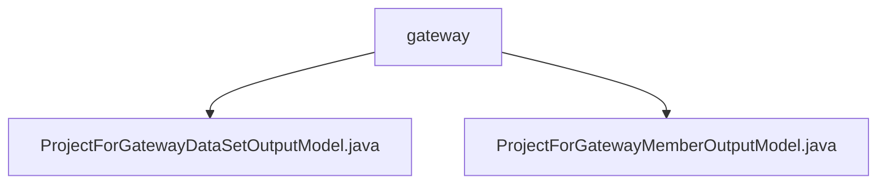

# Basic Information

|      |      |
|------|------|
| Name | gateway |
| Language | .java |
| Code Path | WeFe/board/board-service/src/main/java/com/welab/wefe/board/service/dto/entity/job/gateway |
| Package Name | docs.board.board-service.src.main.java.com.welab.wefe.board.service.dto.entity.job.gateway |
| Brief Description | This model class is used for gateway dataset output, containing member information, dataset details, and status. The member model includes ID, name, role enumeration, and review results. All fields are provided with validation annotations and getter/setter methods. |

# Description

## Overview  
The core responsibility of this module is to manage the dataset and member information output for federated learning gateway projects, including structured data definitions and state tracking. The interface specifications uniformly adopt annotation-based field validation and provide standard Getter/Setter methods. For example, the dataset model validates data volume ranges, while the member model validates role enumerations. Key data structures include dataset metadata (e.g., feature column lists), member role enumerations (Promoter/Provider/Arbiter), and approval status enumerations (Adopt/Disagree). The only external dependency is the Java basic annotation library. For instance, the ProjectForGatewayDataSetOutputModel records whether a dataset contains Y values.  

## Key Business Scenarios  
The module supports federated learning project gateway interactions, managing multi-party collaboration information in a registry-like mode. Typical workflows include: member role approval (e.g., triggering state changes after a Provider submits a dataset) and dataset feature validation (e.g., checking column count matches). Functional completeness is reflected in joint state management, such as synchronizing updates between member approval feedback and dataset states. The API types are all data entity classes. Integration examples include instantiating the ProjectForGatewayDataSetOutputModel when the gateway pushes project dataset metadata.

### Package Internal Structure View

This flowchart illustrates the structural relationship between two Java files within the gateway directory. The path originates from the gateway folder, which contains two output model class files: ProjectForGatewayDataSetOutputModel and ProjectForGatewayMemberOutputModel. Both files are directly under the gateway directory level without any deeper nested structure.

# File List

| Name   | Type  | Description |
|-------|------|-------------|
| [ProjectForGatewayDataSetOutputModel.java](ProjectForGatewayDataSetOutputModel.md) | file | Project gateway dataset output model class, including member ID, name, dataset ID, name, row count, column count, keywords, feature columns, whether it contains Y values, and status information. |
| [ProjectForGatewayMemberOutputModel.java](ProjectForGatewayMemberOutputModel.md) | file | Project member gateway output model, including member ID, name, role (initiator/provider/arbiter), review result (approved/rejected), and review comments. |

